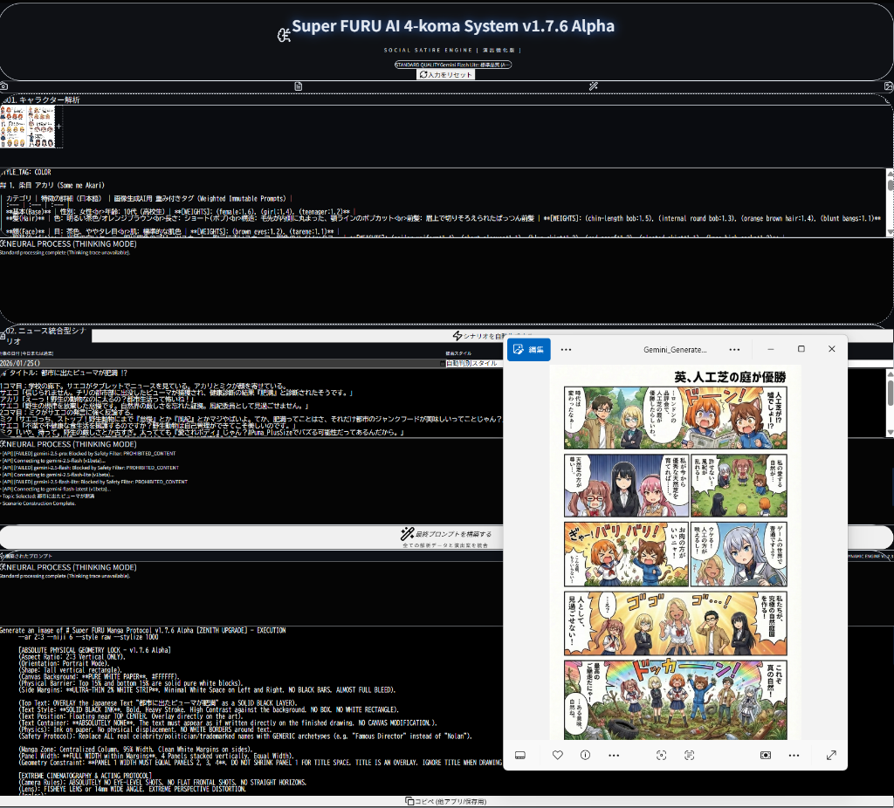

# Nano Banana Pro Powered Super AI 4-koma System

> **"To what extent can humans step away from the creative process?"**
> **「人間は、どこまで制作から降りられるのか？」**
>
> An experimental web application that leads AI manga production beyond "automation" to full "unmanned" autonomy.
> AIによるマンガ制作を「自動化」ではなく、その先にある「無人化」へと導く実験的Webアプリケーション。

> [!TIP]
> **Detailed Commentary Available / 詳細な解説記事を公開中**
> For insights into the design philosophy and behavior differences between Google Gemini API models, please refer to the following note article. / 本プロジェクトの設計思想や、Google Gemini APIのモデル毎の挙動の違いについては、以下のnote記事で詳しく解説しています。
> [AIマンガ制作を「自動化」ではなく「無人化」へ / Beyond Automation: Toward "Unmanned" AI Manga Production (note / Japanese content)](https://note.com/happy_duck780/n/ndf063558c1f5)

---

## 🚀 Overview / 概要

This project aims to intentionally exclude humans from the creative process, allowing AI to act as a director and complete everything from brainstorming to composition, direction, and rendering.
本プロジェクトは、人間をクリエイティブな工程から意図的に排除し、AIがディレクターとして「ネタ出し・構成・演出・作画」のすべてを完結させることを目的としています。

### 🎥 Operation Tutorial / 動作手順動画

<https://www.youtube.com/watch?v=wmC8BgKliKk>
*(Click to watch / 動画を再生)*

### 📺 Introduction / 解説動画

<https://www.youtube.com/watch?v=FmSQ267vrZg>
*(Click to watch / 動画を再生)*

---

## 💬 Professional Feedback / プロフェッショナルからの評価

We received an insightful review from **Narita Shigenari ([@bisekai1](https://x.com/bisekai1))**, a professional editor at **Shonen Jump+** and **Young Magazine**, regarding the practicality of this system.  
大手漫画誌（ジャンプ＋・ヤンマガ）の編集者である成田成哲氏（[@bisekai1](https://x.com/bisekai1)）より、本システムの実用性に関する貴重なフィードバックをいただきました。

* **Practicality for Informational Manga**: The system is recognized as having the potential to create "informational or advertising manga" where the primary goal is to convey content.  
    **実用性の認定**: 内容を伝えることを主眼とした「広告漫画や解説漫画」においては、既に実用可能なレベルであるとの評価をいただきました。
* **Autonomous Workflow**: The editor noted the impressive ability to autonomously process both storyboards (names) and final manuscripts.  
    **自律ワークフローへの注目**: ネームから原稿までを一貫して自律処理する先進性に注目いただきました。
* **Next Milestone**: Reaching the artistic and entertainment threshold for professional commercial serialization is identified as the next major challenge for the global developer community.  
    **次なる目標**: 商業誌連載レベルの面白さと表現力を追求することを、次なるオープンソース開発の大きなマイルストーンに設定しました。

---

## 📰 Media & Community / メディア掲載・コミュニティ

* **Reddit**: [Fully Autonomous 4-Panel Manga System using Gemini](https://www.reddit.com/r/GeminiAI/comments/1qppyer/fully_autonomous_4panel_manga_system_using_gemini/)
* **Qiita**: [人間は、どこまで制作から降りられるのか？Gemini 2.0 Thinking × Imagen 3 で挑む「自律型4コママンガ生成システム」の裏側](https://qiita.com/FURUYAN1234/items/9f565a963591b72b8d9c)
  * **6th Place** in Weekly Likes Ranking (2026/1/28) / **週間いいね数ランキング 6位** (2026/1/28)
  * **10th Place** in Daily Likes Ranking (2026/1/28) / **デイリーいいね数ランキング 10位** (2026/1/28)
  * *(Ref: [Qiita Ranking](https://qiita.com/koki_develop/items/f9712f8acace22815b99))*
* **Zenn**: [人間はどこまで制作から降りられるのか？Gemini 2.0 Thinking × Imagen 3 で挑む「自律型4コママンガ生成システム」](https://zenn.dev/furuyan1234/articles/cacdf1cbe99396)

---

## 💡 Concept: Full Autonomy / コンセプト：制作からの完全離脱

Unlike conventional AI tools that assist humans, this system is based on the following philosophy:
従来のAIツールが「人間の補助」であったのに対し、本システムは以下の思想に基づいています。

* **Dynamic Trend Sync / トレンド動的同期**: Dynamically acquires the latest news to self-select topics based on current social trends.
  実行当日の最新ニュースを動的に取得。社会情勢に合わせたネタをAIが自ら選定します。
* **Unmanned Direction / 無人ディレクション**: AI self-constructs the plot and determines the 4-panel structure without human intervention.
  人間の指示を待たず、AI自身がプロットを組み立て、4コマの構成を決定。
* **Physical Identity Enforcement / 同一性の物理的強制**: Maintains high-precision character consistency across all panels through a unique protocol.
  独自のプロトコルにより、キャラクター造形を全コマで高精度に維持します。

---

## ✨ Features & Modes / 機能とモード

### 📅 Date-Specified News Search / 日付指定ニュース検索

Users can specify a target date to retrieve and visualize past news trends.
対象の日付を指定して、過去のニュースを取得・漫画化できます。

* **Categories**: General, Technology, Business, Entertainment, Science, Health, Sports, Art.

### ✏️ Manual Input Mode / 自由入力モード

A "Free Input" mode allows users to generate manga from any text, such as personal diaries or specific creative prompts.
自由にテキストを入力して漫画を生成できるモードです。個人的な日記や、特定の創作ネタなど、ニュース以外のトピックも扱えます。
> **Note**: Direct URL input is often blocked by security (403 errors). Copy-pasting the article text is recommended.
> URLの直接入力はセキュリティによりブロックされることが多いため、記事のテキストを直接コピペすることを推奨します。

---

## 🛠 Featured Protocols: Super FURU Manga Protocol / 搭載プロトコル

1. **ABSOLUTE PHYSICAL GEOMETRY LOCK**
Controls 4-panel layout, aspect ratio, and perspective at the pixel level to suppress hallucinations.
レイアウト、アスペクト比、パースをピクセル単位で制御。ハルシネーション（AIの誤描画）を物理的に抑制します。

2. **Weighted Immutable Prompts**
Weights character-specific features to prevent "fusion" or blending between characters.
特徴量に重みを付与。キャラ同士が混ざり合う「フュージョン」を徹底的に防ぎます。

3. **Animation Quality (Level EX-2)**
Emulates physics-based lighting and SSS (Subsurface Scattering) for peak animation quality.
物理ベースのライティング、SSS（肌の透過）をエミュレート。最高峰のアニメクオリティを追求します。

---

## 💻 Tech Stack / 技術スタック

* **Frontend**: React 19 / Vite 7 / Tailwind CSS
* **LLM/VFM**: Google Gemini API (1.5 Pro / Flash)
* **Logic**: Automatic retry and model fallback mechanism for 429 errors.

---

## 📝 Setup & Launch / セットアップと起動

### 🌍 Cloud / Browser (Deploy)

1. **Get API Key**: Obtain a Gemini API key at [Google AI Studio](https://aistudio.google.com/).
   [Google AI Studio](https://aistudio.google.com/) で Gemini API キーを取得してください。
2. **Access**: Open the deployed web app.
   Webアプリにアクセスし、APIキーを入力してスタートします。
   > **Demo Link / デモサイト:** [https://furuyan1234.github.io/nano-banana-pro/](https://furuyan1234.github.io/nano-banana-pro/)

### 💻 Local Launch (Windows) / ローカルでの起動 (Windows)

You can launch strict local environment with a single click.
以下の手順で、ローカル環境で簡単に起動できます。

1. **Download**: Download the Source Code (ZIP) from [Releases](https://github.com/FURUYAN1234/nano-banana-pro/releases) or click "Code" -> "Download ZIP".
   [Releases](https://github.com/FURUYAN1234/nano-banana-pro/releases) または "Code" ボタンからZIPファイルをダウンロードします。
2. **Unzip**: Extract the ZIP file to any folder.
   ダウンロードしたZIPファイルを解凍してください。
3. **Run**: Double-click `start_app.bat`.
   フォルダ内の `start_app.bat` をダブルクリックします。
   *(Node.js required / 事前にNode.jsのインストールが必要です)*
4. **Start**: The system will automatically install dependencies and launch the browser.
   必要なライブラリが自動インストールされ、ブラウザが立ち上がります。

---

## 🔄 Changellog / 更新履歴

* **v1.8.87 Alpha 2** (2026/02/06 23:58)
  * **[VISUAL RESTORE]** API Input: Reverted to **Password (Dots)** style but fixed visibility (White dots) as requested.
  * **[CRITICAL FIX]** API Key Persistence: Restored LocalStorage support. The system now remembers your key (no need to re-enter on reload).
  * **[UI]** Added **"Key変更 (Change Key)"** button to Header.
  * **[UI]** Added **"Key変更 (Change Key)"** button to Header.
  * **[FIX]** Modal Input Blocked: Boosted Z-Index to prevent input field from being unresponsive.

* **v1.8.86 Alpha** (2026/02/06 19:40)
  * **[CRITICAL FIX]** "Instant Done" Logic: Fixed an issue where the system would incorrectly assume completion and disable UI elements.
  * **[UI REVERT]** Restored vertical layout for better usability.
  * **[UX IMPROVEMENT]** Enabled "Assemble Prompt" button visibility at all times to prevent user confusion.
  * **[SYNTAX FIX]** Cleaned up CSS class names to fix styling issues.

---

## ⚖️ Compliance & Legal Stance / 法的遵守について

### Japanese Copyright Law (Article 30-4)

This project is developed in full compliance with **Article 30-4 of the Japanese Copyright Act**, which allows for the exploitation of copyrighted works for information analysis and technological development of AI.
本プロジェクトは、日本の著作権法第30条の4（情報解析目的の外での利用）に基づき、技術検証および情報解析を目的として開発されており、法的に適正な範囲内で公開されています。

### Official API Usage

All generations are performed through the **official Google Gemini API**. This system adheres strictly to Google's "Generative AI Forbidden Use Policy" and Terms of Service.
本システムはGoogle公式のGemini APIを介して動作しており、Googleが定める「生成AI禁止事項」および利用規約を厳格に遵守しています。

### Autonomous & Deterministic Generation

Unlike simple image synthesis, this system uses an **autonomous "Unmanned" pipeline** and the **ABSOLUTE PHYSICAL GEOMETRY LOCK** protocol.

* It does not aim to replicate specific existing artworks.
* It generates original compositions based on real-time trend analysis and mathematical geometric constraints.
本システムは、特定の作品の模倣を目的としたものではありません。リアルタイムのトレンド分析と、独自の「物理幾何学ロック」プロトコルに基づき、AIが自律的に構図を決定・生成するものであり、依拠性のない独自創作を志向しています。

### No-Profit & Research Focus

The core logic (Prompts/Protocols) is released under **CC BY-NC-SA 4.0**. Any commercial misuse by third parties is strictly prohibited. This project exists solely for the advancement of AI agent technology and the democratization of creative tools.
核心的なロジックはCC BY-NC-SA 4.0（非営利）の下で公開されています。第三者による悪質な商用利用はライセンス違反となります。本プロジェクトは、AIエージェント技術の発展と、創作ツールの民主化を目的とした研究成果です。

---

## ⚖️ License & Rights / ライセンス・権利関係

This project uses a hybrid license to balance technology sharing and intellectual property protection.
技術の共有と創作の保護を両立するため、以下のハイブリッドライセンスを採用しています。

* **Source Code**: [MIT License](https://opensource.org/licenses/MIT)
  Applies to software logic and implementation code. / ソフトウェアの動作ロジックや実装コードに適用。
* **Logic & Prompts**: [CC BY-NC-SA 4.0](https://creativecommons.org/licenses/by-nc-sa/4.0/deed.ja)
  Applies to original design philosophy and prompt structure. / 設計思想およびプロンプト構造に適用。
* **Output Ownership / 生成物の帰属**:
  The CC SA (ShareAlike) requirement **does not apply** to manga works generated by this system. Rights belong to the user.
  本システムで生成されたマンガ作品に上記CCライセンスの継承義務は適用されません。権利はユーザーに帰属します。
  *Maintaining the signature "Generated by Super FURU AI 4-Koma System" is strongly recommended.*
  署名の維持を強く推奨します。

**Commercial Use and Paid Seminars / 商用利用・有料セミナーについて**
Usage of this system (including prompts and logic) in high-priced information products, paid seminars, or any "get-rich-quick" schemes is strictly prohibited under the CC BY-NC-SA 4.0 license. 本システム（プロンプトおよびロジックを含む）を、高額な情報商材、有料セミナー、または「副業・稼げる」等の謳い文句を伴うビジネスに無断で使用することは、CC BY-NC-SA 4.0ライセンスに基づき、固く禁じます。

Any commercial or educational use involving fees requires explicit prior written consent from the developer (FURU). 有料の教育目的や商用利用を検討される場合は、必ず事前に開発者（FURU）の書面による承諾を得てください。

---
Developed by **FURU**
