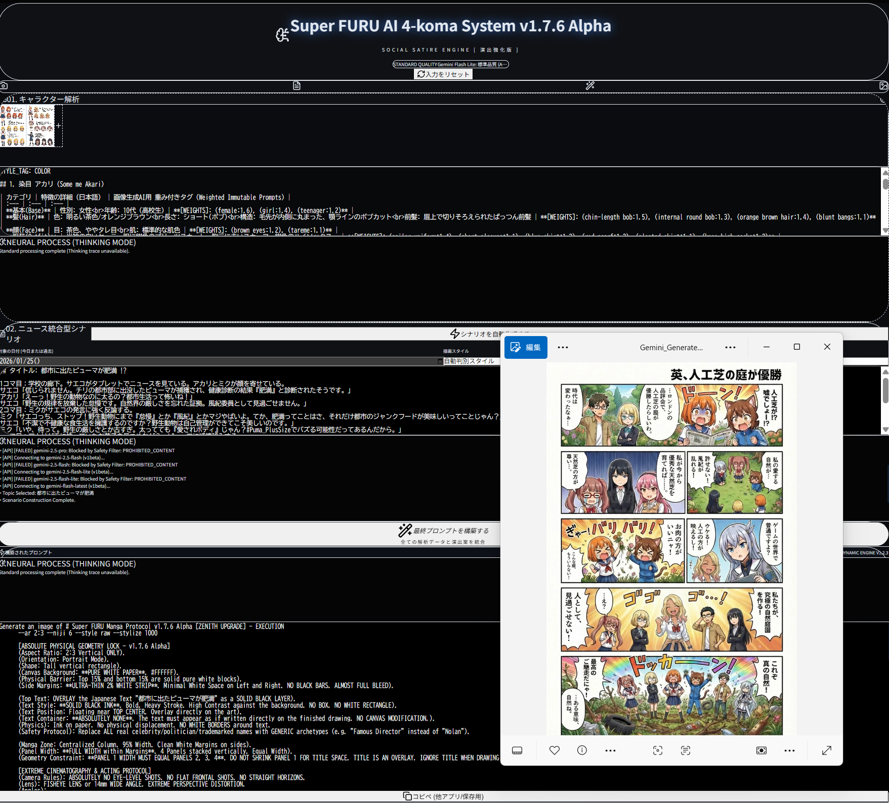

# Nano Banana Pro Powered Super AI 4-koma System
---

### 🏆 Recognition / 実績
- **Ranked #6 in Qiita Daily "Likes" Ranking (Jan 28, 2026)** - Japan's leading technical community.
  **Qiita デイリーいいね数ランキング 10位獲得 (2026年1月28日)** - 日本最大級のエンジニアコミュニティで高く評価されました。
- **Ranked #6 in Qiita Weekly "Likes" Ranking (Jan 28, 2026)** - Achieving high engagement within the developer community.
  **Qiita 週間いいねランキング 6位獲得 (2026年1月28日)** - 週間を通じた継続的な支持と評価を獲得しました。
- **Featured for "Build with Gemini"** - Implementing autonomous agent workflows using the latest LLM.
  **"Build with Gemini" 準拠** - Googleの最新モデルを活用した自律型エージェントワークフローの実装。

---

## 💬 Professional Feedback / プロフェッショナルからの評価

We received an insightful review from **Narita Shigenari ([@bisekai1](https://x.com/bisekai1))**, a professional editor at **Shonen Jump+** and **Young Magazine**, regarding the practicality of this system.  
大手漫画誌（ジャンプ＋・ヤンマガ）の編集者である成田成哲氏（[@bisekai1](https://x.com/bisekai1)）より、本システムの実用性に関する貴重なフィードバックをいただきました。

* **Practicality for Informational Manga**: The system is recognized as having the potential to create "informational or advertising manga" where the primary goal is to convey content.  
    **実用性の認定**: 内容を伝えることを主眼とした「広告漫画や解説漫画」においては、既に実用可能なレベルであるとの評価をいただきました。
* **Autonomous Workflow**: The editor noted the impressive ability to autonomously process both storyboards (names) and final manuscripts.  
    **自律ワークフローへの注目**: ネームから原稿までを一貫して自律処理する先進性に注目いただきました。
* **Next Milestone**: Reaching the artistic and entertainment threshold for professional commercial serialization is identified as the next major challenge for the global developer community.  
    **次なる目標**: 商業誌連載レベルの面白さと表現力を追求することを、次なるオープンソース開発の大きなマイルストーンに設定しました。

> **Reference Link / 参照:** [Review by @bisekai1 on X](https://x.com/bisekai1/status/2016330820383080678)

---

## 🤖 What is nano-banana-pro?
**"To what extent can humans step away from the creative process?"**

This project is an experimental **Autonomous 4-Panel Manga Director**. It doesn't just "draw"; it thinks, scans news, plots stories, and renders professional-grade manga strips without human intervention.
> **"To what extent can humans step away from the creative process?"**
> **「人間は、どこまで制作から降りられるのか？」**
> 
> An experimental web application that leads AI manga production beyond "automation" to full "unmanned" autonomy.
> AIによるマンガ制作を「自動化」ではなく、その先にある**「無人化」**へと導く実験的Webアプリケーション。

---

## 🚀 Overview / 概要

https://github.com/user-attachments/assets/caead72f-8117-4e20-82b9-e353812b3e87

> [!TIP]
> **詳細な解説記事を公開中** > For insights into the design philosophy and behavior differences between Google Gemini API models, please refer to the following note article. / 本プロジェクトの設計思想や、Google Gemini APIのモデル毎の挙動の違いについては、以下のnote記事で詳しく解説しています。
> [【Update 2026/1/24】AIマンガ制作を「自動化」ではなく「無人化」へ（note）/Beyond Automation: Toward "Unmanned" AI Manga Production (note / Japanese content)](https://note.com/happy_duck780/n/ndf063558c1f5)

This project aims to intentionally exclude humans from the creative process, allowing AI to act as a director and complete everything from brainstorming to composition, direction, and rendering.
本プロジェクトは、人間をクリエイティブな工程から意図的に排除し、AIがディレクターとして「ネタ出し・構成・演出・作画」のすべてを完結させることを目的としています。

---

## 💡 Concept: Full Autonomy / コンセプト：制作からの完全離脱

Unlike conventional AI tools that assist humans, this system is based on the following philosophy:
従来のAIツールが「人間の補助」であったのに対し、本システムは以下の思想に基づいています。

* **Dynamic Trend Sync / トレンド動的同期**: Dynamically acquires the latest news to self-select topics based on current social trends.
  実行当日の最新ニュースを動的に取得。社会情勢に合わせたネタをAIが自ら選定します。
* **Unmanned Direction / 無人ディレクション**: AI self-constructs the plot and determines the 4-panel structure without human intervention.
  人間の指示を待たず、AI自身がプロットを組み立て、4コマの構成を決定。
* **Physical Identity Enforcement / 同一性の物理的強制**: Maintains high-precision character consistency across all panels through a unique protocol.
  独自のプロトコルにより、キャラクター造形を全コマで高精度に維持します。

---

## 🛠 Featured Protocols: Super FURU Manga Protocol / 搭載プロトコル

1. **ABSOLUTE PHYSICAL GEOMETRY LOCK**
Controls 4-panel layout, aspect ratio, and perspective at the pixel level to suppress hallucinations.
レイアウト、アスペクト比、パースをピクセル単位で制御。ハルシネーション（AIの誤描画）を物理的に抑制します。

2. **Weighted Immutable Prompts**
Weights character-specific features to prevent "fusion" or blending between characters.
特徴量に重みを付与。キャラ同士が混ざり合う「フュージョン」を徹底的に防ぎます。

3. **Animation Quality (Level EX-2)**
Emulates physics-based lighting and SSS (Subsurface Scattering) for peak animation quality.
物理ベースのライティング、SSS（肌の透過）をエミュレート。最高峰のアニメクオリティを追求します。

---

## 💻 Tech Stack / 技術スタック

* **Frontend**: React 19 / Vite 7 / Tailwind CSS
* **LLM/VFM**: Google Gemini API (1.5 Pro / Flash)
* **Logic**: Automatic retry and model fallback mechanism for 429 errors.

---

## 📝 Setup / セットアップ

1. **Get API Key**: Obtain a Gemini API key at [Google AI Studio](https://aistudio.google.com/).
   [Google AI Studio](https://aistudio.google.com/) で Gemini API キーを取得してください。
2. **Configuration**: Enter the key in the application settings or `.env` file.
   アプリ内の設定画面、または `.env` ファイルにAPIキーを入力します。
3. **Run**: Press **START** to generate the manga automatically.
   `START` ボタンを押すだけで、全自動で漫画が生成されます。

---

## ⚖️ License & Rights / ライセンス・権利関係

This project uses a hybrid license to balance technology sharing and intellectual property protection.
技術の共有と創作の保護を両立するため、以下のハイブリッドライセンスを採用しています。

* **Source Code**: [MIT License](https://opensource.org/licenses/MIT)
  Applies to software logic and implementation code. / ソフトウェアの動作ロジックや実装コードに適用。
* **Logic & Prompts**: [CC BY-NC-SA 4.0](https://creativecommons.org/licenses/by-nc-sa/4.0/deed.ja)
  Applies to original design philosophy and prompt structure. / 設計思想およびプロンプト構造に適用。
* **Output Ownership / 生成物の帰属**: 
  The CC SA (ShareAlike) requirement **does not apply** to manga works generated by this system. Rights belong to the user.
  本システムで生成されたマンガ作品に上記CCライセンスの継承義務は適用されません。権利はユーザーに帰属します。
  *Maintaining the signature "Generated by Super FURU AI 4-Koma System" is strongly recommended.*
  署名の維持を強く推奨します。

**Commercial Use and Paid Seminars / 商用利用・有料セミナーについて**
Usage of this system (including prompts and logic) in high-priced information products, paid seminars, or any "get-rich-quick" schemes is strictly prohibited under the CC BY-NC-SA 4.0 license. 本システム（プロンプトおよびロジックを含む）を、高額な情報商材、有料セミナー、または「副業・稼げる」等の謳い文句を伴うビジネスに無断で使用することは、CC BY-NC-SA 4.0ライセンスに基づき、固く禁じます。

Any commercial or educational use involving fees requires explicit prior written consent from the developer (FURU). 有料の教育目的や商用利用を検討される場合は、必ず事前に開発者（FURU）の書面による承諾を得てください。

---
Developed by **FURU**
