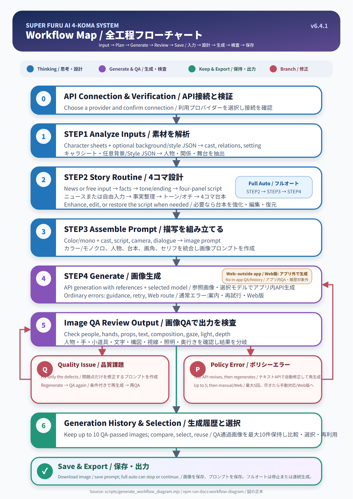
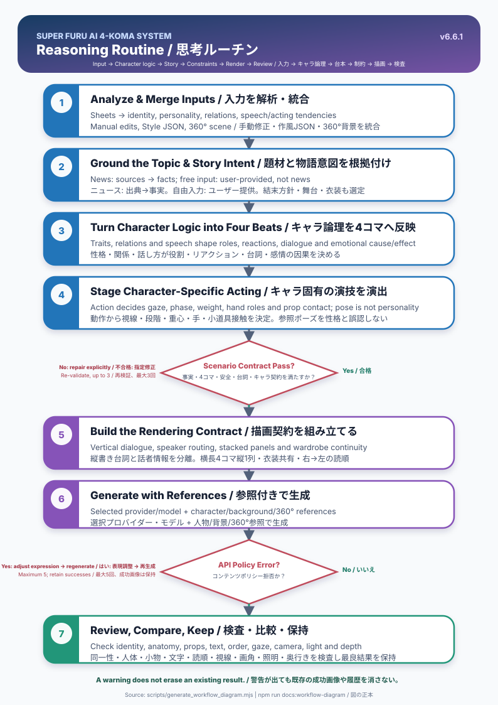

# Super FURU AI 4-koma System / Super FURU AI 4コマシステム

> Current source version: **v6.5.3** / 現在のソース版: **v6.5.3**

An experimental web application in which AI handles topic research, story structure, direction, prompt construction, image generation, and quality review for a four-panel manga. / AIが話題調査、構成、演出、プロンプト構築、画像生成、品質確認まで担当する4コマ漫画制作Webアプリです。

[Open the application](https://furuyan1234.github.io/nano-banana-pro/) / [アプリを開く](https://furuyan1234.github.io/nano-banana-pro/)

[Read the detailed note article](https://note.com/happy_duck780/n/ndf063558c1f5) / [詳しいnote記事を読む](https://note.com/happy_duck780/n/ndf063558c1f5)

## AI Manga Creative Suite / AIまんが制作エコシステム

[](https://youtu.be/pqYVxUUg0Cs?si=27g1I3tO2EuZkOuxJ)

This application is the four-panel manga production system in AI Manga Creative Suite. It turns character references and a topic into a reviewed four-panel manga, then keeps the completed image available for the suite's video, translation, background, story, and character-design workflows. / 本アプリはAI Manga Creative Suiteの4コマ漫画制作システムです。キャラクター資料と題材から、検査済みの4コマ漫画を作成し、完成画像を動画化、翻訳、背景、物語、キャラクター設計の各ワークフローへ渡せます。

### AI Voice Comic Maker integration / AI Voice Comic Makerとの連携

Load a completed four-panel manga into [AI Voice Comic Maker](https://github.com/FURUYAN1234/ai-voice-comic-maker) to analyze the page and render a vertical short video with camera movement, BGM, and a selected local voice engine. This makes the completed manga usable as a TikTok or YouTube Shorts video source. / 完成した4コマ漫画を[AI Voice Comic Maker](https://github.com/FURUYAN1234/ai-voice-comic-maker)へ読み込むと、ページを解析し、カメラワーク、BGM、選択したローカル音声エンジンを使った縦型ショート動画をレンダリングできます。完成漫画をTikTokやYouTube Shorts向け動画の素材として使えます。

### Related systems / 関連システム

- [Story Maker](https://github.com/FURUYAN1234/story-maker): Create stories and plots for a manga topic. / 漫画の題材になる物語やプロットを作成します。
- [AI Character Sheet Maker](https://github.com/FURUYAN1234/character-sheet-maker): Create structured character reference sheets for this workflow. / このワークフローに渡す構造化キャラクターシートを作成します。
- [AI Comic Translation Tool](https://github.com/FURUYAN1234/comic-translation): Translate completed manga pages. / 完成した漫画ページを翻訳します。
- [360° AI Panorama Generator](https://github.com/FURUYAN1234/panoforge): Create spatial background material for manga and video. / 漫画と動画向けの空間背景素材を作成します。
- [AI Voice Comic Maker](https://github.com/FURUYAN1234/ai-voice-comic-maker): Convert a completed manga page into a voiced vertical video. / 完成した漫画ページを音声付き縦型動画に変換します。

## A4 workflow map / A4縦フローチャート



This diagram covers the full path from source analysis through scenario thinking, prompt assembly, API image generation, quality review, policy-repair retries, history, and saving. It is generated from `scripts/generate_workflow_diagram.mjs`; `npm run build` regenerates it, and the generator checks the orchestration points it documents. When the workflow changes materially, replace both this README PNG and the matching uploaded PNG in the note article. / この図は、素材解析から台本の思考ルーチン、プロンプト組み立て、API画像生成、品質検査、ポリシー修正の再試行、履歴、保存までを一枚にまとめています。正本は `scripts/generate_workflow_diagram.mjs` です。`npm run build` 時に再生成され、図が参照する処理の制御点も検査します。フローを大きく変える際は、この図も更新し、公開リリース時にREADMEとnoteの画像を同じ内容へ差し替えます。

### Reasoning routine / 思考ルーチン



This companion map shows how the system classifies a source, builds and validates the four-panel plan, locks required details, builds the rendering prompt, and handles quality or policy branches without discarding an existing successful result. / この補助図は、入力根拠の分類、4コマ設計と検証、保持条件の固定、描写指示の構築、品質・ポリシー分岐時にも既存の成功結果を残す流れを示します。

When a workflow or reasoning rule changes materially, run `npm run docs:workflow-diagram` and replace this README image and its matching note image in the same release. / ワークフローまたは思考ルールを大きく変更した際は、同一リリースで `npm run docs:workflow-diagram` を実行し、このREADME画像とnoteの対応画像を差し替えます。

## What this project does / このプロジェクトでできること

The application provides one continuous four-step workflow. / アプリは次の4ステップを一続きで実行します。

1. **Character analysis / キャラクター解析:** Read a character sheet or reference image and extract identity traits. / キャラクターシートや参照画像から人物の識別要素を抽出します。
2. **Scenario / シナリオ:** Generate a four-panel story and optionally strengthen its direction. / 4コマのシナリオを生成し、必要に応じて演出を強化します。
3. **Prompt / プロンプト:** Build an editable image prompt and run an automatic AI consistency review before display. / 編集可能な画像プロンプトを構築し、表示前にAI整合性チェックを自動実行します。
4. **Image / 画像:** Generate through Google Gemini or OpenAI, inspect the result, and offer bounded repair when enabled. / Google GeminiまたはOpenAIで画像を生成し、結果を検査し、設定時は回数を制限した修正候補を作ります。

### Complete current feature map / 現行機能の全体像

| Area / 領域 | Current behavior / 現在の動作 |
|---|---|
| Provider connection / API接続 | Choose Google Gemini or OpenAI, verify the selected provider before work, and keep STEP1–4 on that provider. A ChatGPT subscription and OpenAI API billing are separate. / Google GeminiまたはOpenAIを選択し、処理前に接続を確認します。STEP1～4は選択したプロバイダーへ統一されます。ChatGPTの契約とOpenAI APIの課金は別です。 |
| STEP1 character input / キャラクター入力 | Load one or more character sheets, add more later, remove individual sheets, and extract names, appearance, identity markers, personality and relationships. Reference-sheet pose, labels and layout are not copied into the manga. / 1枚以上のキャラクターシートを読み込み、後から追加・個別削除できます。名前、外見、識別要素、性格、関係性を抽出し、参照画像のポーズ・ラベル・紙面構成は漫画へ流用しません。 |
| Optional style and space / 任意の画風・空間 | Load a style-setting JSON. A 2:1 equirectangular image is separated from character sheets, analyzed as a 360-degree background, assigned a panel camera direction and cropped for generation. / 作風設定JSONを読み込めます。2:1の全天球画像はキャラシートから分離し、360°背景として解析し、コマ別の撮影方向とクロップを生成へ渡します。 |
| STEP2 topic / 題材 | Use category news search or free input. Free input treats only the supplied subject or successfully retrieved URL text as story material: interface/input-mode labels, news-only search and date rules, internal placeholders, and prior-session topics are excluded. If a model still emits an internal label, the bounded improvement loop compares candidates and keeps the best one, then deterministic cleanup removes only the leaked labels and revalidates the result instead of aborting the scenario. Explicit location and outfit overrides take priority. A short editable SNS explanation and source links are kept outside the manga script. / カテゴリニュース検索または自由入力を使えます。自由入力では、入力した題材または取得に成功したURL本文だけを物語材料として扱い、UI・入力モード名、ニュース専用の検索・日付規則、内部プレースホルダー、前回題材を除外します。モデルが内部ラベルを残した場合も、改善ループで候補を比較して最良を保持し、漏れたラベルだけを決定処理で除去して再検査するため、シナリオを打ち切りません。明示した場所・衣装を優先し、編集可能なSNS説明文と出典リンクは漫画台本の外で管理します。 |
| Story-required guests / 物語上必要な新キャラ | A role character required by the script, such as a merchant or receptionist, is included in the per-panel cast count even without a reference sheet. If that person recurs, identity, adult age, clothing, props, position and action continuity stay fixed; the system must not clone, replace or silently omit the role. / 商店主や受付係など台本上必要な役職人物は、参照画像がなくても各コマの登場人数へ含めます。再登場時は同一人物として、成人年齢、服装、小道具、位置、動作の連続性を保ち、複製・別人化・理由のない省略を防ぎます。 |
| Ending selection / 結末 | Automatic, Gag automatic, individual gag endings, Serious automatic, individual serious endings, Gag Documentary and Serious Documentary. Automatic choice is resolved once and carried into STEP3–4; an incompatible label returned by the text model cannot replace the resolved selection. / 全体おまかせ、ギャグ内おまかせ、個別ギャグ、シリアス内おまかせ、個別シリアス、ギャグ・ドキュメンタリー、シリアス・ドキュメンタリーを選べます。自動選択の結果はSTEP3～4へ固定して渡し、文章モデルが返した非互換のオチ名で上書きしません。 |
| Scenario enhancement / シナリオ強化 | Independently select expression, body, effects, background, camera, dialogue and story-direction enhancement. Revert to the pre-enhancement scenario at any time. Documentary direction has a fact-preserving variant for both gag and serious modes. / 表情、身体、演出、背景、カメラ、セリフ、物語演出を個別選択でき、強化前へ戻せます。ドキュメンタリーではギャグ・シリアスの両方に事実保持型の演出を使います。 |
| STEP3 prompt / プロンプト | Choose color or monochrome, build the provider-specific prompt, run a text-model consistency review, edit the final prompt, copy it for Web use, and save generation metadata as JSON. / カラー／白黒を選び、プロバイダー別プロンプトを構築し、文章モデルの整合性確認後に編集・Web用コピー・生成設定JSON保存ができます。 |
| STEP4 image / 画像 | Generate in the app, choose available quality and size settings, stop remaining quality retries, or use the copied prompt manually on the provider's Web UI. / アプリ内で生成し、利用可能な品質・サイズを選択し、残りの品質再試行を停止できます。コピーしたプロンプトを公式Web画面で手動利用する経路もあります。 |
| Review and history / 検査・履歴 | Review panel count, dialogue, balloon order and speaker tails, per-panel character identity and eyewear, anatomy, camera, prop ownership, surface orientation, unwanted text and medium compliance. QA independently inventories every readable or partly readable glyph sequence on bubbles, signs, packaging, labels, books and screens. Plausible AI-completed environmental text is allowed unless it materially contradicts the setting, identity, facts, clues, action or joke; omitted or unclassified text stays unverified. Keep the latest ten candidates in session memory and download the selected one. / コマ数、台詞、吹き出し順・尻尾、各コマの人物同一性と眼鏡、人体、カメラ、小道具所有、面の向き、不要文字、カラー／白黒条件を検査します。吹き出し、看板、包装、ラベル、本、画面に見える全文字と部分文字を画像から独立転記します。AIが情景に沿って補完した環境文字は、場所・人物・事実・手掛かり・動作・オチを大きく誤らせない限り許容し、一覧漏れや分類不能は未確認として残します。直近10候補をセッション内履歴に保持し、選択候補を保存できます。 |
| Full-auto controls / フルオート | The workflow can advance through STEP2–4, show the current stage and countdown, and be stopped without clearing the already completed work. / STEP2～4を自動で進め、現在段階とカウントダウンを表示し、完了済みの内容を消さずに停止できます。 |
| Video handoff / 動画化 | Copy the generic MiniMax H3 prompt, or download the separate FourPanel ComfyUI workflow JSON and matching custom-node package. / 汎用MiniMax H3プロンプトをコピーするか、別配布のFourPanel ComfyUIワークフローJSONと対応カスタムノードを取得できます。 |

STEP1 moves to its live analysis log while character sheets are being read. STEP2 through STEP4 place the newly actionable main button near the lower edge after the preceding step completes. STEP4, its copy controls, image settings and history stay hidden until STEP3 has produced a non-empty final prompt. When STEP3 starts, the view moves to its live progress log; only after a final prompt is ready does it move to STEP4. Editing an already completed prompt does not move the view. After each step, the next available main STEP button slowly alternates between darker and brighter states; reduced-motion browser settings disable this animation. / STEP1はキャラクターシート解析中に実際の進捗ログへ移動します。STEP2〜STEP4は前のSTEPが完了した時点で、次に操作できる主ボタンを画面下端寄りに表示します。STEP3が空でない最終プロンプトを作るまで、STEP4、コピーボタン、画像設定、履歴は表示しません。STEP3開始時は実際の進捗ログへ移動し、最終プロンプトが完成した時だけSTEP4へ移動します。完成済みプロンプトの手動編集では画面を移動しません。各STEP完了後は次に押せる主ボタンがゆっくり明暗変化し、ブラウザーの視差効果軽減設定ではアニメーションを止めます。

### Story construction algorithm / 物語アルゴリズム

The story routine is a constrained editor rather than a single request to “make a funny manga.” It processes the following layers in order. / 物語ルーチンは、単に「面白い漫画を作る」と依頼する一発生成ではなく、次の制約層を順に処理します。

1. **Normalize input facts / 入力事実の正規化:** Separate source/reference metadata, URLs, article titles, interface labels, input-mode names and internal placeholders from drawable events and real character dialogue. News-only category/date/freshness instructions never enter free-input prompts. Compound headings such as `出典・参考:` and their bullet lists remain posting metadata and never become a speaker, balloon or visible label. Explicit quotations spoken by a character and explicitly required prop lettering remain in the script. / 出典・参考メタデータ、URL、記事名、UIラベル、入力モード名、内部プレースホルダーを、描画する出来事と実際の人物台詞から分離します。ニュース専用のカテゴリ・日付・鮮度指示は自由入力プロンプトへ入れません。`出典・参考:`のような複合見出しと箇条書きは投稿用情報として扱い、話者・吹き出し・画面文字へ変換しません。人物が実際に話す引用と明示された小道具文字は保持します。
2. **Resolve tone once / 調子の確定:** Resolve automatic selection into one gag or serious ending policy. Serious topics protect consequence and restraint; documentary modes additionally lock facts, numbers, chronology and causality. / 自動選択をギャグまたはシリアスの結末方針へ一度だけ確定します。シリアス題材は結果と抑制を守り、ドキュメンタリーでは事実・数値・時系列・因果も固定します。
3. **Build a four-beat comic or dramatic spine / 4段階のギャグ・ドラマ設計:** Ordinary gag construction uses a character desire or contradiction, setup, readable escalation, then a visual reversal or payoff. A Surreal ending is deliberately different: it may use destruction, causal leaps, incoherence and absurd visual change without retroactive explanation, provided the absurd event is visible and the ending is not merely a slogan. Serious construction uses concrete loss, cost, choice, action and aftermath; it avoids manufacturing emotion with a lecture or abstract feeling words alone. / 通常ギャグは人物の欲望または矛盾、仕込み、読める増幅、視覚的な反転または回収で組みます。静寂型（シュール）は別契約で、物・設備・舞台の破壊、因果の飛躍、支離滅裂、不条理な画面変化を、後付け説明で合理化せず許可します。目で分かる出来事があり、標語だけの結末でなければ、論理的な伏線や回収を要求しません。シリアスは具体的な損失、代償、選択、行動、余韻で組み、説教や抽象感情語だけで深刻さを作りません。
4. **Apply documentary variants / ドキュメンタリー分岐:** Gag Documentary accumulates verified facts in panels 1–3 and uses a character reaction or fact-derived payoff in panel 4 without inventing an incident, statement, prize or failure. Serious Documentary strengthens the human consequence and aftermath while preserving the reference style and ordinary proportions. / ギャグ・ドキュメンタリーは1～3コマで確認済み事実を積み、4コマ目を人物の反応または事実由来の回収にし、事件・発言・受賞・失敗を捏造しません。シリアス・ドキュメンタリーは参照絵柄と通常頭身を守り、人への影響と余韻を強めます。
5. **Assign visual evidence, guests and props / 視覚証拠・新キャラ・小道具:** Select concrete objects, equipment and actions that prove this topic. Add a role character only when the story needs that person, count the guest in every applicable panel, and preserve identity and spatial continuity when recurring. Preserve each prop's owner, function, material, facing, contact and transfer. Do not mechanically turn every increase or shortage into longer paper, a scroll or an accordion object. / 題材を絵で証明する物、設備、行動を選びます。物語上必要な場合だけ役職人物を加え、該当コマの人数に含め、再登場時は同一人物と位置関係を維持します。小道具の持ち主、用途、材質、向き、接触、受け渡しを保持し、増減や不足を毎回長い紙・巻物・蛇腹へ機械変換しません。
6. **Design acting identity and contrast / 演技個性と緩急:** If a cast profile explicitly describes acting habits, the Acting Identity Lock keeps character-specific tendencies in lean, posture, gesture amplitude or frequency, gaze and object-check behavior. It expresses the tendency through different story actions instead of repeating one pose, and never infers personality from a reference-sheet pose alone. / キャラクター情報に演技癖が明記されている場合、Acting Identity Lockが前傾、姿勢、身振りの振幅・頻度、視線、物の確認動作を人物固有の傾向として保持します。同じポーズを反復せず、物語ごとの別動作で表し、参照画像のポーズだけから性格を推測しません。
7. **Pair camera and action / カメラと動作:** Write each `Camera` and action as one physical shot. Specify position, height, azimuth, crop, lens effect, visible surfaces, action phase, support leg or seat, center of gravity, left/right hand roles and contact target. Explicit camera and action always win. / 各`Camera`と動作を一つの物理ショットとして設計します。撮影位置、高さ、左右方向、範囲、レンズ効果、見える面、動作段階、支持脚・座面、重心、左右の手、接触先を具体化し、明示CameraとActionを最優先します。
8. **Control page rhythm and focus / 紙面リズムと注視点:** Give each panel one first-read subject or action and at most one supporting cue. The focal subject receives the strongest contour, contrast, placement and light; secondary people and background use thinner lines, lower contrast, selective omission or physically consistent depth of field. A quiet panel still retains enough setting shape and depth to understand the space. / 各コマの第一注視対象または動作を1つ、補助要素を最大1つに絞ります。主対象へ最も強い輪郭、コントラスト、配置、光を与え、脇役と背景は細い線、低コントラスト、選択的省略、物理的に整合する被写界深度で整理します。静かなコマでも空間が分かる場所の形と奥行きは残します。
9. **Lock script and lettering / 台本・文字固定:** Keep four panels with content-driven heights, exact dialogue, speaker order and title. Reserve Japanese balloons from right to left independently of character placement: B1 is the rightmost body and later balloons move left. Tail roots leave the lower speaker-facing half of each bubble, use a clear route around heads/faces/hair/text, and end at the assigned speaker. Explicit object text remains exact. Unspecified posters, signs, packages, menus and book covers keep natural artwork, pictograms, color blocks, borders, material and layout; natural context-appropriate lettering may be readable or decorative, short or long, in any amount or density. Do not suppress or simplify a surface merely because its lettering was not scripted. Image QA transcribes every visible glyph from pixels rather than inferring correctness from this prompt. / 内容に応じた高さの4コマ枠、台詞全文、話者順、タイトルを保持します。人物配置と独立して日本語吹き出しを右から左へ予約し、B1を最右、後続を左へ置きます。尻尾は吹き出し下半分の話者側から出し、頭・顔・髪・台詞文字を避けて指定話者へ接続します。明示された物体文字は正確に保持します。未指定のポスター、看板、包装、メニュー、書籍表紙は、自然な図柄・アイコン・配色・枠・材質・レイアウトを残し、場所に自然な文字を可読／装飾、短文／長文、量や密度を問わず自由に描けます。台本にない文字だからという理由で面を抑制・簡略化しません。画像QAではプロンプトから正しさを推測せず実画像に見える文字をすべて転記して照合します。
10. **Assemble, review and choose / 構築・検査・採用:** STEP3 composes provider-specific instructions, preserves the locks during prompt compaction and asks the text model to review inconsistencies. STEP4 reviews the rendered image. A later scenario-enhancement request failure keeps the strongest already validated safe candidate; a failure before any usable candidate remains an error. Image repairs keep a bounded history and select the best inspected candidate when every attempt still has issues. / STEP3はプロバイダー別指示を組み、長文短縮後も各ロックを残し、文章モデルに矛盾確認を依頼します。STEP4は実画像を検査します。シナリオ強化の後続APIが失敗しても検証済み安全候補があれば最良候補を保持し、候補が一つもない最初の失敗はエラーとして扱います。画像修正は上限付き履歴を比較し、全候補に問題が残る場合も検査上の最良候補を採用します。

### Image anatomy and drawing priorities / 人体・描線・情報整理

- The primary character, face, hand or story prop receives the strongest G-pen-like contour and clearest local contrast. Distant or secondary detail is lighter and thinner; decorative clutter may be omitted. / 主役の人物・顔・手・重要小道具へ最も強いGペン風輪郭と局所コントラストを与え、遠景・脇役は薄く細くし、不要な装飾を省略できます。
- Joint chains must remain coherent through neck, shoulders, elbows, wrists, hips, knees and ankles. Each visible hand belongs to one connected arm and each prop has a readable owner, grip, support and contact. / 首、肩、肘、手首、股関節、膝、足首の連鎖を整合させ、見える手を一本の腕へ接続し、小道具の持ち主・把持・支持・接触を読めるようにします。
- A rear-facing head shows skull, hair, ear and at most a natural cheek edge. Eyes, nose and mouth are not invented beside the back of the head unless the shot is a physically plausible rear three-quarter view; impossible neck twists are rejected. / 後ろ向きの頭部は頭蓋・髪・耳と自然な頬端までにし、解剖学的に成立する後ろ斜め以外では後頭部の横へ目鼻口を捏造せず、不可能な首のねじれを拒否します。
- Four identical conversational bust shots, identical distance in every panel, everyone looking into the lens, unclear space, unclear prop ownership, dialogue-only staging and an unexplained final-panel location jump remain prohibited. Camera movement, lighting, gaze, acting, expression, continuity, time and speaker clarity are reviewed together. / 会話人物のバストアップ4連続、全コマ同距離、全員カメラ目線、空間不明、小道具所有不明、会話だけの絵、理由のない最終コマの場所変更は引き続き禁止です。カメラ、照明、視線、演技、表情、位置、小道具、時間、話者の明確さをまとめて確認します。

These are generation and review constraints, not guarantees. Provider image models can still miss anatomy, Japanese glyphs or exact staging, so the actual output remains the acceptance evidence. / これらは生成・検査条件であり、結果保証ではありません。画像モデルは人体、日本語文字、厳密な構図を誤る場合があるため、採否は実際の出力画像で確認します。

### Models used by the scenario routine / シナリオルーチンのモデル

| Selected provider / 選択API | STEP2 scenario and enhancement route / STEP2のシナリオ・強化経路 |
|---|---|
| OpenAI | `gpt-6-astra` → `gpt-5.6-sol` → `gpt-4.1` → `gpt-4.1-mini` → `gpt-4.1-nano` → `gpt-4o` |
| Google Gemini | `gemini-3.5-flash` → `gemini-2.5-flash` → `gemini-2.5-pro` → `gemini-flash-latest` → `gemini-pro-latest` |

`gpt-6-astra` is the OpenAI model identifier used by this application. It is unrelated to Google's Project Astra product name. The app sends the scenario prompt through its provider route; it does not inherit the Codex desktop task's High or Extra High reasoning setting. OpenAI's Astra-first route is appropriate for multi-constraint four-panel construction, while the fallback chain prevents one unavailable model from blocking the workflow. Model presence in a list is not proof of image quality; the rendered manga still requires visual review. / `gpt-6-astra`は本アプリが使うOpenAIモデルIDで、GoogleのProject Astraという製品名とは別物です。アプリは選択プロバイダーの経路へシナリオ指示を送信し、Codexデスクトップ作業の「高い」「極高」推論設定を引き継ぎません。多制約の4コマ構成にはAstra先行経路が適しており、利用不可時は後続モデルで処理停止を避けます。モデル一覧への表示は画像品質の証明ではなく、生成画像の目視確認が必要です。

STEP3 shows `⏳ AI応答を待機中... (○秒経過)` directly below its build button while the connected text API reviews the prompt, then stops the counter when processing ends. / STEP3は接続中の文章APIがプロンプトを精査している間、構築ボタン直下に`⏳ AI応答を待機中... (○秒経過)`を表示し、処理完了時にカウントを停止します。

### Image history and downloads / 生成履歴と保存

The current session keeps the latest ten API candidates, including repair attempts in the history strip. Select any entry to return it to the preview, then use the normal download button to save that selected image. Files use `AI_4koma_comic_{API}_{title}_{YYYYMMDDHHMMSS}.{extension}`. History is current-session memory only and does not survive a page reload; the app does not request a destination folder or automatically write image files. / 現在のセッションでは、修正途中の候補を含めたAPI画像を直近10件まで生成履歴へ残します。任意の履歴を選択するとプレビューへ戻り、その選択画像を通常のダウンロードボタンで手動保存できます。ファイル名は `AI_4koma_comic_{API}_{title}_{YYYYMMDDHHMMSS}.{extension}` の形式です。履歴は現在のブラウザー内メモリのみで、ページ再読み込み後には残りません。保存先フォルダーの選択や画像ファイルの自動保存は行いません。

STEP2's local scenario update discourages interchangeable “keep extending the same prop” plots: select objects and consequences from the topic's actual activities, while preserving explicit props, facts, bold cameras and acting. Direction enhancement does not replace an existing plot or invent expandable props. Generate anew from STEP2 to change the premise; STEP3 preserves already scripted scrolls or accordion paper. One fresh scenario rendered through the real API in color and monochrome showed no scroll/accordion mechanism while retaining strong perspective; this is not a recurrence-rate study or a guarantee against repetition. / STEP2のローカル修正では、題材が違っても同じ物を延ばし続ける展開への偏りを抑える指示を追加しています。題材固有の行為と結果から小道具を選び、明示指定・事実・大胆なカメラと演技は保持します。演出強化で既存の筋を置き換えたり、伸縮・継ぎ足しの仕掛けを新設したりしません。構想を変える場合はSTEP2から再生成してください。STEP3だけでは台本中の巻物や蛇腹を消しません。新規1台本を実APIでカラー・白黒に生成し、強い遠近を残したまま巻物状の仕掛けがないことを確認しました。ただし、題材ごとの再発率は未計測で、反復の解消を保証しません。

### Clothing selection / 衣装選定

STEP2 excludes labelled reference-clothing fields while retaining identity, personality and relationships. Automatic outfits follow each person's role and activity: required uniforms, workwear and protective equipment take priority for on-duty staff; visitors and off-duty people keep appropriate separate clothes. User-entered outfits take priority. When an explicit outfit intentionally conflicts with the setting era, culture or genre, the character keeps that outfit as the contrast; the background cannot restyle it into period-appropriate clothing. When no outfit is specified, clothing is inferred naturally from the setting. Unsupported school attire triggers the existing bounded retry and warning mechanism. The image-prompt safety conversion preserves occupational uniforms, and both providers keep character/role-specific Outfit assignments in color and monochrome, including Serious Documentary. To change an existing casual outfit, regenerate from STEP2 or edit Outfit and matching actions; then rebuild STEP3. / STEP2へ渡すキャラ情報から参考衣装欄を除外し、外見・性格・関係性を維持します。自動衣装は各人物の役割と行為から選び、勤務中に必要な制服・作業服・安全装備を優先し、来訪者や非勤務者と区別します。手入力の衣装を最優先します。明示した衣装が時代・文化・ジャンルと意図的に食い違う場合は、そのミスマッチを対比として保持し、背景側の服装へ同化させません。衣装指定がない場合は、場所と時代から自然に推定します。根拠のない学校制服は既存の上限付き再試行・警告の対象です。画像生成前の安全変換で職業制服を消さず、両プロバイダのカラー・白黒・シリアスモードへ人物別・役割別のOutfitを渡します。既存の私服指定を変えるにはSTEP2から再生成するかOutfitと対応するト書きを編集し、STEP3を再構築してください。

### Four-panel prompt priorities / 4コマプロンプトの優先順位

Four-panel prompts protect cast count, identity markers such as glasses, wardrobe, exact script, selected medium and page layout before optional decoration. When the scene leaves direction open, the app may vary camera angle or staging; it does not impose a numeric quota or override a scripted frontal, quiet or repeated shot. Rebuild STEP3 after changing the scenario so the current prompt reflects this rule. / 4コマの指示では、人数、眼鏡などの識別要素、衣装、台詞を含む台本、選択した媒体、ページ構成を、任意の背景装飾より先に守ります。台本が演出を指定していない部分だけ、カメラ角度や見せ方を変えます。数値ノルマで、正面・静かなコマ・繰り返す構図を上書きしません。台本を変えた後はSTEP3を再構築して、現在の指示文へ反映してください。

### Story endings / ストーリーの結末

STEP2 groups endings into Automatic, Serious and Gag. Automatic chooses the tone from the topic; clear loss, disaster and victim-related topics use serious endings. Each tone also has its own automatic choice. Serious offers quiet aftermath, resolve, warning, open question, emotional closure and tragic closure, with short explanations beside each choice. / STEP2の結末は「おまかせ」「シリアス」「ギャグ」に分類しています。全体のおまかせは題材に応じて調子を選び、明白な喪失・災害・被害などはシリアスへ振り分けます。両カテゴリ内にも専用のおまかせがあります。シリアスでは静かな余韻、決意・再出発、警告、問題提起、感動・救い、悲劇・喪失を、括弧の説明を見ながら選べます。

General serious endings use serious story construction, enhancement and image direction without forcing a gag or chibi transformation. They retain the selected art style; the all-panel reference-style lock remains specific to Serious Documentary. The resolved automatic ending is retained through STEP3 and STEP4. / 一般シリアスでは物語設計・シナリオ強化・画像演出をシリアス用に切り替え、ギャグやちび化を強制しません。選んだ画風を使い、全コマの参照絵柄固定はシリアス・ドキュメンタリー専用です。自動選択で決まった結末はSTEP3・STEP4へ引き継ぎます。

#### Documentary endings / ドキュメンタリーの結末

The documentary options are listed inside their respective Serious and Gag groups. / ドキュメンタリーは、それぞれシリアスとギャグの分類内にあります。

STEP2 offers two source-faithful documentary choices. **Serious Documentary** keeps the character-sheet art style in every panel and turns only the ending into a serious manga conclusion. **Gag Documentary** keeps the source facts while turning only the ending into a gag-manga beat. / STEP2には原文忠実のドキュメンタリー選択肢が2つあります。**シリアス・ドキュメンタリー** は全コマでキャラクターシートと同じ絵柄を維持し、オチだけをシリアス漫画として締めます。**ギャグ・ドキュメンタリー** は原文の事実を守り、オチだけをギャグ漫画化します。

Changing the ending mode clears the prior scenario, final prompt and current image, then requires STEP2 and STEP3 to be rebuilt. While Serious Documentary is selected, STEP3, Web copy and API generation reject a stale or manually edited prompt that lacks the all-panel reference-style lock or restores gag/chibi/proportion-switch directives. / 結末モードを変更すると、以前のシナリオ・最終プロンプト・現在画像を消去し、STEP2とSTEP3の再生成を求めます。シリアス・ドキュメンタリー選択中は、全コマ参照絵柄固定がない古い指示文や、ギャグ・ちび化・頭身変更指示を戻した編集済み指示文を、STEP3・Webコピー・API生成の各直前で拒否します。

Documentary source facts are extracted from arbitrary input and assigned to the story as an internal fact ledger. The ledger is excluded from speech bubbles and visible labels, rejects unsupported timeline substitutions, and is validated before prompt assembly. / ドキュメンタリーでは任意の入力本文から事実を抽出し、内部用の事実台帳として各コマへ割り当てます。台帳そのものは吹き出しや画像内ラベルへ出さず、原文にない時期への置換を拒否し、プロンプト構築前に原文忠実性を検査します。

The STEP2 ending selector uses a compact 28px-high light selection face, a fixed chevron and a visible `▼ Selection menu` cue, with a 12px gap before the STEP2 execution button. STEP4 uses 11px labels and 26px-high selects for API image quality and size. / STEP2の結末選択欄は、高さ28pxのコンパクトな明るい選択面・常時表示の矢印・`▼ 選択メニュー`表示を備え、STEP2実行ボタンとの間に12pxの余白を確保します。STEP4のAPI画像品質・サイズは見出し11px、選択欄高さ26pxです。

### SNS posting explanation / SNS投稿用の解説

Source/reference metadata is excluded before dialogue, cast, staging and image-prompt extraction; actual character dialogue and explicitly scripted prop lettering remain intact. / 出典・参考リンクのメタデータは台詞・人物・構図・画像プロンプトの抽出前に除外します。人物の実際の台詞や、明示された小道具の文字は保持します。

STEP2 now requests a short topic explanation alongside the scenario for both category search and free input. The finalized manga title is added as a heading before the explanation, so copied SNS text does not begin abruptly with body text. Free-input posting copy is sanitized by the same source-boundary rules as the manga script, so input-method labels and phrases such as “user-provided topic” do not appear unless the source itself contains them. Above STEP3, edit the explanation and copy it together with reference links. Links come from search-provider citations or user-entered URLs; missing sources are indicated, and input URLs are not treated as verified. The explanation is excluded from the manga prompt. A new scenario or reset clears the previous copy; copy edited text before regenerating or reloading. Existing scenarios need a fresh STEP2 run for automatic copy. / カテゴリ検索・自由入力とも、STEP2でシナリオと一緒に題材の解説を作成します。確定した漫画タイトルを解説の前へ見出しとして付けるため、コピーしたSNS投稿文がいきなり本文から始まることはありません。自由入力の投稿文にも漫画本文と同じ入力境界を適用し、原文にない入力方式ラベルや「ユーザー提供トピック」等の制作メタ語を残しません。STEP3の上で編集し、参考リンクごとコピーできます。リンクは検索APIの出典または入力URLから取得し、取得できなかった場合は表示します。入力URLの内容確認を保証するものではありません。解説は漫画の画像用プロンプトに入りません。新規生成・リセットで前の文章は消えるため、再生成・再読み込み前に必要な文章をコピーしてください。既存のシナリオへの自動追加にはSTEP2の再生成が必要です。

### STEP3 output mode / STEP3の出力モード

Choose **Color** (default) or **Monochrome**, then press STEP3 to rebuild the same scenario. Changing the selection clears the previous prompt and current image preview without starting generation; generation history stays available. The selection survives STEP1/STEP2 resets in the current session; the full settings reset returns it to Color. / 初期値は **カラー** です。**白黒** に切り替えてSTEP3を押すと、同じシナリオから指示文を再構築します。選択変更時は古い指示文と現在の画像プレビューをクリアしますが、自動生成はせず、画像生成履歴も残します。起動中はSTEP1・STEP2からのやり直しでも選択を保持し、全設定リセットでカラーに戻ります。

API generation and Web copy share three tone masses: white paper, solid black and bounded black-on-white screentone/hatching. Lit skin and light planes of walls, ceilings and fabric stay white; tone is confined to assigned material midtones and bounded shadows. Reference shading and panel styles must preserve these white areas. The same rules survive Web compaction and enter image QA. Source hues are translated into fixed ink tones; G-pen line variation, camera, acting, setting evidence and verbatim dialogue remain protected. / API生成・Web貼付の共通指示は、白地・黒ベタ・範囲を限定した網点／ハッチングの三階調です。肌の明部と、明るい壁・天井・布地は白く残し、トーンは素材の中間調または境界のある影に限定します。参照画像の陰影やコマごとの画風でもこの白地を守り、Web用短縮後と画像QAにも同じ条件を渡します。参照の色は固定したインクの明暗へ変換し、Gペンの線の強弱・カメラ・演技・場所の手掛かり・正確な台詞を保持します。

The reference, script-priority and ink-only checks survive Web prompt compaction: reference color boundaries and accents become fixed black/white/screen regions. Monochrome also preserves camera perspective, full-body acting and dramatic lighting through directional black shadows, white rim highlights and contrasting screen masses. Background simplification retains perspective and contact shadows; color-independent style proportions remain active, except when Serious Documentary locks reference proportions. After this update, rebuild with STEP3 and copy the newly displayed prompt. / Web用の長文短縮後も、参照の解釈・シナリオとの優先順位・各コマの白黒指示を保持します。白黒でもカメラの遠近感と全身演技を保ち、強い照明は方向のあるベタ影・白い輪郭光・網点の明暗差へ変換します。背景整理でも遠近と接地影を残し、細密コマと抽象コマに強弱を付けます。色に依存しない画風別の頭身指定も保持しますが、シリアス・ドキュメンタリーでは参照の頭身を優先します。更新後はSTEP3で再構築して新しい指示文をコピーしてください。実画像の迫力がカラーと同等になることを保証するものではありません。

This is a generation instruction, not a pixel-conversion or print-preflight tool. There is no finishing-image import. Exact two-value pixels, resolution and publisher submission requirements must be checked on the actual output; prompt wording alone does not guarantee them. / 画像の後処理や入稿検査ではなく、生成時の指示です。「仕上げ用画像読込」はありません。実画像の厳密な二値、解像度、投稿先の原稿規定への適合は別途確認が必要で、プロンプトだけでの保証はできません。

The four primary actions for STEP1 through STEP4 use the same full-width light-blue treatment so the required path is easy to identify; secondary settings, copy, download, and reset controls keep their separate styles. / STEP1～STEP4の主操作を同じ横幅・薄い青色に統一し、最低限押す操作を見つけやすくしました。設定・コピー・ダウンロード・やり直し等の補助操作はそれぞれの表示を維持します。

## Quick start / すぐに使う

1. Open the [published application](https://furuyan1234.github.io/nano-banana-pro/). / [公開アプリ](https://furuyan1234.github.io/nano-banana-pro/)を開きます。
2. Choose Gemini API or OpenAI API and enter that provider's API key in the application. / Gemini APIまたはOpenAI APIを選び、対応するAPIキーをアプリへ入力します。
3. Select character-sheet images with the STEP1 button or drop them into its drop zone; multiple images can be added together or later. Optional 360-degree background images and style-setting JSON files can be loaded there too. / STEP1ボタンでキャラクター設定画像（キャラシート）を選ぶか、ドロップ領域へ読み込みます。複数枚は同時または後から追加でき、任意で360°背景画像や作風設定JSONも読み込めます。
4. Run STEP2. While the scenario request is active, the app keeps its real progress or error log directly below the STEP2 button and hides the stale result, preview and STEP3. A completed scenario reveals those controls and highlights STEP3. / STEP2を実行します。シナリオ処理中はSTEP2ボタン直下の実際の進捗・エラーログだけを表示し、古い結果・プレビュー・STEP3を隠します。シナリオ完成後に各欄を表示し、次のSTEP3を案内します。
5. Review the editable scenario and prompt, then run STEP4. / 編集可能なシナリオとプロンプトを確認し、STEP4を実行します。
6. Inspect the actual image, especially dialogue, hands, props, character identity, and panel order. / 実画像の台詞、手、小物、人物の同一性、コマ順を確認します。

The app can also produce a prompt for manual use on the Gemini or ChatGPT website; a ChatGPT subscription does not include OpenAI API usage, and API billing is separate. / GeminiまたはChatGPTのWeb画面へ手動で貼り付けるプロンプトも作成できます。ChatGPTのサブスクリプションにOpenAI API利用料は含まれず、API課金は別です。

Explicit shoulder-camera ownership survives clothing descriptions and Web-prompt compaction. Low-angle cues preserve the scripted proportions; a chest-held document may be hidden by a rear-facing holder instead of appearing through their back. These are prompt constraints; the rendered result still needs visual review. / 肩越しカメラの人物指定は、衣装の修飾語やWeb用の短縮後も保持します。アオリでも指定頭身を維持し、背面から見た人物が胸元に抱える書類は、背中を透けて見せず自然に隠してよいと指示します。これらは生成指示であり、描画結果は目視確認が必要です。

## API routes and settings / API経路と設定

| Route / 経路 | Main use / 主な用途 | Notes / 注意 |
|---|---|---|
| Google Gemini API / Google Gemini API | Text analysis and Gemini image generation. / 文章解析とGemini画像生成。 | Availability and model names depend on the connected account. / 利用可否とモデル名は接続アカウントに依存します。 |
| OpenAI API / OpenAI API | Text analysis, category-news search, and GPT Image generation. / 文章解析、カテゴリニュース検索、GPT Image生成。 | Category-news scenarios use OpenAI Responses Web Search; no Gemini key is required. / カテゴリニュースのシナリオはOpenAI Responses Web Searchを使い、Geminiキーは不要です。 |
| Web copy / Web貼り付け | Manual use in Gemini or ChatGPT. / GeminiまたはChatGPTでの手動利用。 | The finished Web image does not return automatically for app-side post-generation QA. / Webで完成した画像はアプリ側の生成後検査へ自動では戻りません。 |

Generation prompts retain a per-person limb ownership check even after Web-copy compaction: trace hands to shoulders and feet to hips, distinguish natural occlusion or cropping from missing limbs, and reject ownerless limbs near furniture or other bodies while preserving the scripted pose and camera. This is a drawing instruction, not an independent inspection of the finished Web image. / 生成指示には、Web貼り付け用の短縮後も人物ごとの手足確認を残します。手から肩、足から骨盤への接続を確認し、自然な遮蔽・画角外と欠損を区別し、指定した演技・構図を保ちながら家具や他人の身体の付近に出る所属不明の手足を防ぐよう指示します。これは作画指示であり、Web完成画像を独立して検査する機能ではありません。

The default OpenAI image setting is Sunburst / xhigh at the exact A4 manuscript ratio, 1120×1584; the large tier is 2240×3168 at the same 210:297 ratio. API output is normalized to the selected exact canvas. The Web-copy prompt states both exact tiers, but ChatGPT Web can still return a near-A4 canvas because it does not run the app's normalizer; a small Web-only ratio variance is accepted. Current GPT Image 2.5/2 APIs accept these custom dimensions because both edges are multiples of 16 and remain within the documented size limits. The STEP4 generation button shows the selected model's official list-price snapshot: GPT Image 2.5 Sunburst/Flare use image input $8 (cached $2), image output $30, text input $5 (cached $1.25); GPT Image 2 uses image input $4 (cached $1), image output $15, text input $2.50 (cached $0.625), all in USD per million tokens as of 2026-09-22. Larger sizes and higher quality increase cost and latency and do not guarantee correct dialogue, hands, or composition. / OpenAI画像の既定値は、利用可能な場合Sunburst / xhigh・A4漫画原稿比率の1120×1584です。大サイズも同じ210:297比率の2240×3168です。API出力は選択した正確なキャンバスへ正規化します。Web貼付用プロンプトにも両方の正確な寸法を記載しますが、ChatGPT Webではアプリ側の正規化を通らないためA4近似になる場合があり、Web版だけは小さな比率誤差を許容します。現行GPT Image 2.5／2 APIは、両辺が16の倍数で仕様上限内のため、このカスタム寸法を直接受け付けます。STEP4生成ボタン内には選択中モデルの公式参考単価を表示し、2026-09-22時点でGPT Image 2.5 Sunburst/Flareは画像入力$8（キャッシュ$2）・画像出力$30・テキスト入力$5（キャッシュ$1.25）、GPT Image 2は画像入力$4（キャッシュ$1）・画像出力$15・テキスト入力$2.50（キャッシュ$0.625）です（いずれもUSD／100万トークン）。大きなサイズや高品質設定は料金と待ち時間が増え、台詞・手・構図の正確さを保証しません。

For OpenAI text, STEP2 scenario creation and optional enhancement still default to GPT-6 Astra. A lower-cost starting model selected for validation applies only while the current page remains open; reload starts from Astra again. Failures fall through only to later entries: GPT-6 Astra → GPT-6 Sol → GPT-5.6 Sol → GPT-5.6 Terra → GPT-6 Luna → GPT-5.6 Luna → GPT-4.1 → GPT-4.1 mini → GPT-4.1 nano → GPT-4o. Dropdown options retain a parenthesized quality/cost note and input/output reference prices (USD per million tokens). The 2026-09-23 short-context standard list prices are $10/$50 for GPT-6 Astra, $2/$10 for GPT-6 Sol, and $0.10/$0.50 for GPT-6 Luna; the older GPT-5.6 entries retain their existing bundled prices. These estimates are not live billing and exclude tool fees, cache discounts, taxes, long-context premiums and account-specific terms. The progress log reports the selected start and final adopted model. Character analysis, prompt review and image generation keep their existing routes. Official model listing does not prove access for every API organization; verify the selected model in the app before relying on it. / OpenAI文章処理のSTEP2シナリオ作成・任意の強化は、引き続きGPT-6 Astraが既定です。検証用の開始モデル選択は現在のページを開いている間だけ有効で、再読込ではAstraに戻ります。失敗時の切替先は選択位置より後ろだけです：GPT-6 Astra → GPT-6 Sol → GPT-5.6 Sol → GPT-5.6 Terra → GPT-6 Luna → GPT-5.6 Luna → GPT-4.1 → GPT-4.1 mini → GPT-4.1 nano → GPT-4o。選択肢の括弧内には品質・料金の短い説明と入力／出力の参考単価（USD／100万トークン）を引き続き表示します。2026-09-23時点の短いコンテキスト・標準処理の公式単価はGPT-6 Astraが$10/$50、GPT-6 Solが$2/$10、GPT-6 Lunaが$0.10/$0.50です。GPT-5.6系は従来の同梱単価を維持します。参考値は実際の請求額ではなく、ツール料金・キャッシュ割引・税・長文コンテキスト加算・アカウント固有条件は含みません。進捗ログには開始・最終採用モデルを表示します。キャラクター解析・プロンプト確認・画像生成の経路は従来どおりです。公式のモデル掲載だけでは利用中のAPI組織での利用可能性までは証明できないため、選択モデルの実動作をアプリで確認してください。

After the existing STEP2 safety and format checks, a mode-aware payoff review verifies that panels 1–2 plant a seed, panel 3 forms a reader prediction, and panel 4 shows a visible reversal, payoff, consequence, or reframe instead of ending on explanation or a slogan. If the first candidate is weak, the selected scenario model rewrites all four panels once and the result must pass both the existing validators and a second payoff review. A failed repair is never adopted; the original validated scenario remains available with a warning. Serious endings may use consequence or reframe without a cheap comic reversal, and documentary endings may not invent a new fact. / 既存のSTEP2安全・書式検証後に、結末モード対応の構成監査を行います。1〜2コマ目の種、3コマ目までの読者予測、4コマ目の目に見える反転・回収・帰結・再解釈を確認し、解説や標語だけの結末を不合格にします。弱い場合は選択中シナリオモデルで1〜4コマ全体を一度だけ再構成し、既存検証と再監査の両方を通った案だけを採用します。修正案が失敗した場合は検証済みの元案を警告付きで保持します。シリアスには安いギャグ反転を強制せず、ドキュメンタリーには新事実を追加しません。

Usage and estimated cost are logged only when the API returns valid input and output token counts; missing usage is not treated as zero cost. / 使用量と参考費用は、APIが有効な入力・出力トークン数を返した場合だけ表示します。使用量が不明な応答を費用ゼロとは表示しません。

For OpenAI image prompts, the bottom-right English watermark includes the model actually adopted for STEP2, for example `ChatGPT / GPT-6 Sol / FURU AI 4-koma v6.5.3`; the bottom-left Japanese watermark is unchanged. / OpenAI画像用の最終プロンプトでは、右下の英語透かしにSTEP2で実際に採用されたモデル名を入れます（例: `ChatGPT / GPT-6 Sol / FURU AI 4-koma v6.5.3`）。左下の日本語透かしは変更しません。

The API key chosen at connection time fixes one provider for every application step: a Gemini key keeps STEP1–4 on Gemini, while an OpenAI key keeps STEP1–4 on OpenAI. In news mode, selected categories use Google Grounding only on the Gemini route and OpenAI Responses Web Search only on the OpenAI route. / 接続時に入力したAPIキーで、アプリの全工程のプロバイダーを固定します。GeminiキーではSTEP1〜4をGemini、OpenAIキーではSTEP1〜4をOpenAIで実行します。ニュースモードのカテゴリ検索は、Gemini経路ではGoogle Groundingだけ、OpenAI経路ではOpenAI Responses Web Searchだけを使用します。

Automatic repair is enabled by default, with at most three repairs (four images including the initial generation). Before each repair, AI analyzes visible defects, possible causes and prior outcomes, then supplies a changed repair strategy and verification criteria. Identical strategies for recurring defects are rejected and reanalyzed once. Each candidate is checked and compared with the best retained image. If all candidates fail, the best available image is used with explicit warnings and processing continues; manual cancellation still stops it. Analysis and QA also incur API costs. / 自動修正は既定ONで、最大3回（初回込み4枚）です。各修正前にAIが実際の誤り・原因仮説・過去の結果を解析し、修正方針と確認項目を作成します。同じ不具合への同一方針は拒否して1回再解析します。各候補を検査し、その時点の最良候補と比較します。全候補が不合格でも最良候補を警告付きで採用し、後続処理を続けます。明示的な停止操作は尊重します。解析・再検査にもAPI料金がかかります。

Web貼り付けとAPIで共通の元プロンプトに、B番号に対応する話者を保持します。複数の吹き出しは話者の位置と切り離して `RIGHTMOST` / `LEFT OF Bn` / `LEFTMOST` の順序を固定し、単独の吹き出しは話者側の空きへ置いて、頭・顔・髪・文字を横切らない最短のしっぽを指定話者へ接続します。案内板・画面・メニューなどの列挙文字を人物が読むト書きは作中面の文字として保持し、明示された発話だけを吹き出しへ入れます。Web短縮でも話者、順序、しっぽの接続先を削りません。古いプロンプトはSTEP3で再構築してください。ト書きの短縮名・背景集団からの人数制約と、編集済みの結末・自由記述の人物特徴も反映します。 / The shared API and Web prompt retains each B-number-to-speaker mapping. Multiple bubbles keep their explicit `RIGHTMOST` / `LEFT OF Bn` / `LEFTMOST` order independently of speaker position; a single bubble instead uses clear space on its speaker's side and the shortest tail route that avoids heads, faces, hair and text. Enumerated copy that a character reads from a board, screen, menu or similar surface stays on that in-scene surface; only explicit speech enters a bubble. Web compaction preserves the speaker, order and tail endpoint.

Page proportions use one A4 manga-manuscript contract: 210:297 (width:height, approximately 1:1.414). Standard output is 1120×1584 with a 103px title band, one undivided 1446px four-panel block, and a compact 35px footer; the large API tier is 2240×3168 with every value doubled. Individual panel heights remain content-driven because the panel block is moved and scaled as one bitmap; the app never slices its four panels or replaces the model-rendered extra-bold condensed Japanese Gothic title. If the generated title is enclosed by an aligned rectangular rule, normalization removes that surrounding rule while retaining the rendered title glyphs. When all bands are detectable, the app reconstructs them on the A4 canvas without distorting artwork. If detection is ambiguous, it still contains the complete source on an A4 canvas without cropping, so a 2:3 or 3:4 transport image cannot leave the app as the final manuscript. The result uses the original single image-download control; no separate ratio-export button is needed. Both watermark lines are restricted to the outer footer and must not be duplicated inside story panels or on in-scene pages. / ページ配分は210:297（横:縦、約1:1.414）のA4漫画原稿契約だけを使用します。標準は1120×1584（タイトル103px、分割しない4コマ全体1446px、フッター35px、左右7px）、大サイズは2240×3168で全値を2倍します。4コマ全体を1枚のビットマップとして移動・拡縮するため、各コマの高さは内容に応じた比率を維持し、個別コマの切断やモデルが描いた極太・長体の日本語ゴシックタイトルの置換は行いません。全領域を検出できる場合は絵を歪めずA4キャンバスへ再配置し、検出が曖昧でも元画像全体を切らずにA4キャンバスへ収めます。したがって、API搬送画像が別比率でも最終漫画原稿としてそのまま残しません。結果画面は従来の画像ダウンロードボタンだけを使い、別の比率変換ボタンは不要です。透かし2行は外側フッターだけに1回ずつ置き、コマ内や作中原稿へ複製しないよう指示します。

On the API path, a separate image-transcription pass that receives neither the script nor the reference images classifies every readable region before checking dialogue order. Only text inside an actual manga balloon body enters the left-to-right inventory; text printed on paper, booklets, signs, screens, boards, packages, and other in-scene surfaces is excluded even when a rectangular border surrounds it. Confirmed reversed ordering is prioritized for targeted repair, and reading-order placement is derived from the script instead of being left to the repair AI's free-form instructions. Candidate comparison also rejects any regression from a previously confirmed reading order. Image recognition can still misread the artwork, so inspect the rendered image. In STEP4, “Generate a new image with the API” (「APIで新しい画像を生成する」) always creates a new image from the final prompt. If an analysis failure or API limit ends the process early, the app shows the reason and retains the failing candidate with a warning instead of falsely marking it as passed. / APIでは、台本・参照画像を渡さない別の画像転記が、可読文字を先に分類してから台詞順を照合します。実際の漫画吹き出し内の文字だけを左右位置の一覧へ入れ、紙、冊子、看板、画面、ボード、包装など作中の物体に印刷された文字は、矩形の枠で囲まれていても吹き出しから除外します。確認できた逆順を優先して局所修正し、読順の配置指示は修正AIの自由文に任せず台本から決定します。候補比較でも既に確認できた読順の退行を採用しません。画像認識の誤読は残り得るため、実画像の確認が必要です。STEP4の「APIで新しい画像を生成する」は最終プロンプトから毎回新規画像を作ります。解析失敗やAPI上限で早期終了する場合は理由を表示し、未合格の候補を合格と偽らず警告付きで保持します。

If the image API rejects a prompt under its content policy, STEP4 internally analyzes and softens the rejected wording, then retries image generation up to five times and stops on the first success. Each retry uses both the text API and image API and may incur charges. The app retains the last successful displayed image, image history, original prompt and repaired prompt sequence. Only after the internal limit is exhausted does it show controls to run another bounded cycle or switch to the provider's Web interface. / 画像APIがコンテンツポリシーで拒否した場合、STEP4は拒否表現を内部で解析して安全な言葉へ修正し、最初に成功するまで画像生成を最大5回再試行します。各試行では文章APIと画像APIを使用し、料金が発生する場合があります。最後に成功した表示画像と画像履歴、元プロンプト、各修正版の順序を保持します。内部上限まで失敗した場合だけ、もう一度上限付きで試す操作とWeb版へ切り替える操作を表示します。

## Prompt and image safeguards / プロンプトと画像の確認

The prompt preserves explicit cast, dialogue, props, action, camera direction, and quiet beats while allowing variation in camera height, tilt, depth, and body acting. / 明示した登場人物、台詞、小物、動作、カメラ方向、静かな間を保持しながら、カメラの高低・傾き・奥行き・身体演技に変化を付けます。

Explicit camera positions, depth and gaze targets take priority over default speaker placement. Named shoulder views retain the specified foreground character; screen text, subtitles and captions remain scene lettering, never people or speech-bubble speakers. Rebuild STEP3 to apply this correction to a saved scenario. / 明示された撮影位置・人物の左右と前後・視線先を、台詞順から作る既定配置で上書きしません。肩越し構図では指定された手前の人物を保持し、画面文字・字幕・キャプションを登場人物や吹き出しの話者として扱いません。保存済みシナリオにもSTEP3で再構築すると反映されます。

Quoted print stays on its physical surface even when later actions mention speaking or returning objects. Explicit dialogue retains repeated lines, parentheses and nested quotations; same-line speakers and trailing speaker annotations retain their own bubble targets. / 印字・表示を説明する引用は、後続の動作に発話や返却を含んでも小道具の面に保持します。明示台詞の繰り返し・括弧内の本文・入れ子の引用を保持し、同一行の複数話者や台詞末尾の話者指定も個別に吹き出しへ対応付けます。

Four-panel camera checks distinguish elevation, left/right viewpoint, shot size and lens depth. Natural Japanese low/high-angle directions and zoom/telephoto cues are translated into visible framing instructions; a large foreground, chibi proportions or blur alone does not prove the requested effect. Camera geometry is fixed before projecting people and objects; readability never relocates an explicitly placed camera. QA records requested and observed elevation, azimuth, framing and lens depth separately in the log; missing or uncertain evidence prevents PASS. Quiet dialogue can also use low/high angles and telephoto effects; camera selection is not restricted by action intensity. New scenarios distinguish lettering beats from body-action beats, while saved scripts retain their explicit text and actions. Rendering improvement still requires inspection of actual API images. / 4コマのカメラ確認では、アオリ・俯瞰、左右の撮影位置、寄り引き、レンズの遠近感を分けます。日本語の高低指定とズーム・望遠を具体的な見え方へ補い、前景の大きさ・ちびキャラ化・ボケだけでは効果を再現したと判定しません。指定Cameraを固定して人物・物を投影し、顔や文字の見やすさを理由に撮影位置を移動しません。QAは高低・左右・寄り引き・レンズ遠近ごとの指定と観察をログに記録し、根拠不足や不確実な項目があればPASSにしません。静かな会話でも高低差や望遠効果を選べるようにし、新規シナリオでは文字を読む場面と身体演技を見せる場面を考えて設計します。保存済み台本の明示文字・動作は削除しません。実際の描画改善はAPI画像での確認が必要です。

Four-panel prompts protect cast count and identity, glasses, the approved outfit, exact script, layout, selected style and medium. Camera and acting variety follow the story without numeric quotas; explicit frontal and repeated shots stay intact. Common style requirements are stated together, and only unspecified background textures or decorative effects may be simplified. Rebuild STEP2 for revised automatic direction, or STEP3 to keep the saved scenario and rebuild its image instructions. These changes do not guarantee fewer drawing errors; image-quality improvement requires comparison of actual generated images. / 4コマの指示は人数・人物の同一性・眼鏡・確定衣装・台本・枠・選択画風・カラー／白黒を保護します。カメラと演技の種類数にノルマを設けず、明示された正面や反復構図を保ちます。画風の共通条件をまとめ、省略できるのは未指定の背景の細部と装飾効果に限ります。自動演出の変更はSTEP2から、保存済み台本を保った指示の再構築はSTEP3から行います。描画ミスの減少を保証する変更ではなく、実画像での改善は生成結果の比較が必要です。

Explicit abstract beats may omit scenery to contrast with detailed setting shots, while preserving story props and contacts. Deformation follows the selected panel style and never overrides a locked reference style or normal proportions. Necessary reactions remain readable even in supporting characters; individual gaze, weight and hand roles vary while scripted synchronized actions remain intact. These exceptions also survive prompt compaction. / 意図的な抽象コマでは背景を大胆に省略し、描き込むコマとの落差を作れます。必要な小道具と接触は保持します。デフォルメは選択されたコマの画風に従い、参照画風固定や通常頭身の指定を上書きしません。脇役でも必要な反応は読めるようにし、視線・重心・手の役割を描き分けます。指定された一斉動作は保ち、短縮後の指示にもこれらの条件を残します。
Overhead framing remains visible through body and prop projection even when scenery is omitted. Scripted gaze targets take priority; ordinary conversational eye contact remains the fallback. / 背景を省略しても人物・小物の見下ろし形状で俯瞰を保ちます。明示された視線先を優先し、指定がない会話では通常の相互視線を補います。

Four-panel direction asks for one focal target per panel and story-motivated contrast in subject scale, negative space, background detail and effects. Quiet beats retain setting shapes and depth at lower contrast; distant backgrounds may defocus while focal faces, hands and story props stay sharp. Monochrome reduces distant line density and widens white gaps; screens stay within assigned tone regions. Required supporting cast can be smaller and lower contrast. Bubble size and height follow dialogue and reading order. In a multi-bubble panel, Each Dialogue block reserves numbered balloon centers from right to left before art; B1 is rightmost and later balloons stay strictly leftward even when heights stagger, independently of character positions. When horizontal speaker positions are not explicitly scripted, speakers follow the same right-to-left dialogue order while Camera/Action depth, framing and contacts remain fixed. Every bubble number locks its tail root to the lower speaker-facing half, its path to an unobstructed corridor around heads/faces/hair/text, and its tip to the assigned speaker's mouth or head; image QA checks all three. Explicit named left/right staging remains authoritative. Multi-bubble manga QA also compares observed balloon centers independently; reversed order is a bubble_order defect and missing positional evidence remains unverified. Explicit hand actions and gaze take priority over stock poses. Unspecified posters, signs and printed surfaces keep their natural design and may use natural context-appropriate lettering without a quantity limit; whole surfaces are not blanked or blurred to avoid text. These instructions survive long-prompt compaction while preserving the content-driven four-panel layout, dialogue and speaker ownership. They do not guarantee visual pacing, camera adherence, exact actions or lettering; inspect each generated image. / 4コマでは各コマの注視対象を決め、人物の大きさや背景の密度に強弱を付けるよう指示します。静かなコマでも場所の形と奥行きを残し、遠景は被写界深度に応じてぼかせます。焦点の合う人物・手元・重要な小道具は明瞭にし、白黒の遠景は線を減らして白い隙間を広げ、網点は指定されたトーン領域内に留めます。背景の形と明るい面の白地を保持します。吹き出しは台詞量と読み順に合わせます。複数の吹き出しがあるコマでは、人物の左右配置と切り離して、各Dialogue内で台詞番号に右→左の吹き出し中心位置を割り当て、絵を描く前に領域を確保します。B1を最も右、B2以降を必ずその左へ置き、高さをずらしても右へ戻しません。人物ごとの左右位置が明記されていない場合は、Camera／Actionの奥行き・画角・接触動作を保ったまま話者も台詞順に右から左へ置きます。明示された人物の左右位置は上書きしません。各B番号の尻尾は吹き出し下半分の話者側から出し、頭・顔・髪・台詞文字を避けた経路で指定話者の口元または頭部へ接続し、画像QAでも根元・経路・先端を確認します。複数吹き出しの中心位置に加え、画像を物理的に左から右へ読んだ実文字リストを送信済み台詞と照合し、左右逆転はbubble_order不具合、根拠不足は未確認にします。モデルによる文字・位置の読み取り自体にも誤り得るため、目視確認は引き続き必要です。指定の手動作・視線を定型ポーズより優先します。未指定の看板・ポスター・印刷面は自然な図柄・アイコン・配色・枠・材質・レイアウトを残し、場所に自然な文字を量の上限なく描けます。文字回避のために面全体を空白やぼかしにしません。長文の短縮時もこれらの条件と内容に応じた高さの4コマ枠、台詞、話者の対応を保持します。ただし、実画像での読みやすさ・画角・動作・文字の正確さを保証するものではなく、生成ごとの確認が必要です。

Recurring props do not require their lettering to be readable in every panel. New scenarios assign necessary text to the relevant story beats; other views can show the same object's side, back or distant silhouette. Explicit text and repetition remain protected. Rebuilding STEP3 does not rewrite a saved scenario. / 同じ小道具が再登場しても、その文字を毎コマ読ませる必要はありません。新規シナリオでは必要な文字を読ませるコマへ割り当て、他のコマでは同じ物の側面・背面・遠景を使えるよう指示します。明示された文字・反復は保持します。STEP3の再構築だけでは保存済みシナリオを書き換えません。

Facial acting is described through eyebrows, eyelids, gaze, and mouth shape, with intensity chosen for the scene. This is prompt guidance and does not guarantee the model's rendered facial expression. / 顔演技・表情設計は眉、まぶた、視線、口の形を場面に応じて指定します。これはプロンプト上の指示であり、モデルが描く表情を保証しません。

Character sheets define identity rather than a reusable page layout. STEP4 asks the model to keep appearance while avoiding the reference sheet's labels, poses, boxes, and text. / キャラクターシートは人物の同一性資料として扱い、レイアウトの見本にはしません。STEP4は外見を保持しつつ、参照シートのラベル、ポーズ、枠、文字を持ち込まないよう指示します。

Functional surfaces such as phones, documents, books, and monitors are oriented toward the person using or reading them. Printed glyphs rotate and project with the physical surface instead of being forced upright to the viewer. / スマホ、書類、本、モニター等の機能面は使用者・読み手へ向けます。印字は読者へ無理に正立させず、実物の面と一緒に回転・透視投影するよう指定します。

Image QA checks panel structure, character identity, body and hand integrity, prop ownership, dialogue-only bubbles, text leakage, and observable surface orientation. Each panel carries an exact-once physical-cast contract: every named actor gets one full-size body silhouette in one depth position, and every Camera, Action, dialogue, or reaction mention must reuse that body. Explicitly scripted miniatures, reflections, photos, or screen images are inventoried separately as contained diegetic replicas; they never authorize another full-size actor. QA validates both inventories so a repeated face or body is reported even across foreground/background or panel-edge occlusion. For every large, foreground, foreshortened, open, or action-critical hand, QA inventories visible and naturally occluded digits and requires their total to be five. A four-digit hand is an anatomy defect; uncertain or missing evidence remains unverified. Missing evidence triggers one review of the same image, then remains unverified without image regeneration if unresolved. / 画像QAはコマ構造、人物同一性、身体・手、小物の持ち主、吹き出しが台詞だけか、余分な文字、確認可能な面の向きを検査します。各コマは登場人物ごとに実体の等身大シルエット1体・奥行き位置1か所というexact-once契約を持ち、Camera、Action、台詞、リアクションに同じ人物が繰り返し現れても同じ身体を再利用します。台本に明示されたミニチュア、鏡像、写真、画面内人物は、容器や面の中に限る劇中複製として実体とは別に棚卸しし、等身大の追加人物を許可しません。QAは両方の内訳を突合するため、前景／背景やコマ端の見切れをまたぐ同一人物の顔・身体の重複も報告します。大きい手、前景の手、短縮遠近の手、開いた手、動作上重要な手ごとに、見える指と自然に隠れた指を数え、合計5本であることを必須にします。4本指は人体不具合とし、判別不能・根拠不足は未確認に残します。根拠不足は同じ画像を1回再検査し、解消しなければ未確認のまま採用します。それだけを理由に画像を再生成しません。

## MiniMax H3 and ComfyUI / MiniMax H3・ComfyUI動画化

The expanded `FURUの4コマ漫画を動画化（MiniMax H3 / ComfyUI）` section offers a manual standard-template route and a dedicated Fused4step + SLA distribution. / `FURUの4コマ漫画を動画化（MiniMax H3 / ComfyUI）`を開くと、手動の標準テンプレート経路と専用Fused4step・SLA配布経路を選べます。

### Use the ComfyUI standard template yourself / ComfyUI標準テンプレートを自分で使う場合

Copy the generic MiniMax H3 authoring prompt and configure ComfyUI's standard Reference-to-Video workflow yourself. It derives panel cast, identities, speakers, dialogue windows, acting, camera, and sound from each attached manga rather than embedding a sample cast. / 汎用MiniMax H3作成プロンプトをコピーし、ComfyUI標準のReference-to-Videoワークフローを自分で設定します。特定の見本キャストを埋め込まず、添付漫画ごとに各コマの人物、同一性、話者、台詞窓、演技、カメラ、音を導出します。

Connect the four-panel image only to `ref_image_0` and leave `ref_image_1`以降 disconnected. Start `Resolution Selector (Size)` at 16:9 and 0.4 megapixels, and set the `基本スケジューラー` to `normal`, with `字幕なし` as the default. / 4コマ画像は`ref_image_0`だけへ接続し、`ref_image_1`以降は未接続にします。`Resolution Selector (Size)`は16:9・0.4メガピクセル、`基本スケジューラー`は`normal`、既定は`字幕なし`です。

The generic prompt transfers the packaged workflow's four-panel order, per-panel cast lock, one-speaker-per-dialogue-window rule, silent speech buffers, readable acting/camera staging, and low-volume H3 BGM. A prompt alone cannot automate image preprocessing, API dialogue extraction and reading review, per-line variable-duration generation, candidate comparison, audio/video audits, or waveform-tail repair. With the standard graph, set the image, dialogue, fixed total duration, and output frames manually. / 汎用プロンプトには、配布版の四コマ順序、各コマ人物固定、一人一台詞窓、発声前後の無音余白、読み取りやすい演技・カメラ、低音量H3 BGMのノウハウを取り込みます。ただしプロンプトだけでは、画像前処理、APIによる台詞抽出・読み確認、行ごとの自動可変尺、候補比較、音声・映像監査、終端波形修復は自動化できません。標準グラフでは画像、台詞、固定の合計秒数、生成フレーム数を手動で合わせます。

### Use the Fused4step + SLA distribution / Fused4step・SLA 配布ワークフローを使う場合

The app has separate buttons for the workflow JSON and the three-custom-node ZIP; `2つは別の操作` and each button downloads a different file. / アプリにはワークフローJSONとカスタムノード3点ZIPの別ボタンがあり、`2つは別の操作`として異なるファイルをダウンロードします。

- [Download workflow JSON](https://furuyan1234.github.io/nano-banana-pro/workflows/FourPanel_NonLM_4step_20260922104144.json) / [ワークフローJSONをダウンロード](https://furuyan1234.github.io/nano-banana-pro/workflows/FourPanel_NonLM_4step_20260922104144.json)
- [Download custom-node ZIP](https://github.com/FURUYAN1234/nano-banana-pro/releases/download/v6.5.3/ComfyUI_H3_FourPanel_NonLM_20260922104144.zip) / [カスタムノードZIPをダウンロード](https://github.com/FURUYAN1234/nano-banana-pro/releases/download/v6.5.3/ComfyUI_H3_FourPanel_NonLM_20260922104144.zip)

The current source tree intentionally contains no distribution ZIP. The custom-node ZIP is a named asset of the matching GitHub Release. / 現在のソースツリーには配布ZIPを意図的に登録せず、カスタムノードZIPは同じ版のGitHub Release専用アセットとして公開します。

Install all `3フォルダ` from the ZIP under `ComfyUI/custom_nodes/`, install PlagueKind-Nodes, H3-AudioRefine, and a compatible Triton separately, then place the JSON under `ComfyUI/user/default/workflows/` and restart ComfyUI. / ZIP内の`3フォルダ`をすべて`ComfyUI/custom_nodes/`へ配置し、PlagueKind-Nodes、H3-AudioRefine、対応Tritonを別途導入してから、JSONを`ComfyUI/user/default/workflows/`以下へ置いてComfyUIを再起動します。

Four required model weights are not bundled. Use `models.json` and the workflow's `不足モデル` display to open the `ダウンロード` sources under each model's own terms. / 必須モデル4点は同梱しません。`models.json`およびワークフローの`不足モデル`表示から各モデルの`ダウンロード`元を開き、個別条件を確認して取得します。

The current graph uses Fused 4ステップ, 音声再精錬4ステップ at denoise 1.0, and SLA Attention at 0.90. / 現行グラフはFused 4ステップ、音声再精錬4ステップ・denoise 1.0、SLA Attention 0.90を使用します。

H3 SLA Attention requires separately installed [ComfyUI-PlagueKind-Nodes](https://github.com/PlagueKind/ComfyUI-PlagueKind-Nodes) and a compatible Triton environment; audio refinement requires separately installed [ComfyUI-H3-AudioRefine](https://github.com/Adudeguyman/ComfyUI-H3-AudioRefine). / H3 SLA Attentionには別途導入する[ComfyUI-PlagueKind-Nodes](https://github.com/PlagueKind/ComfyUI-PlagueKind-Nodes)と対応Triton環境が必要で、音声補正には別途導入する[ComfyUI-H3-AudioRefine](https://github.com/Adudeguyman/ComfyUI-H3-AudioRefine)を使用します。

Dialogue starts at five seconds and only lines that need more time extend up to 15 seconds; no-dialogue input uses 30 seconds. / 台詞は基本5秒とし、必要な台詞だけ最大15秒まで延長し、台詞なしの場合は30秒です。

The workflow performs 区間 generation and 検査, comparing 初回込み最大5候補. It proceeds immediately on an earlier pass and retains the best inspected candidate if all fail; 採用済みでも全検査合格とは限りません. / ワークフローは区間ごとに生成・検査し、初回込み最大5候補を比較します。途中で合格すれば直ちに次へ進み、全候補が不合格なら検査上の最良候補を保持します。採用済みでも全検査合格とは限りません。

The supplied `20260922104144` distribution completed the normal saved-workflow path with six segments and a 36-second, 864x480, 24 fps MP4. Its manifest reported `complete` and `quality_status: pass`, 184 custom-node regression tests passed, and the repaired fourth segment rejected repeated and unrelated speech before accepting one correct utterance. Execution on another PC remains unverified. / 添付識別子`20260922104144`配布版は通常の保存済みワークフロー経路で6区間・36秒・864x480・24fpsのMP4まで完走しました。manifestは`complete`・`quality_status: pass`、カスタムノード回帰184件は合格し、修正対象の第4区間では二重発声と無関係な余剰発話を棄却して正しい1回の発話を採用しました。別PC実行は未検証です。

## Package licenses and privacy / 配布ライセンスと個人情報

| Included folder / 同梱フォルダー | License / ライセンス |
|---|---|
| `ComfyUI-NanoBanana-H3` | MIT |
| `ComfyUI-MiniMax-H3-Long-Video` | GPL-3.0-only |
| `ComfyUI-Spectrum-MiniMax-H3` | GPL-3.0-or-later |

The ZIP contains source code and setup documents only. It contains no API keys, authentication files, user paths, model weights, input images, generated video, or personal pronunciation dictionary. / ZIPはソースコードと導入文書だけを収録し、APIキー、認証ファイル、利用者パス、モデル本体、入力画像、生成動画、個人用発音辞書を含みません。

API calls send the selected text or image data to the chosen provider and may incur charges. Keys are handled according to the active application or ComfyUI process and must never be embedded in a workflow or distribution archive. / API呼び出しは選択した文章・画像を指定プロバイダーへ送信し、料金が発生する場合があります。キーは実行中のアプリまたはComfyUIプロセスで扱い、ワークフローや配布ZIPへ埋め込まないでください。

## Development / 開発

```bash
npm install
npm run dev
npm run lint
npm run build
node --test
```

The production application is published from the `main` branch through the repository's release process. / 本番アプリはリポジトリのリリース手順を通して`main`ブランチから公開します。

## FAQ / よくある質問

**Does this guarantee perfect Japanese text? / 日本語を完全に正しく描けますか？**  No. The prompt and QA reduce known failure modes, but generated glyphs remain model output and require visual confirmation. / いいえ。プロンプトとQAで既知の失敗を減らしますが、生成文字はモデル出力のため目視確認が必要です。

**Why are there two ComfyUI download buttons? / ComfyUIのダウンロードボタンが2つあるのはなぜですか？**  The JSON defines the workflow, while the ZIP supplies three custom-node folders and documentation; three additional runtime dependencies are installed separately. / JSONはワークフロー定義、ZIPはカスタムノード3フォルダーと導入文書です。さらに実行依存3項目を別途導入します。

**Where are older packages? / 旧版はどこですか？**  Older source tags remain for audit history, but their bundled distributions are withdrawn. New installations must use the current `20260922104144` workflow button and matching v6.5.3 FourPanel Release asset. / 旧タグは監査用履歴として残しますが、旧同梱配布物は取り下げ扱いです。新規導入は現在の`20260922104144`ワークフローボタンとv6.5.3 FourPanel Releaseアセットを使用してください。

**Is this the T2V/I2V/Ref2V repository? / T2V・I2V・Ref2Vのリポジトリですか？**  No. Those workflows are maintained separately in [comfyui-h3-workflows](https://github.com/FURUYAN1234/comfyui-h3-workflows). / いいえ。それらは別の[comfyui-h3-workflows](https://github.com/FURUYAN1234/comfyui-h3-workflows)で管理します。

## 📋 ChangeLog

### v6.5.3 (2026-09-24)
- **[Fix & UX]** 印字と発話の誤判定、話者・台詞・コマ見出し・視線指定の処理を修正 / Fixed printed-text versus speech parsing, speaker and dialogue handling, panel headings, and explicit gaze

### v6.5.2 (2026-09-23)
- **[Fix & UX]** STEP2のOpenAIシナリオモデルにGPT-6 Sol／GPT-6 Lunaを追加し、料金表示と選択後フォールバックを更新 / Added GPT-6 Sol/Luna to STEP2, refreshed price labels, and updated selected-model fallback

### v6.5.1 (2026-09-23)
- **[Free-input isolation]** 自由入力ではユーザーの題材だけを物語材料にし、入力方式・UI・内部プレースホルダー・ニュース専用規則を題名、本文、メタデータ、SNS解説から隔離 / Treat only the supplied subject as story material in free-input mode, isolating input-mode, UI, placeholder and news-only labels from titles, scripts, metadata and SNS copy
- **[Best-candidate repair]** 改善回数を使い切っても作品を打ち切らず、比較した最良候補を保持して漏れた内部ラベルだけを決定的に補正・再検査 / Keep the highest-scoring candidate after bounded improvement attempts, deterministically repair only leaked internal labels, and revalidate instead of aborting the work
- **[Ending authority]** 確定済みの結末をSTEP2～3の正本にし、文章モデルの非互換なオチ名による上書きを禁止。静寂型（シュール）は破壊、因果の飛躍、支離滅裂、不条理を後付け説明なしで許可 / Keep the resolved ending authoritative across STEP2–3, block incompatible model-returned labels, and allow destructive, causally discontinuous, incoherent absurdity in Surreal mode without forced explanation

### v6.5.0 (2026-09-22)
- **[Physical Cast Lock]** Camera、Action、台詞、リアクションで同じ人物が複数回言及されても、コマ内では同じ等身大の身体1体を再利用。前景・背景・見切れをまたぐ二重描画を禁止 / Reuse one full-size physical body when the same actor is mentioned across Camera, Action, dialogue, or reactions, preventing duplicates across foreground, background, and panel-edge crops
- **[Diegetic Replicas]** 明示されたミニチュア、鏡像、写真、画面内人物を実体キャストと別に棚卸しし、指定された容器・面の内側の小型表現だけを許可 / Inventory scripted miniatures, reflections, photos, and screen figures separately from the physical cast, allowing them only as small representations inside their specified container or surface
- **[Fail-Closed QA]** 実体人物と劇中複製の両方について観測数・位置・識別根拠を要求し、内訳欠落や等身大化を合格にしない / Require observed count, position, and identity evidence for both physical actors and diegetic replicas; missing inventories or full-size replicas cannot pass QA

### v6.4.9 (2026-09-22)
- **[Surface Text Parser]** 案内板・画面・メニュー等の列挙文字に続く「文字を読む」を発話扱いせず、作中面の文字として保持。明示台詞だけを吹き出し化し、Web/API両経路でB番号・話者・尻尾対応を維持 / Keep enumerated board, screen and menu copy on its in-scene surface when a character reads it; only explicit dialogue becomes a bubble, preserving B-number, speaker and tail ownership across Web and API prompts
- **[Current Pricing]** 公開時のOpenAI公式料金を再確認し、STEP2の文章モデル料金基準日を2026-09-22へ更新。GPT Image料金も同日公式値と一致することを確認 / Rechecked official OpenAI prices at release time, advanced the STEP2 text-model snapshot to 2026-09-22, and confirmed GPT Image pricing against the same-day official values

### v6.4.8 (2026-09-22)
- **[Story Payoff]** STEP2後にフリ・読者予測・4コマ目の視覚的帰結を結末モード別に監査。弱い候補は1〜4コマ全体を一度だけ再構成し、既存検証と再監査の両方を通った場合だけ採用。失敗時は元候補を保持 / Added a mode-aware setup, reader-prediction and visual-payoff review after STEP2; weak candidates receive one full four-panel rewrite and are adopted only after existing validation plus a passing second review, otherwise the original remains
- **[A4 Web Contract]** Web貼付用の短縮プロンプトにも1120×1584／2240×3168を保持。API版は選択寸法へ正規化し、Web版はアプリ後処理外のため小さなA4近似誤差を許容 / Preserved 1120×1584 / 2240×3168 in the compact Web-copy prompt; API output is normalized exactly while small near-A4 variance is accepted for Web output outside the app normalizer
- **[Scene Lettering]** 台本で明示した文字だけを厳密に固定し、未指定の背景文字は場所に自然であれば量を制限せず許容。文字回避による面全体の空白・ぼかし・モザイク化は禁止 / Kept explicitly scripted lettering exact while allowing natural setting-appropriate incidental lettering without a quantity limit; whole surfaces may not be blanked, blurred or mosaicked to avoid text
- **[Cast Count]** 各コマの全登場人物を1人1体・1奥行き位置に固定し、QAが名前ごとの実出現数を台本のCAST COUNTと突合。前景／背景やコマ端をまたぐ同一人物の重複も検出 / Locked every named actor to one body in one depth position per panel and made QA compare observed identity instances with the scripted cast count, including duplicates split across foreground, background, or panel edges
- **[FourPanel H3]** 配布ワークフローと3カスタムノードZIPを識別子`20260922104144`へ更新。6区間・36秒・864×480・24fps、manifest合格、184回帰、音声再精錬4ステップ・denoise 1.0の供給バイトとハッシュを固定 / Updated the FourPanel workflow and three-custom-node ZIP to identifier `20260922104144`, preserving the supplied six-segment 36-second 864×480/24fps validation, passing manifest, 184 regressions, four audio-refinement steps, denoise 1.0, and exact hashes

### v6.4.7 (2026-09-22)
- **[Fix & UX]** STEP2の公開既定をGPT-6 Astraへ固定し、検証用モデル選択のブラウザ永続化を廃止。STEP4生成ボタン内へ選択中OpenAI画像モデルの公式API料金を掲載。漫画原稿の比率契約をA4 210:297へ統一し、OpenAI APIも1120×1584／2240×3168を直接要求 / Fixed STEP2 to reopen on GPT-6 Astra without persisting validation-only model choices, added current official OpenAI image API prices inside the STEP4 generation button, and unified manga output on the A4 210:297 contract with direct 1120×1584 / 2240×3168 OpenAI requests

### v6.4.6 (2026-09-21)
- **[Fix & UX]** 背景のポスターや看板の図柄・配色・枠・アイコンを残し、文字回避のために面全体を空白・ぼかし・モザイク化しないよう修正 / Preserve poster and sign artwork, colors, borders and icons, and prevent whole surfaces from being blanked, blurred or mosaicked to avoid incidental text

### v6.4.5 (2026-09-21)
- **[Fix & UX]** 単独の吹き出しを話者側へ置き、しっぽを指定した話者へ短く接続。複数の吹き出しだけ右から左へ並べます / Place a single bubble on its mapped speaker's side with a short tail to that speaker, while retaining right-to-left ordering only for multiple bubbles

### v6.4.4 (2026-09-21)
- **[Page Layout]** 2:3出力のタイトル帯、可変高4コマ全体、フッター、左右余白を出力サイズ別に固定し、各コマの相対高と生成済みタイトル文字を保持。タイトル矩形罫線を除去し、透かしを外側フッターだけへ限定 / Fixed the title band, undivided variable-height panel block, footer and side insets per 2:3 output tier while preserving relative panel heights and rendered title lettering; removed aligned title rules and restricted watermarks to the outer footer
- **[Bubble & Anatomy QA]** 台詞順と人物の左右位置を分離し、吹き出し尻尾の根元・経路・先端を検査。前景の手は手首から掌と5本指を確認し、靴などへの置換を不合格化 / Separated dialogue order from character staging, verified bubble-tail root, path and endpoint, and added wrist/palm/five-digit checks that reject footwear or other objects replacing a hand
- **[Text Classification]** 作中の紙・冊子・看板・画面などの印刷文字を吹き出し読順から除外し、SNS用解説へ確定タイトル見出しを必ず付加 / Excluded printed in-scene text on papers, booklets, signs and screens from speech-balloon order checks, and guaranteed the confirmed title heading in SNS explanation text
- **[UX]** 結果画面は従来の画像ダウンロードだけに戻し、固定比率・加工前画像・QA再検査の追加ボタンを撤去 / Restored the single existing image-download action and removed extra fixed-ratio, raw-image and QA-recheck controls

### v6.4.3 (2026-09-21)
- **[Models & Cost]** STEP2でAstra、Sol、Terra、Luna、GPT-4.1系から開始モデルを選択し、選択位置より下位だけへフォールバック。選択・試行・採用モデル、実績トークン数、参考費用を表示 / Added a persisted STEP2 starting-model selector across Astra, Sol, Terra, Luna and GPT-4.1 models, descending-only fallback, and selected/attempted/adopted model plus token/cost reporting
- **[Camera Fix]** 衣装修飾付きの肩越し指定でも前景人物を正しく固定し、単独話者コマでも背面カメラ、自然な遮蔽、指定頭身を維持 / Corrected foreground ownership for clothing-modified shoulder shots and retained rear-camera, natural occlusion and scripted proportions in single-speaker panels
- **[QA]** 情景に合うAI補完の環境文字は物語を大きく誤らせない限り許容し、参照画像がある場合は各コマの各人物について眼鏡を独立確認 / Allowed harmless AI-completed environmental lettering while rejecting major story mismatches, and added per-panel per-character eyewear evidence when references are supplied

### v6.4.2 (2026-09-20)
- **[Fix & UX]** Web貼り付け用プロンプトの短縮後も、人物ごとの手足の接続・自然な遮蔽・画角外を確認する指示を保持し、構図と演技を損なわないようにしました / Web-copy prompt compaction now retains per-character limb connections and natural occlusion/cropping guidance without flattening the scripted composition or acting

### v6.4.1 (2026-09-19)
- **[Fix & UX]** 画像APIのポリシー拒否時に、表現を修正して最大5回まで再生成し、成功画像とプロンプト履歴を保持 / On image-API policy rejection, repairs wording and retries up to five times while retaining the successful image and prompt history

### v6.4.0 (2026-09-19)
- **[Fix & UX]** STEP1解析中は経過表示窓へ移動し、STEP2からSTEP4の次に操作できる主ボタンは画面下端に表示する導線を追加。 / Focused STEP1 analysis on its progress window and placed the next actionable STEP2-4 button at the lower edge of the view.
- **[Fix & API]** 画像APIのポリシー拒否は、内部で安全な表現へ修正して最大5回まで再生成。成功画像、履歴、元・修正プロンプトを残し、各再試行が文章APIと画像APIを使うことを表示。 / On an image-API policy rejection, repair the wording internally and retry up to five times while retaining the successful image, history, and original and repaired prompts; disclose that each retry uses text and image APIs.

### v6.3.9 (2026-09-19)
- **[Fix & UX]** STEP3開始時に進捗ログへ移動し、最終プロンプト完成時だけSTEP4へ移動する導線を追加。手動編集では画面位置を変えません。 / Added STEP3 progress-log focus and STEP4 transition after prompt completion without moving the view during manual edits.

### v6.3.8 (2026-09-19)
- **[Fix & UX]** STEP2の実行中は実際の進捗・エラーログだけを表示し、古い結果、プレビュー、STEP3を隠す段階表示を追加。完了後はSTEP3を案内し、READMEの画像QA説明を英日対応に修正 / Added progressive disclosure during STEP2: show only the real progress or error log while hiding stale results, preview and STEP3; reveal and guide STEP3 after completion, and align the README image-QA guidance in English and Japanese

### v6.3.7 (2026-09-19)
- **[Fix & UX]** 漫画プロンプトと画像QAを強化。ギャグ／シリアス演出、演技個性、衣装優先、Gペン・解剖・焦点、可読文字、カラー／白黒、最良候補継続、次STEP案内と不合格時だけの再検査を統合 / Strengthened manga prompts and rendered-image QA across gag and serious direction, acting identity, outfit priority, G-pen anatomy and focus, readable text, color and monochrome, best-candidate continuation, next-step guidance, and failure-only image review

### v6.3.6 (2026-09-17)
- **[Fix & UX]** 不合格画像の原因と失敗履歴をAI解析し、同じ方針を避けて最大3回修正。全候補が不合格でも比較した最良候補を警告付きで採用して続行し、吹き出しの右から左の読順を各コマで固定 / Added AI failure analysis with up to three bounded repairs that avoid repeated strategies, preserve the best candidate with a warning when all repairs fail, and enforce right-to-left speech-bubble ordering in every panel

### v6.3.5 (2026-09-17)
- **[Fix & UX]** 台詞の右から左の順序と吹き出し尻尾の話者対応を共通ルールとQAで固定しました / Locked right-to-left dialogue order and speaker-matched speech-bubble tails in shared rules and QA

### v6.3.4 (2026-09-17)
- **[Fix & UX]** 出典・参考リンクのメタデータが漫画の台詞や登場人物へ混入する問題を共通処理で修正 / Fixed source and reference metadata leaking into manga dialogue and cast extraction with shared filtering

### v6.3.3 (2026-09-17)
- **[Fix & UX]** SNS投稿用の解説と出典リンクを追加 / Added SNS posting explanations and source links

### v6.3.2 (2026-09-17)
- **[Fix & UX]** 一般シリアス結末と題材別の自動選択を追加。ギャグ・シリアス双方のおまかせ、ドキュメンタリー配置、説明を統一。 / Added general serious endings and topic-aware automatic selection; aligned category-specific automatic choices, documentary placement, and descriptions.

### v6.3.1 (2026-09-16)
- **[Fix & UX]** 画面文字を毎コマで読ませる構図の衝突を抑え、文字を読むコマと演技を見せるコマを分ける汎用ルールを追加。カメラ効果の未達は次回課題として記録。 / Added a generic lettering-per-beat rule so recurring screen text does not force every panel into a readable eye-level composition; remaining camera gaps are documented as follow-up work.

### v6.3.0 (2026-09-16)
- **[Fix & UX]** フォルダー自動保存を撤去し、生成履歴10件と手動ダウンロードのみを維持。強パースは物語上の焦点へ分散し、足前出しを既定にしない / Removed folder auto-save while retaining ten history items and manual download. Strong perspective now uses a story-relevant focal form instead of defaulting to a forward foot.

### v6.2.9 (2026-09-16)
- **[Fix & UX]** 生成履歴を直近10件へ復元し、最終採用API画像を選択済み保存先へ実書き込みする自動保存と年月日時分秒ファイル名を追加 / Restored ten recent image-history entries and added automatic writing of quality-selected API images to a chosen destination with date-time filenames

### v6.2.8 (2026-09-16)
- **[Fix & UX]** フルオートと連続ループで手入力の場所・衣装を保持し、STEP2実APIで反映を確認 / Full-auto and continuous loops retain manual location and outfit overrides, verified with a live STEP2 API run.

### v6.2.7 (2026-09-16)
- **[Fix & UX]** STEP1〜4のAPI待機上限を10分へ統一し、GPT-6系の応答・再試行を待てるように改善 / Unified STEP1-4 API timeouts at ten minutes so GPT-6 responses and retries can complete

### v6.2.6 (2026-09-16)
- **[Fix & UX]** OpenAI接続時のカテゴリニュースシナリオをResponses Web Searchで生成し、STEP1〜4を選択APIだけへ固定 / Generate OpenAI category-news scenarios with Responses Web Search and keep STEP1-4 on the selected API only

### v6.2.5 (2026-09-16)

- **[Fix]** Extended Model Chain derivation to every active Gemini route: text, vision, and image generation. A provider-route update now changes the matching viewer entry without a duplicated snapshot edit, and the required pre-deploy test covers both OpenAI and Gemini routes. / **[修正]** Model Chainの導出対象を、Geminiの通常文章・Vision・画像生成の全実行経路へ拡張しました。プロバイダー経路を更新すると、対応する表示も複写作業なしで追随し、必須のpre-deployテストはOpenAIとGeminiの両方を確認します。
- **[Fix & Quality]** Preserved role-specific occupational uniforms, workwear, and safety gear while keeping visitors and off-duty characters in their assigned clothes. Monochrome output now reserves pure white for lit skin, light walls, ceilings, and light fabric, with screentone limited to bounded midtones and shadows. Real Sunburst/xhigh color and monochrome API pages verified both conditions with automatic repair disabled. / **[修正・品質]** 職業制服・作業服・安全装備を人物の役割ごとに保持し、来訪者・非勤務者の服装と分離しました。白黒は肌の明部、明るい壁・天井・布地を純白に残し、網点を範囲限定の中間調と影へ限定しました。Sunburst/xhighのカラー・白黒実API画像を自動修正OFFで検証しています。

### v6.2.4 (2026-09-16)

- **[Fix]** Made OpenAI text-route lists the single source of truth for the visible Model Chain. Updating a text route now updates its STEP1–3 OpenAI display automatically; STEP4 derives its default, selectable, and fallback entries from the image-setting source. The pre-deploy check blocks a release if this synchronization contract fails. / **[修正]** OpenAI文章経路の一覧を、画面のModel Chainの唯一の定義にしました。今後は文章経路を更新するとSTEP1〜3のOpenAI表示も自動で追随し、STEP4も画像設定の初期選択・明示選択・代替選択から導出します。同期契約の検査に失敗したリリースはpre-deployチェックで停止します。

### v6.2.3 (2026-09-16)

- **[Fix]** Updated the visible Model Chain to match the active STEP2 OpenAI sequence: GPT-6 Astra, GPT-5.6 Sol, then the established GPT-4.1 chain. STEP4 now identifies Sunburst as the verified-model default, Flare as an explicit option, and GPT Image 2.0 as the fallback selection when 2.5 is unavailable. The pre-deploy check now covers these route-specific lists too. / **[修正]** 画面のModel Chainを、STEP2の実行経路であるGPT-6 Astra、GPT-5.6 Sol、既存のGPT-4.1系へ同期しました。STEP4は、認証済み時の初期選択をSunburst、明示選択をFlare、2.5が利用できない場合の初期選択をGPT Image 2.0として表示します。pre-deployチェックも経路別の一覧を確認します。

### v6.2.2 (2026-09-16)
- **[Fix]** 人数、人物の同一性、眼鏡、衣装、台詞を優先し、任意の背景装飾だけを整理。構図や画風の数値ノルマを外し、指定した正面・静かなコマ・繰り返す構図を保持 / Prioritized cast count, identity, glasses, wardrobe and exact script over optional decoration; removed numeric composition/style quotas and preserved scripted frontal, quiet and repeated shots

### v6.2.1 (2026-09-15)
- **[Fix & UX]** キャラシートの参考衣装をSTEP2の新規シナリオ・演出強化とOutfit指定時の画像キャスト情報から分離し、外見・性格・関係性を保持したまま題材と場面に基づいて自動選定。根拠のない学校制服や後付けの学生役を再試行対象にし、明示した衣装・学校行事・職業制服は保持 / Isolated reference clothing from STEP2 scenario/enhancement and overridden image-cast context while retaining identity, personality and relationships; automatic wardrobe now follows the subject and setting, retries unsupported school attire or invented student roles, and preserves explicit outfits, school contexts and professional uniforms

### v6.2.0 (2026-09-15)
- **[Fix & UX]** 題材と因果に沿って小道具を選び、同じ物の連続拡張を避けつつ、明示された小道具・カメラ・演技を保持 / Selected props from topic-specific causality, avoiding repeated extensions while preserving explicit props, camera work and acting

### v6.1.9 (2026-09-15)
- **[Fix & UX]** 白黒でも光・遠近・全身演技を保持し、色非依存の頭身指定をカラーと共通化 / Retained dramatic monochrome lighting, depth and full-body acting, with shared color-independent proportions

### v6.1.8 (2026-09-15)
- **[Fix & UX]** GPT-6 AstraをSTEP2のシナリオ作成・強化だけの先行経路にし、失敗時はGPT-5.6 Solと既存GPT-4.1系へ段階フォールバック。二面小道具の裏面操作をQAで誤検知せず、圧縮後も最終コマの能動的な配置と顔演技を保持 / Routed only STEP2 scenario creation and enhancement through GPT-6 Astra with GPT-5.6 Sol and established GPT-4.1 fallbacks, added context-aware two-sided-prop QA, and retained active final-panel staging and facial acting under prompt compaction.

### v6.1.7 (2026-09-15)
- **[Fix & UX]** 背景を省略する抽象コマでも俯瞰の身体・小道具投影を残し、明示された個別視線を会話用の補助指示より優先。指定がない通常会話では相互視線を維持 / Preserved overhead body and prop projection in abstract beats and prioritized explicit individual gaze over conversational fallback rules; ordinary unspecified conversations retain mutual eye contact

### v6.1.6 (2026-09-15)
- **[Fix & UX]** 4コマで背景の奥行きと被写界深度を保ち、明示カメラと肩越し人物配置を修正 / Preserved four-panel setting depth and depth of field, and corrected explicit cameras and shoulder-over placement

### v6.1.5 (2026-09-13)

- Added generic stale-mode invalidation and final-prompt consistency guards for Serious Documentary. / シリアス・ドキュメンタリーへ、汎用の旧モード無効化と最終プロンプト整合検査を追加しました。
- Made the STEP2 ending selector visually distinct but compact with a 28px-high light face, explicit menu cue and fixed chevron, and added a measured 12px gap before the STEP2 execution button. / STEP2の結末選択欄を高さ28pxのコンパクトな明るい面、明示的なメニュー表示、固定矢印で識別しやすくし、STEP2実行ボタンとの間へ実測可能な12pxの余白を追加しました。
- Made the seventh scenario-enhancement category follow the ending mode: Serious Documentary shows and sends Serious Direction while every other ending keeps Gag Direction. Serious enhancement preserves the existing art style and normal proportions and rejects newly introduced CHIBI/COMEDY emotion tags. / 7番目のシナリオ強化カテゴリを結末モード連動にし、シリアス・ドキュメンタリーでは「シリアス演出」、それ以外では「ギャグ演出」を表示・送信します。シリアス強化は既存絵柄と通常頭身を維持し、新規CHIBI／COMEDY感情タグを拒否します。
- Normalized the explanatory copy in the STEP4 API quality/size and Web image-correction/upscale sections to the same 10–11px scale used by the video and safety guides. The API quality/size labels are 11px and their selects are compact 26px-high controls with 11px text; generation settings are unchanged. / STEP4のAPI品質・サイズとWeb画像比率修正・アップスケールの説明文を、動画化・安全ポリシーと同じ10〜11px基準へ統一しました。API品質・サイズの見出しは11px、選択欄は高さ26px・文字11pxへ縮小し、生成設定自体は変更していません。
- A fresh OpenAI GPT Image 2.5 Sunburst / xhigh run with both character sheets kept normal proportions and one reference-sheet art style across all four panels, including the final panel. All 431 tests, strict lint, production build and browser error checks passed. / キャラクターシート2枚を使ったOpenAI GPT Image 2.5 Sunburst / xhigh実生成では、最終コマを含む全4コマで通常頭身と同一の参照絵柄を維持しました。全431テスト、厳格lint、本番ビルド、ブラウザエラー検査に合格しています。

### v6.1.4 (2026-09-13)

- Split the former documentary ending into Serious Documentary and Gag Documentary. Both preserve arbitrary source facts; Serious Documentary also keeps the attached character-sheet art style across all four panels and changes only the ending into a serious conclusion. / 従来のドキュメンタリーをシリアス・ドキュメンタリーとギャグ・ドキュメンタリーへ分割しました。どちらも任意の原文事実を保持し、シリアス版は全4コマで添付キャラクターシートの絵柄を維持して、結末だけをシリアスにします。
- Added a generic internal source-fact ledger, source-anchor validation and timeline normalization. These rules contain no sample character names or fixed story facts, and internal fact labels are never printed in the image. / 汎用の内部事実台帳、原文アンカー検査、時系列正規化を追加しました。見本の人物名や固定の物語事実は含めず、内部用の事実ラベルは画像へ表示しません。
- Replaced the FourPanel download targets with the supplied v5.9.9 workflow JSON and three-custom-node distribution ZIP. Added a generic standard MiniMax H3 clipboard prompt and documented which automated variable-duration, candidate comparison and audit features still require the packaged workflow. / FourPanelのダウンロード先を添付v5.9.9ワークフローJSONとカスタムノード3点ZIPへ更新しました。標準MiniMax H3用の汎用コピープロンプトを追加し、自動可変尺、候補比較、監査など配布ワークフローでのみ自動化される機能も明記しました。
- A live OpenAI API run with two character sheets produced a 1024×1536 serious documentary page. All 419 tests, strict lint, production build and whitespace checks passed. / キャラクターシート2枚を添付したOpenAI API実生成で、1024×1536のシリアス・ドキュメンタリー4コマを確認しました。全419テスト、厳格lint、production build、空白差分検査に合格しています。

### v6.1.3 (2026-09-13)

- Added a fixed 12px visual gap between the STEP3 settings-file save button and the STEP4 API generation button. Button height, width, wording, color and behavior are unchanged. / STEP3の設定ファイル保存ボタンとSTEP4のAPI生成ボタンの間へ、表示環境に依存しない12pxの余白を追加しました。ボタンの高さ・幅・文言・色・処理は変更していません。
- The Color/Monochrome prompt behavior and separately distributed FourPanel v6.0.9 workflow JSON/custom-node ZIP remain unchanged from v6.1.2. / カラー／白黒のプロンプト動作と、別配布のFourPanel v6.0.9ワークフローJSON・カスタムノードZIPはv6.1.2から変更していません。

### v6.1.2 (2026-09-13)

- Added a persistent Color/Monochrome selector to STEP3. Monochrome rebuilds the same scenario with shared API/Web instructions for white paper, black ink, black-on-white tones, strong G-pen lines, dynamic staging, and simplified nonessential background detail. / STEP3に保持式のカラー／白黒切替を追加しました。白黒では同じシナリオから、白い紙面、黒インク、白地の網点、強いGペン線、動きのある構図、不要な背景細部の整理をAPI／Web共通で指示します。
- Source colors from arbitrary character sheets are treated as identity metadata and converted to stable ink or tone regions. Actual API and Web-paste runs with two character sheets removed visible pink and other source hues, but the returned PNGs were not mathematically exact two-value images. / 任意のキャラクターシートの色は同一性情報として扱い、固定した黒・白・網点領域へ変換します。キャラシート2枚を使ったAPIとWeb貼付の実生成では目視できるピンク等の色残りは消えましたが、PNGの画素値は厳密な二値ではありませんでした。
- Tightened STEP3/STEP4 wording: the prompt heading is now `最終プロンプト`, the edit guidance sits below the status log, the API-only implementation note is removed, and the generation button reads `APIで画像をアプリ内で生成する（STEP4）`. / STEP3・STEP4の表示を整理し、見出しを`最終プロンプト`、編集案内を状況確認窓の下へ配置し、API専用の実装説明を削除、生成ボタンを`APIで画像をアプリ内で生成する（STEP4）`へ変更しました。

### v6.1.1 (2026-09-12)
- **[Fix & UX]** STEP1の選択ボタンをSTEP2〜4と同じ横幅へ統一し、画像選択・追加ドロップ・任意の360°背景／作風JSONを説明する案内文へ更新。STEP3内の「プロンプトをコピーする（web貼り付け時）」ボタンを白から薄い黄色へ変更 / Matched the STEP1 selector width to STEP2–4, clarified image selection and optional companion inputs, and changed the STEP3 web-prompt copy button from white to pale yellow

### v6.1.0 (2026-09-12)

- Corrected the light-blue STEP guide so the STEP1 upload area stays dark and only its compact selection control is blue. STEP2 and STEP3 keep their original neutral raised edge, while STEP4 remains unchanged. / STEP案内の薄青表示を修正し、STEP1は広い読込領域を黒へ戻して小さな選択操作だけを薄青にしました。STEP2・3は従来の薄いグレーの立体枠へ戻し、STEP4は変更していません。
- The FourPanel workflow and custom-node downloads remain the separately verified v6.0.9 JSON and ZIP; this patch changes only the app guidance display. / FourPanelのワークフローとカスタムノードは、検証済みのv6.0.9 JSONとZIPを別々に配布するままです。今回の修正はアプリの案内表示だけです。

### v6.0.9 (2026-09-12)

- Changed only the four required STEP1–STEP4 actions to a shared light-blue style, making the minimum path clear while leaving secondary controls visually separate. / 必須のSTEP1～STEP4主操作だけを薄い青色へ統一し、補助操作と見分けやすくしました。
- Repackaged the unchanged reviewed FourPanel workflow and five-custom-node bundle as v6.0.9 so the app, workflow button, ZIP button, repository documentation, and note guidance all use one current version. / 検証済みのFourPanel生成内容は変えず、アプリ・ワークフロー・ZIP・Git文書・note案内の現行版をv6.0.9へ統一しました。

### v6.0.8 (2026-09-12)

- Moved the FourPanel custom-node ZIP from Git-tracked static files to a version-matched GitHub Release asset while retaining separate app buttons for JSON and ZIP. / FourPanelカスタムノードZIPをGit追跡の静的ファイルから同版GitHub Releaseアセットへ移し、アプリのJSON・ZIP別ボタンを維持しました。
- Removed obsolete workflow and ZIP downloads from the current Pages and Hugging Face trees. / 現在のPages・Hugging Faceツリーから旧ワークフローと旧ZIPを除去しました。
- Added the Apache-2.0 text and LightX2V origin notice required by the bundled PlagueKind-derived files. / 同梱PlagueKind由来ファイルに必要なApache-2.0本文とLightX2V出典表示を追加しました。
- Rewrote both the repository README and bundled README in inline `English / 日本語` format. / Git READMEと同梱READMEを一文内の`English / 日本語`形式へ統一しました。

### v6.0.7 (2026-09-12)

- Added adaptive dialogue timing, structured combined audio/visual repair, and up to five inspected candidates per segment. / 台詞の必要時間延長、音声・映像同時不合格時の構造化修正、区間ごとの最大5候補比較を追加しました。

### v6.0.6 (2026-09-12)

- Displayed the selected API model, quality, and size in the white settings control while keeping the black STEP4 button concise. / 白い設定欄に選択中のAPIモデル・品質・サイズを表示し、黒いSTEP4ボタンを簡潔にしました。

### v6.0.5 (2026-09-12)

- Added elapsed-time display while the pre-output STEP3 AI review is running. / STEP3の出力前AI精査中に経過秒数を表示しました。

### v6.0.1 (2026-09-11)

- Added GPT Image 2.5 Sunburst quality and size controls with bounded QA behavior. / GPT Image 2.5 Sunburstの品質・サイズ設定と回数を制限したQA動作を追加しました。

## License / ライセンス

The web application source is licensed under the repository [LICENSE](LICENSE). Bundled ComfyUI packages retain the separate licenses listed above. / Webアプリのソースはリポジトリの[LICENSE](LICENSE)に従い、同梱ComfyUIパッケージには上記の個別ライセンスが適用されます。

