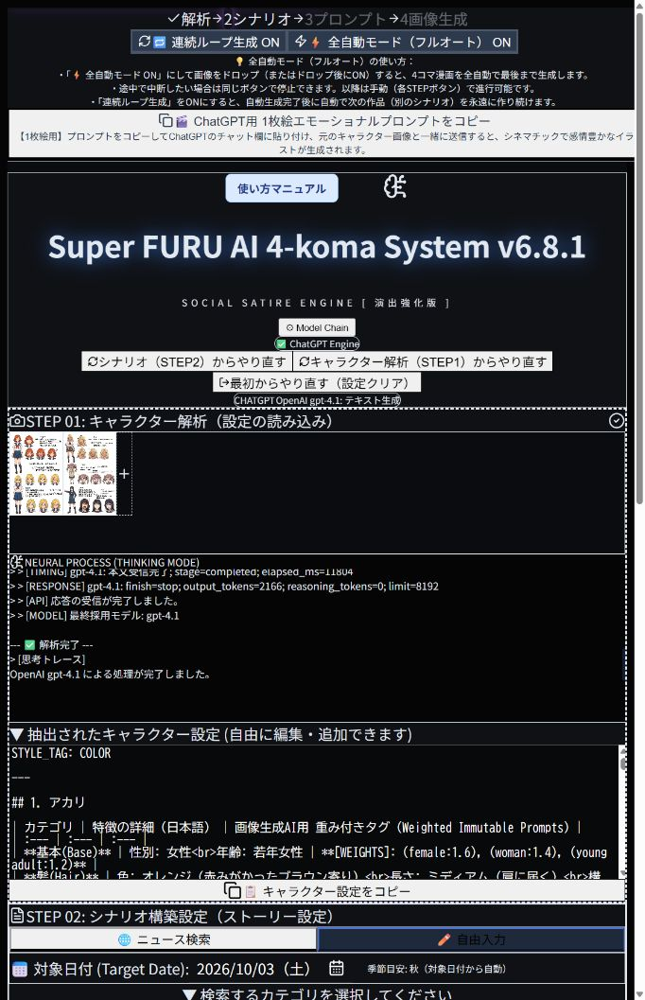
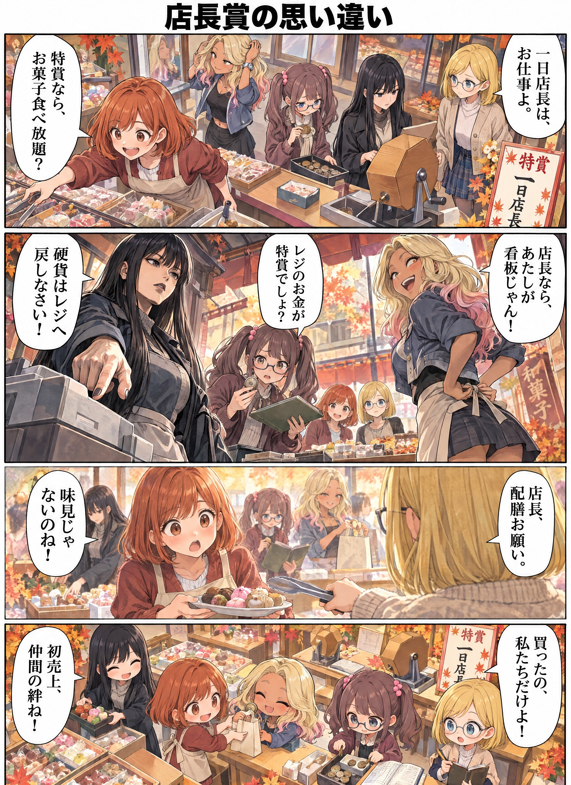
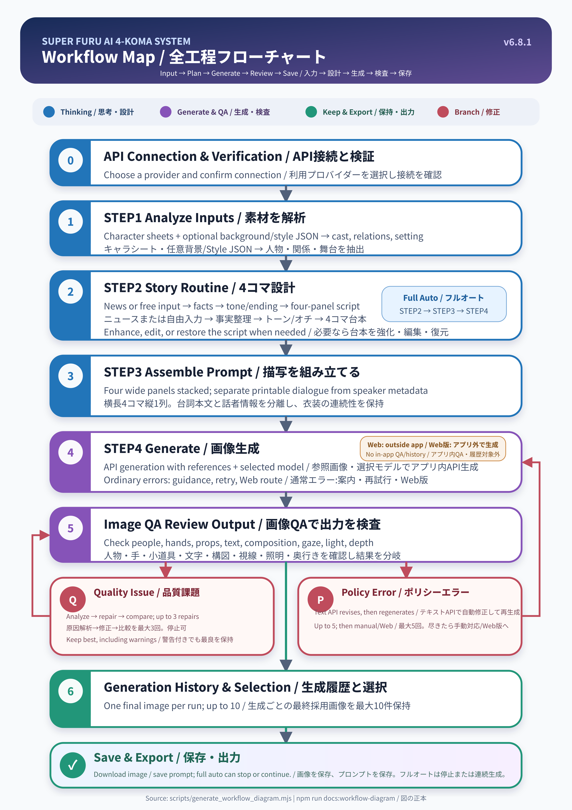
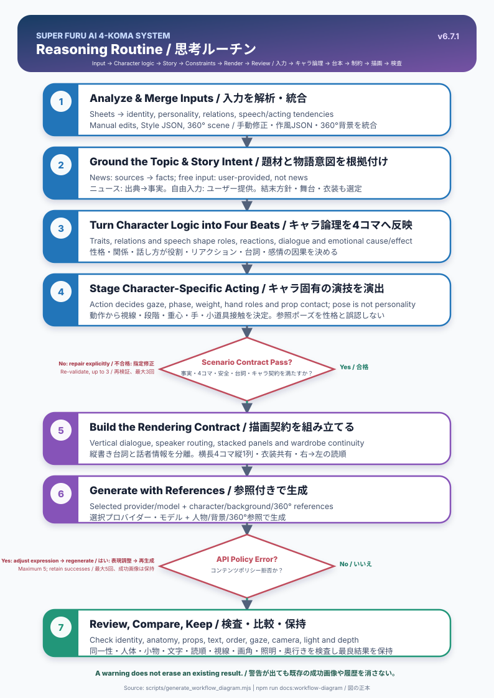

# Super FURU AI 4-koma System / Super FURU AI 4コマシステム

> **Source code available; free to use.** Ordinary use, free integration and free provision require no application, prior contact or permission from FURU. You may sell and monetize your own works. External API costs and third-party terms are separate. See Terms & Output Rights below. / **ソースコード公開・利用無料。** 通常利用と無料の組み込み・無料提供に、申請・事前連絡・FURUの許可は不要です。自分の作品は販売・収益化できます。外部API料金と第三者の条件は別です。詳しくは「利用条件・作品の権利」をご確認ください。


> Current source version: **v6.9.7** / 現在のソース版: **v6.9.7**


An experimental web application in which AI handles topic research, story structure, direction, prompt construction, image generation, and quality review for a four-panel manga. / AIが話題調査、構成、演出、プロンプト構築、画像生成、品質確認まで担当する4コマ漫画制作Webアプリです。

[Open the app / アプリを開く](https://furuyan1234.github.io/nano-banana-pro/) · [Full manual / 全機能PDFマニュアル](https://furuyan1234.github.io/nano-banana-pro/downloads/super-furu-ai-4koma-full-manual-2026-10-01.pdf)

The full operation manual and API setup guides cover v6.9.5, including image limits and the distinction between image counts and people. Current application terms are in [LICENSE](LICENSE). / 全機能マニュアルとAPI取得ガイドはv6.9.5対応で、画像枚数の上限と人数との違いも説明しています。現在のアプリ利用条件は [LICENSE](LICENSE) を参照してください。

## Application screen and output / 操作画面と生成例

| Application / 操作画面 | Generated manga / 生成例 |
|---|---|
|  |  |

Controls captured in the previous release retain the same layout here, alongside an inspected API-generated example. Review the rendered result as well as automated findings; outputs vary. / 左は前版で撮影した接続・素材登録の操作例（本版でも同じ配置）、右はOpenAI API（GPT Image 2.5 Sunburst / max）で生成して確認した作例です。画風・人物の縮尺・台詞は画像を見て確認し、自動検査の未確認項目や軽微な見切れは注意事項として扱います。生成ごとに同じ品質を保証するものではありません。

https://github.com/user-attachments/assets/15608ccc-8d86-4b78-9ff3-785201b42629

## Visual direction and reading / 演出と読みやすさ

Automatic camera design / 自動カメラ設計: STEP2 requires a high or low viewpoint for every automatically designed panel; only an explicit user request can permit eye level. Missing elevation is rejected after bounded retries, with the unaccepted candidate retained in the progress log. Japanese camera-height phrases and positive pitch angles share the same projection parser used by assembly and QA. / STEP2の自動構成は全コマで俯瞰またはアオリを指定し、アイレベルはユーザーの明示指定があるコマだけに限定します。高さ未指定の候補は規定回数の検査後も未達なら次工程へ送らず、進捗欄へ保持します。「高めに撮る」「低めから」などの表現と正の仰俯角を共通判定し、画像QAでは指定文の丸写しを観察証拠にしません。高低の投影証拠が不足する画像は未確認として保持します。画像の出来を保証するものではなく、Webで別途生成した画像はアプリの自動QA対象にはなりません。

Automatic direction retains rectilinear wide angles and excludes fisheye. Choose normal, gekiga, watercolor, pop art, pencil sketch or chibi to suit each scene, without a fixed order or frequency. Selected-mode locks and imported styles remain supported. QA requires observed figure construction, linework and paint, not background effects or classification labels alone. / 「魚眼・アイレベルは使わない」などの禁止指定を採用指示と取り違えず、「顔〜胸の寄り」「長焦点」も画角として認識します。短縮後も顔・身体のアオリ投影指示を保持します。API作例では劇画の顔・淡い水彩・ちびキャラ等の描き分けを確認しています。生成ごとの差は残り、未確認項目を成功として表示しません。通常の広角は自動構成に残し、魚眼は自動候補から外しています。画風の自動候補は通常・劇画・水彩・ポップアート・鉛筆スケッチ・ちびキャラの6種類です。コマの内容と演技に応じて選び、順番や回数は固定しません。選択モードの画風固定を守り、取り込んだ台本の既存画風も保持します。画像QAは背景効果や分類名だけで合格にせず、人物の形・線・塗りを確認します。

Drawing options: STEP2 mosaic masking for existing copyrighted characters and STEP3 watermarking default to ON. The former adds a large-mosaic instruction to scenario and image prompts; disabling the latter removes both footer marks. The settings apply to OpenAI/Gemini API and Web-copy prompts. Rebuild from STEP2 for mosaic changes or STEP3 for watermark changes; toggling alone does not call an API. Settings last until a full reset or reload, do not alter existing images retroactively, and require visual confirmation. / 描画オプション：STEP2の「版権キャラクターにモザイクをかける」と、STEP3の「ウオーターマークを表記する」は初期状態でONです。前者はシナリオ構築と最終画像プロンプトに「版権キャラクターにおおきなモザイクをかける」を追加し、後者をOFFにすると左右のフッターの描画指示を外します。OpenAI／GeminiのAPIとWeb用コピーに共通で反映します。設定変更後はモザイクならSTEP2、ウオーターマークならSTEP3から再作成してください。変更だけでAPIは実行されません。選択は全設定リセットまたは再読込まで保持します。生成済み画像には遡って反映されず、AIの対象判断・描画は実画像で確認してください。

The right footer keeps the scenario-model attribution and shows the current image engine first, for example `ChatGPT Images 2.5 / GPT-6.1 Sol / FURU AI 4-koma v6.9.6`. Changing image quality/model updates the image-engine prefix for API and Web-copy instructions; existing images are retained. / 右フッターはシナリオモデル名を残し、先頭に現在の画像生成エンジン名を記載します。例：`ChatGPT Images 2.5 / GPT-6.1 Sol / FURU AI 4-koma v6.9.6`。画像モデルを変更すると、API・Webコピー用の表記をその選択へ同期します。生成済み画像は保持します。


Mosaic targets are existing-work characters actually depicted in the scripted Action. Reference sheets, art style, resemblance or a shared name alone do not authorize masking original cast members. An intentional source instruction applies only to its specified person and region. Check both masked and unmasked subjects in the final image. GPT-6.1 Sol is the default scenario model in development and production. / モザイク対象は台本のActionで実際に描く既存作品の人物描写です。参照キャラクターシートの存在、画風、外見の類似、同名だけを根拠にオリジナルの登場人物を隠しません。原文で本人への意図的なモザイクを指定した場合は、その対象・領域だけに適用します。最終画像で対象と非対象の両方を確認してください。OpenAIシナリオモデルの初期選択は開発版・公開版ともGPT-6.1 Solです。

Dialogue and page-layout safeguards / 台詞とコマ割り: Printable dialogue is kept separate from speaker routing metadata, with malformed quotes rejected before copying or API submission. Both provider prompts retain four full-width horizontal panels in one vertical column, including after long-prompt compaction. / 台詞本文と話者メタデータを分離し、括弧が壊れた本文はコピー・API送信前に拒否します。両provider・長文圧縮後も、横長4コマを縦1列に積む指定を保持します。台本や設定を変更したらSTEP3でプロンプトを再構築してください。生成AIの描画と画像QAには誤りが残り得るため、実画像の目視確認は必要です。

Quoted source text / 出典の引用: Wording identified as an article or document quotation, including a quoted passage followed by "という記述", remains scene text rather than a nearby character's speech. VisualEvidence labels and quoted sign text stay in visual action, never becoming a speaker or extra bubble. Explicit speaking or reading aloud still gets a bubble. Balloon-layout errors identify the panel and mismatch without assuming user error. Rebuild STEP3 for existing scripts. / 「という記述」などで資料の文言を示す引用は状況描写に残し、近くの人物の吹き出しへ入れません。VisualEvidence欄の看板文字も視覚描写として保持し、話者や余分な台詞として数えません。人物が実際に発話・音読する引用は台詞として保持します。配置エラーでは対象コマと不一致の内容を示し、入力の誤りと決めつけません。既存のシナリオへの反映にはSTEP3を作り直してください。

Balloon speaker labels / 吹き出し配置の話者表記: STEP3 accepts complete-name bracket/spacing variants and acting annotations repeated on the same dialogue line. Collective labels and lists of complete cast names retain their member routing instead of being assigned to one cast member. Different owners, conflicting member lists, empty owners, count/order errors and missing routes still stop assembly. / 話者名の外括弧・空白・中黒の表記差と、同じ台詞行にある演技注記を照合します。「全員（構成員の列挙）」や人物名を列挙した合唱は内訳を配置情報に残し、一人の人物へ置き換えません。参照シートのない店員なども内訳に含められます。別人・内訳の食い違い・空の話者・台詞件数や読順の不一致・尾の経路の欠落は引き続き停止し、話者エラーでは配置側と台詞側の表記を表示します。

Dialogue lettering / 台詞の書字方向: Prefer vertical Japanese lettering. Horizontal lettering is allowed when it best serves composition or readability; direction alone does not fail image QA or trigger paid regeneration. / 台詞は極力縦書きにします。構図や読みやすさに最適な横書きは許容し、横書きだけで画像を不合格にしたり有料再生成したりしません。背景の人物も実体の人数へ含め、紙・画面内に描かれた人物で代替しません。遮蔽や識別困難な人物は未確認とし、明確な欠落と区別します。

Camera and panel styles / カメラと各コマの絵柄: Cast counting does not require exposed faces or a lineup and does not override the scripted projection or panel medium. Relative low camera positions and worms-eye views receive upward projection cues; a character looking over another's shoulder is distinct from an over-the-shoulder camera. / 人数を満たすために顔を見せたり横並びにしたりせず、指定した投影と各コマの絵柄を保持します。基準より低い撮影位置とワームズアイにも投影の補助指示を出し、人物の「肩越しに見る」視線と肩越しカメラを区別します。指示とローカル検査が通っても、実画像が指定を満たすとは限りません。

Single-speaker balloon / 発話が一つのコマ: A lone balloon stays near its mapped speaker while the cast retains the scripted camera positions. A distant body with only a claimed tail connection remains unverified for visual inspection; it does not trigger image regeneration by itself. Rebuild STEP3 for an existing scenario, then inspect the rendered page before publishing. / 発話が一つならフキダシ本体を話者の近くに置き、人物のカメラ指定位置は保持します。本体が話者から大きく離れ、ヒゲ接続の申告だけがある場合は目視確認待ちとし、それだけで再生成しません。既存シナリオはSTEP3から作り直し、公開前に実画像を確認してください。

Balloon planning / 吹き出しの配置設計: STEP2 scenarios plan speaker positions, balloon space and tail routes together. When a layout is present, STEP3 checks speaker order, completeness and right-to-left placement before image submission. Scenarios without layout metadata are supported. Generated images still require visual review. / STEP2では人物位置・吹き出しの余白・尾の経路を一緒に設計します。配置データがある場合、STEP3で話者順・記入漏れ・右から左の配置を検証してから画像へ進みます。配置データのないシナリオも使えます。生成画像の目視確認は引き続き必要です。

Explicit camera fields / 明示カメラ指定: Both `[Camera: ...]` tags and standalone `Camera:` lines take precedence over fallback shots for either provider. / 角括弧タグと独立したカメラ指定行のどちらも、既定の画角より優先します。

Scene-led selection / 場面に応じた選択: STEP2 chooses art styles and endings from the story, without fixed tag quotas or character rotations. A coherent, motivated payoff takes priority over novelty. Up to six recent accepted endings from the current screen session are sent as comparison data during scenario generation and review; they are cleared by the full settings reset or reload. The same ending type, intentional repetition or an uncertain comparison alone does not trigger repair. / 絵柄・決め役・オチの型を固定配分せず、伏線と人物の動機・行動から成立する結末を優先します。同じ画面セッションの直近採用作から最大6件の結末要約を、生成・監査時に接続先AIへ比較資料として送ります。全設定リセットまたは再読込で消去されます。同じ型、意図した反復、不確かな比較だけでは修正しません。画風固定など選択モードの条件は保持します。

Page and focus / 外枠とピント: Keep the four outer frame sides and corners inside the canvas with a visible margin unless full bleed is explicitly requested. Focus follows the scripted speaker, reaction or main action; nonessential foreground and background may soften or use thinner, paler detail. Required text, contacts and reactions remain readable, and explicit deep focus wins. Directional motion blur is optional for scripted movement. / 明示した断ち切りを除き、外枠の四辺・四隅と余白を残します。人数確認は全員を同じ鮮明さにする指定ではありません。話者・反応・主動作に合わせ、非重要な前後景はボケや薄描きを使えます。必要な文字・接触・反応の判読と明示した深いピントは守ります。動きがある場面では方向に沿ったモーションブラーを使えます。実画像で描画を確認してください。

Shoulder-view identity / 肩越しの人物: Registered aliases resolve to one person across camera, balloon tails and cast count. Unresolved or ambiguous names are not replaced by a speaker chosen from dialogue order. Camera-side position alone does not assign the operator of a prop. Keep each actor's scripted gaze and connect tails to contours visible from the specified view. / 登録された別名は、カメラ・吹き出しの尾・人物数で同じ人物として扱います。名前を解決できない場合や別名が重複する場合、台詞順から別人へ置き換えません。カメラに近い人物を小道具の操作者と決めつけず、各人物の指定された視線と、その画角で見える輪郭への尾の接続を保ちます。

Panel art styles / コマごとの画風: Compact prompts retain concrete linework, facial shading and material directions. Automatic chibi deformation yields to camera, acting and expressions; explicit user style and proportion requests remain. Rebuild STEP3 for existing scenarios and inspect the rendered result. / 短縮後も描線・顔の陰影・質感の指示を保持します。自動のちび化よりカメラ・演技・表情を優先し、明示された画風・頭身指定は守ります。既存シナリオはSTEP3から再構築し、実画像で効果を確認してください。

Camera and visual direction / カメラと画作り: Scenarios carry positions, actions and prop states between panels and stage how one character affects another. STEP2 compares the four views and their story roles; material, unintended repetition can receive one direction repair, while meaningful repeats and minor differences are retained. Camera position, elevation, framing, lens perspective and Dutch tilt are designed separately. A contextual pullback normally reveals body action, space and actor distances; large foreground figures, natural crops and intentional close-only pages remain valid. Initial Web/API prompts preserve that framing, use contour and contrast for readability, and allow taller panels for body action. Repeated decorative detail or already-read text alone does not justify zooming in during scenario review; explicitly required text remains protected. Rebuild from STEP2 to change an existing camera plan. Shoulder views retain scripted gaze, and balloon order does not assign horizontal actor slots. Low shots preserve the requested height and project faces, bodies and setting from the same viewpoint. QA requires localized underside evidence for an upward-shot pass; uncertainty alone does not trigger regeneration. Compression preserves expressive acting and layered lighting, with local value, color and contour contrast separating faces and hands from busy settings. Verify the result in the rendered image. / シナリオ段階から位置・動作・小道具をコマ間で引き継ぎ、働きかけと相手の反応を設計します。STEP2で4コマの視点と役割を比較し、意図しない反復が見せ場の差を失わせる場合は演出を1回修正します。意味のある反復や軽微な差は保持します。撮影位置・仰俯角・寄り引き・レンズ遠近・ダッチの傾きは分けて設計します。原則一コマは身体演技・空間・人物間の距離が伝わる引きを設けますが、手前の人物を大きく描ける構図や自然な見切れ、意図した寄りだけのページも保持します。全員の足先や一律の縮小は強制しません。Web/API共通の初回指示で画角を保ち、輪郭と明暗で読みやすくし、身体演技には十分なコマ高を配分します。既出の文字や補助細部を再び大きく読ませるためだけに、シナリオ監査で寄りへ変更しません。ユーザーが明示した可読文字は保持します。既存のカメラ設計を変える場合はSTEP2から作り直してください。肩越しでも台本の視線を保ち、台詞順から人物の左右位置を固定しません。アオリは指定された撮影高さを保ち、顔・身体・背景へ同じ見上げの投影を指定します。検査で下面の具体的な位置を確認できない場合は未確認とし、それだけでは再生成しません。圧縮後も演技と光を残し、局所的な明暗・色・輪郭の差で顔や手を背景から見分けやすくします。効果は実画像で確認してください。

Wardrobe continuity: Clothing and attachments are specified once per character and shared between panels. Scripted dressing or removal remains valid; occlusion and offscreen placement are not missing items. API QA requests repair only with clear evidence of the same person and body region in two panels. Complete visual consistency is not guaranteed. / 衣装の連続性: 4コマでは人物ごとに服と付属品の有無・数・形・取り付け位置を一度決め、コマ間で共有します。台本にある着脱等は保持し、遮蔽や画面外を欠落とは扱いません。API検査は、同じ人物・部位が明瞭に見える2コマの根拠がある場合だけ衣装変化を修正対象にします。生成結果の完全一致を保証する機能ではありません。

[Open the application](https://furuyan1234.github.io/nano-banana-pro/) / [アプリを開く](https://furuyan1234.github.io/nano-banana-pro/)

[Read the detailed note article](https://note.com/happy_duck780/n/ndf063558c1f5) / [詳しいnote記事を読む](https://note.com/happy_duck780/n/ndf063558c1f5)

Panel media and projection / コマ別の画材と投影: Watercolor applies transparent pale washes to figures, clothes, props and backgrounds. Normal, gekiga and chibi use their own opaque color treatment; explicit pale palettes still take priority. Subsequent panels reset inherited chibi anatomy. High/low camera review needs localized evidence on actors, not scenery alone. Explicitly offscreen continuity actors are excluded from physical on-screen counts. / 水彩は人物・服・小道具・背景まで淡い透明な薄塗りを指定します。通常・劇画・ちびキャラは各画風の不透明な塗りを使い、明示した淡色指定は保持します。ちび化の次のコマは頭身を戻します。俯瞰・アオリの検査は背景だけでなく人物の具体的な投影根拠を必要とし、画面外で位置を保持する人物は画面内人数へ数えません。既存の台本はSTEP3から再構築してください。

## AI Manga Creative Suite / AIまんが制作エコシステム

[](https://youtu.be/pqYVxUUg0Cs?si=27g1I3tO2EuZkOuxJ)

This application is the four-panel manga production system in AI Manga Creative Suite. It turns character references and a topic into a reviewed four-panel manga, then keeps the completed image available for the suite's video, translation, background, story, and character-design workflows. / 本アプリはAI Manga Creative Suiteの4コマ漫画制作システムです。キャラクター資料と題材から、検査済みの4コマ漫画を作成し、完成画像を動画化、翻訳、背景、物語、キャラクター設計の各ワークフローへ渡せます。

### AI Voice Comic Maker integration / AI Voice Comic Makerとの連携

Load a completed four-panel manga into [AI Voice Comic Maker](https://github.com/FURUYAN1234/ai-voice-comic-maker) to analyze the page and render a vertical short video with camera movement, BGM, and a selected local voice engine. This makes the completed manga usable as a TikTok or YouTube Shorts video source. / 完成した4コマ漫画を[AI Voice Comic Maker](https://github.com/FURUYAN1234/ai-voice-comic-maker)へ読み込むと、ページを解析し、カメラワーク、BGM、選択したローカル音声エンジンを使った縦型ショート動画をレンダリングできます。完成漫画をTikTokやYouTube Shorts向け動画の素材として使えます。

### Related systems / 関連システム

- [Monogatari Buzz Maker / 物語バズメーカー](https://github.com/FURUYAN1234/viral-radar): Turn evidence-backed Web/RSS trends into planning material for manga, short videos, explainer videos, and novels. / 公開Web・RSSから取得した根拠付きトレンドを、漫画・ショート動画・解説動画・小説の制作案へ整理します。
- [Story Maker](https://github.com/FURUYAN1234/story-maker): Create stories and plots for a manga topic. / 漫画の題材になる物語やプロットを作成します。
- [AI Character Sheet Maker](https://github.com/FURUYAN1234/character-sheet-maker): Create structured character reference sheets for this workflow. / このワークフローに渡す構造化キャラクターシートを作成します。
- [AI Comic Translation Tool](https://github.com/FURUYAN1234/comic-translation): Translate completed manga pages. / 完成した漫画ページを翻訳します。
- [360° AI Panorama Generator](https://github.com/FURUYAN1234/panoforge): Create spatial background material for manga and video. / 漫画と動画向けの空間背景素材を作成します。
- [AI Voice Comic Maker](https://github.com/FURUYAN1234/ai-voice-comic-maker): Convert a completed manga page into a voiced vertical video. / 完成した漫画ページを音声付き縦型動画に変換します。

## A4 workflow map / A4縦フローチャート



This diagram covers the full path from source analysis through scenario thinking, prompt assembly, API image generation, quality review, policy-repair retries, history, and saving. It is generated from `scripts/generate_workflow_diagram.mjs`; `npm run build` regenerates it, and the generator checks the orchestration points it documents. When the workflow changes materially, replace both this README diagram and the matching uploaded image in the note article. / この図は、素材解析から台本の思考ルーチン、プロンプト組み立て、API画像生成、品質検査、ポリシー修正の再試行、履歴、保存までを一枚にまとめています。正本は `scripts/generate_workflow_diagram.mjs` です。`npm run build` 時に再生成され、図が参照する処理の制御点も検査します。フローを大きく変える際は、この図も更新し、公開リリース時にREADMEとnoteの画像を同じ内容へ差し替えます。

### Reasoning routine / 思考ルーチン



This companion map shows how the system classifies a source, builds and validates the four-panel plan, locks required details, builds the rendering prompt, and handles quality or policy branches without discarding an existing successful result. / この補助図は、入力根拠の分類、4コマ設計と検証、保持条件の固定、描写指示の構築、品質・ポリシー分岐時にも既存の成功結果を残す流れを示します。

When a workflow or reasoning rule changes materially, run `npm run docs:workflow-diagram` and replace this README image and its matching note image in the same release. / ワークフローまたは思考ルールを大きく変更した際は、同一リリースで `npm run docs:workflow-diagram` を実行し、このREADME画像とnoteの対応画像を差し替えます。

## What this project does / このプロジェクトでできること

The application provides one continuous four-step workflow. / アプリは次の4ステップを一続きで実行します。

1. **Character analysis / キャラクター解析:** Read a character sheet or reference image and extract identity traits. / キャラクターシートや参照画像から人物の識別要素を抽出します。
2. **Scenario / シナリオ:** Generate a four-panel story and optionally strengthen its direction. / 4コマのシナリオを生成し、必要に応じて演出を強化します。
3. **Prompt / プロンプト:** Build an editable image prompt and run an automatic AI consistency review before display. / 編集可能な画像プロンプトを構築し、表示前にAI整合性チェックを自動実行します。
4. **Image / 画像:** Generate through Google Gemini or OpenAI, inspect the result, and offer bounded repair when enabled. / Google GeminiまたはOpenAIで画像を生成し、結果を検査し、設定時は回数を制限した修正候補を作ります。

### Complete current feature map / 現行機能の全体像

| Area / 領域 | Current behavior / 現在の動作 |
|---|---|
| Provider connection / API接続 | Choose Google Gemini or OpenAI, verify the selected provider before work, and keep STEP1–4 on that provider. A ChatGPT subscription and OpenAI API billing are separate. / Google GeminiまたはOpenAIを選択し、処理前に接続を確認します。STEP1～4は選択したプロバイダーへ統一されます。ChatGPTの契約とOpenAI APIの課金は別です。 |
| STEP1 material recognition / 素材の認識 | Drop character, expression, turnaround, background and prop images together. AI recognizes material roles and identities, with optional later additions or individual removal. Reference-sheet pose, labels and layout are not copied into the manga. / 人物・表情集・三面図・背景・小物をまとめて読み込み、AIが種類と人物の同一性を認識します。後から追加・個別削除でき、参照画像のポーズ・ラベル・紙面構成は漫画へ流用しません。 |
| Optional style and space / 任意の画風・空間 | Load a style-setting JSON. A 2:1 equirectangular image is separated from character sheets, analyzed as a 360-degree background, assigned a panel camera direction and cropped for generation. / 作風設定JSONを読み込めます。2:1の全天球画像はキャラシートから分離し、360°背景として解析し、コマ別の撮影方向とクロップを生成へ渡します。 |
| STEP2 topic / 題材 | Use category news search or free input. Free input treats only the supplied subject or successfully retrieved URL text as story material: interface/input-mode labels, news-only search and date rules, internal placeholders, and prior-session topics are excluded. If a model still emits an internal label, the bounded improvement loop compares candidates and keeps the best one, then deterministic cleanup removes only the leaked labels and revalidates the result instead of aborting the scenario. Explicit location and outfit overrides take priority. A short editable SNS explanation and source links are kept outside the manga script. The target date includes its Japanese weekday in parentheses; the seasonal hint appears beside it. / カテゴリニュース検索または自由入力を使えます。自由入力では、入力した題材または取得に成功したURL本文だけを物語材料として扱い、UI・入力モード名、ニュース専用の検索・日付規則、内部プレースホルダー、前回題材を除外します。モデルが内部ラベルを残した場合も、改善ループで候補を比較して最良を保持し、漏れたラベルだけを決定処理で除去して再検査するため、シナリオを打ち切りません。明示した場所・衣装を優先し、編集可能なSNS説明文と出典リンクは漫画台本の外で管理します。対象日付の括弧内に曜日を表示し、右側に季節目安を添えます。 |
| Story-required guests / 物語上必要な新キャラ | A role character required by the script, such as a merchant or receptionist, is included in the per-panel cast count even without a reference sheet. If that person recurs, identity, adult age, clothing, props, position and action continuity stay fixed; the system must not clone, replace or silently omit the role. / 商店主や受付係など台本上必要な役職人物は、参照画像がなくても各コマの登場人数へ含めます。再登場時は同一人物として、成人年齢、服装、小道具、位置、動作の連続性を保ち、複製・別人化・理由のない省略を防ぎます。 |
| Ending selection / 結末 | Automatic, Gag automatic, individual gag endings, Serious automatic, individual serious endings, Gag Documentary and Serious Documentary. Automatic choice is resolved once and carried into STEP3–4; an incompatible label returned by the text model cannot replace the resolved selection. / 全体おまかせ、ギャグ内おまかせ、個別ギャグ、シリアス内おまかせ、個別シリアス、ギャグ・ドキュメンタリー、シリアス・ドキュメンタリーを選べます。自動選択の結果はSTEP3～4へ固定して渡し、文章モデルが返した非互換のオチ名で上書きしません。 |
| Scenario enhancement / シナリオ強化 | Independently select expression, body, effects, background, camera, dialogue and story-direction enhancement. Revert to the pre-enhancement scenario at any time. Documentary direction has a fact-preserving variant for both gag and serious modes. / 表情、身体、演出、背景、カメラ、セリフ、物語演出を個別選択でき、強化前へ戻せます。ドキュメンタリーではギャグ・シリアスの両方に事実保持型の演出を使います。 |
| STEP3 prompt / プロンプト | Choose color or monochrome, build the provider-specific prompt, run a text-model consistency review, edit the final prompt, and copy it for Web use. Failed reviews retain the original prompt and show an incomplete-review warning with the actual model/HTTP reason. Input errors are distinguished from API failures. Changing or reverting the scenario cancels the old review and unlocks STEP3. As soon as the prompt is ready, save a privacy-safe companion JSON for manual Web generation; it does not wait for an API image. / カラー／白黒を選び、プロバイダー別プロンプトを構築し、文章モデルの整合性確認後に編集・Web用コピーができます。精査失敗時は元の指示文を保持し、精査未完了と実際のモデル・HTTP状態・理由を表示します。入力不備とAPI障害は区別し、シナリオの変更・復元時は旧精査を中断してSTEP3を操作可能に戻します。最終プロンプト完成時点で、API画像を待たずにWeb手動生成用の安全化済み別添JSONを保存できます。 |
| STEP4 image / 画像 | Generate in the app, choose available quality and size settings, stop remaining quality retries, or use the copied prompt manually on the provider's Web UI. API-generated PNG downloads automatically embed a separate API-image production record with the actual model and output hash. / アプリ内で生成し、利用可能な品質・サイズを選択し、残りの品質再試行を停止できます。コピーしたプロンプトを公式Web画面で手動利用する経路もあります。API生成PNGには、実際のモデルと出力画像ハッシュを含むAPI画像専用の制作情報を自動保存します。 |
| Review and history / 検査・履歴 | Review panel count, dialogue, balloon order and speaker tails, per-panel character identity and eyewear, anatomy, camera, prop ownership, surface orientation, unwanted text and medium compliance. Explicit rear and over-the-shoulder shots receive an independent camera audit; a repair that fixes the named rear foreground without regressing bubble order or adding another concrete defect is preferred. QA independently inventories every readable or partly readable glyph sequence on bubbles, signs, packaging, labels, books and screens. Plausible AI-completed environmental text is allowed unless it materially contradicts the setting, identity, facts, clues, action or joke; omitted or unclassified text stays unverified. Keep only the final accepted image from each generation in the latest-ten session history; repair candidates remain internal. / コマ数、台詞、吹き出し順・尻尾、各コマの人物同一性と眼鏡、人体、カメラ、小道具所有、面の向き、不要文字、カラー／白黒条件を検査します。明示された背面・肩越し構図は独立したカメラ監査も行い、指定された前景背面を直しつつ吹き出し順を退行させず、別の具体的不具合を増やさない修正版を優先します。吹き出し、看板、包装、ラベル、本、画面に見える全文字と部分文字を画像から独立転記します。AIが情景に沿って補完した環境文字は、場所・人物・事実・手掛かり・動作・オチを大きく誤らせない限り許容し、一覧漏れや分類不能は未確認として残します。セッション内履歴には各生成の最終採用画像だけを直近10件まで保持し、修正途中の候補は内部比較だけに使います。 |
| Full-auto controls / フルオート | The workflow can advance through STEP2–4, show the current stage and countdown, and be stopped without clearing the already completed work. / STEP2～4を自動で進め、現在段階とカウントダウンを表示し、完了済みの内容を消さずに停止できます。 |
| Video handoff / 動画化 | Copy the generic MiniMax H3 prompt, or download the separate FourPanel ComfyUI workflow JSON and matching custom-node package. / 汎用MiniMax H3プロンプトをコピーするか、別配布のFourPanel ComfyUIワークフローJSONと対応カスタムノードを取得できます。 |

STEP1 moves to its live analysis log while character sheets are being read. STEP2 through STEP4 place the newly actionable main button near the lower edge after the preceding step completes. STEP4, its copy controls, image settings and history stay hidden until STEP3 has produced a non-empty final prompt. When STEP3 starts, the view moves to its live progress log; only after a final prompt is ready does it move to STEP4. Editing an already completed prompt does not move the view. Starting image generation scrolls once to the center of the image display area; subsequent progress updates leave manual scrolling alone. A single-line spinner, current phase and elapsed time appear in that area's center until processing ends. The history strip stays locked during STEP4 without a duplicate generation badge. The completed image fades in over 450 ms. STEP4 keeps its current phase and total elapsed seconds in the fixed log header until the run ends. After each step, the next available main STEP button slowly alternates between darker and brighter states; reduced-motion browser settings disable animation and smooth scrolling. / STEP1はキャラクターシート解析中に実際の進捗ログへ移動します。STEP2〜STEP4は前のSTEPが完了した時点で、次に操作できる主ボタンを画面下端寄りに表示します。STEP3が空でない最終プロンプトを作るまで、STEP4、コピーボタン、画像設定、履歴は表示しません。STEP3開始時は実際の進捗ログへ移動し、最終プロンプトが完成した時だけSTEP4へ移動します。完成済みプロンプトの手動編集では画面を移動しません。画像生成開始時は一度だけ画像表示予定枠の中央へ移動し、その後の進捗更新では手動スクロールを妨げません。その枠の中央に回転アイコン・処理名・経過時間を1行で表示し、処理終了時に消します。STEP4中は生成履歴の操作をロックし、履歴側には重複する「生成中」表示を出しません。完成画像は450ミリ秒でふわっと表示します。STEP4の進捗窓の固定見出しには、終了まで現在の処理と合計経過秒数を表示します。各STEP完了後は次に押せる主ボタンがゆっくり明暗変化し、ブラウザーの視差効果軽減設定ではアニメーションと滑らかなスクロールを止めます。

### Story construction algorithm / 物語アルゴリズム

The story routine is a constrained editor rather than a single request to “make a funny manga.” It processes the following layers in order. / 物語ルーチンは、単に「面白い漫画を作る」と依頼する一発生成ではなく、次の制約層を順に処理します。

1. **Normalize input facts / 入力事実の正規化:** Separate source/reference metadata, URLs, article titles, interface labels, input-mode names and internal placeholders from drawable events and real character dialogue. News-only category/date/freshness instructions never enter free-input prompts. Compound headings such as `出典・参考:` and their bullet lists remain posting metadata and never become a speaker, balloon or visible label. Explicit quotations spoken by a character and explicitly required prop lettering remain in the script. / 出典・参考メタデータ、URL、記事名、UIラベル、入力モード名、内部プレースホルダーを、描画する出来事と実際の人物台詞から分離します。ニュース専用のカテゴリ・日付・鮮度指示は自由入力プロンプトへ入れません。`出典・参考:`のような複合見出しと箇条書きは投稿用情報として扱い、話者・吹き出し・画面文字へ変換しません。人物が実際に話す引用と明示された小道具文字は保持します。
2. **Resolve tone once / 調子の確定:** Resolve automatic selection into one gag or serious ending policy. Serious topics protect consequence and restraint; documentary modes additionally lock facts, numbers, chronology and causality. / 自動選択をギャグまたはシリアスの結末方針へ一度だけ確定します。シリアス題材は結果と抑制を守り、ドキュメンタリーでは事実・数値・時系列・因果も固定します。
3. **Build a four-beat comic or dramatic spine / 4段階のギャグ・ドラマ設計:** Ordinary gag construction uses a character desire or contradiction, setup, readable escalation, then a visual reversal or payoff. A Surreal ending is deliberately different: it may use destruction, causal leaps, incoherence and absurd visual change without retroactive explanation, provided the absurd event is visible and the ending is not merely a slogan. Serious construction uses concrete loss, cost, choice, action and aftermath; it avoids manufacturing emotion with a lecture or abstract feeling words alone. / 通常ギャグは人物の欲望または矛盾、仕込み、読める増幅、視覚的な反転または回収で組みます。静寂型（シュール）は別契約で、物・設備・舞台の破壊、因果の飛躍、支離滅裂、不条理な画面変化を、後付け説明で合理化せず許可します。目で分かる出来事があり、標語だけの結末でなければ、論理的な伏線や回収を要求しません。シリアスは具体的な損失、代償、選択、行動、余韻で組み、説教や抽象感情語だけで深刻さを作りません。
4. **Apply documentary variants / ドキュメンタリー分岐:** Gag Documentary accumulates verified facts in panels 1–3 and uses a character reaction or fact-derived payoff in panel 4 without inventing an incident, statement, prize or failure. Serious Documentary strengthens the human consequence and aftermath while preserving the reference style and ordinary proportions. / ギャグ・ドキュメンタリーは1～3コマで確認済み事実を積み、4コマ目を人物の反応または事実由来の回収にし、事件・発言・受賞・失敗を捏造しません。シリアス・ドキュメンタリーは参照絵柄と通常頭身を守り、人への影響と余韻を強めます。
5. **Assign visual evidence, guests and props / 視覚証拠・新キャラ・小道具:** Select concrete objects, equipment and actions that prove this topic. Add a role character only when the story needs that person, count the guest in every applicable panel, and preserve identity and spatial continuity when recurring. Preserve each prop's owner, function, material, facing, contact and transfer. Do not mechanically turn every increase or shortage into longer paper, a scroll or an accordion object. / 題材を絵で証明する物、設備、行動を選びます。物語上必要な場合だけ役職人物を加え、該当コマの人数に含め、再登場時は同一人物と位置関係を維持します。小道具の持ち主、用途、材質、向き、接触、受け渡しを保持し、増減や不足を毎回長い紙・巻物・蛇腹へ機械変換しません。
6. **Design acting identity and contrast / 演技個性と緩急:** If a cast profile explicitly describes acting habits, the Acting Identity Lock keeps character-specific tendencies in lean, posture, gesture amplitude or frequency, gaze and object-check behavior. It expresses the tendency through different story actions instead of repeating one pose, and never infers personality from a reference-sheet pose alone. / キャラクター情報に演技癖が明記されている場合、Acting Identity Lockが前傾、姿勢、身振りの振幅・頻度、視線、物の確認動作を人物固有の傾向として保持します。同じポーズを反復せず、物語ごとの別動作で表し、参照画像のポーズだけから性格を推測しません。
7. **Pair camera and action / カメラと動作:** Write each `Camera` and action as one physical shot. Specify position, height, azimuth, crop, lens effect, visible surfaces, action phase, support leg or seat, center of gravity, left/right hand roles and contact target. Explicit camera and action always win. / 各`Camera`と動作を一つの物理ショットとして設計します。撮影位置、高さ、左右方向、範囲、レンズ効果、見える面、動作段階、支持脚・座面、重心、左右の手、接触先を具体化し、明示CameraとActionを最優先します。
8. **Control page rhythm and focus / 紙面リズムと注視点:** Give each panel one first-read subject or action and at most one supporting cue. The focal subject receives the strongest contour, contrast, placement and light; secondary people and background use thinner lines, lower contrast, selective omission or physically consistent depth of field. A quiet panel still retains enough setting shape and depth to understand the space. / 各コマの第一注視対象または動作を1つ、補助要素を最大1つに絞ります。主対象へ最も強い輪郭、コントラスト、配置、光を与え、脇役と背景は細い線、低コントラスト、選択的省略、物理的に整合する被写界深度で整理します。静かなコマでも空間が分かる場所の形と奥行きは残します。
9. **Lock script and lettering / 台本・文字固定:** Keep four panels with content-driven heights, exact dialogue, speaker order and title. Reserve Japanese balloons from right to left independently of character placement: B1 is the rightmost body and later balloons move left. Tail roots leave the lower speaker-facing half of each bubble, use a clear route around heads/faces/hair/text, and end at the assigned speaker. Explicit object text remains exact. Unspecified posters, signs, packages, menus and book covers keep natural artwork, pictograms, color blocks, borders, material and layout; natural context-appropriate lettering may be readable or decorative, short or long, in any amount or density. Do not suppress or simplify a surface merely because its lettering was not scripted. Image QA transcribes every visible glyph from pixels rather than inferring correctness from this prompt. / 内容に応じた高さの4コマ枠、台詞全文、話者順、タイトルを保持します。人物配置と独立して日本語吹き出しを右から左へ予約し、B1を最右、後続を左へ置きます。尻尾は吹き出し下半分の話者側から出し、頭・顔・髪・台詞文字を避けて指定話者へ接続します。明示された物体文字は正確に保持します。未指定のポスター、看板、包装、メニュー、書籍表紙は、自然な図柄・アイコン・配色・枠・材質・レイアウトを残し、場所に自然な文字を可読／装飾、短文／長文、量や密度を問わず自由に描けます。台本にない文字だからという理由で面を抑制・簡略化しません。画像QAではプロンプトから正しさを推測せず実画像に見える文字をすべて転記して照合します。
10. **Assemble, review and choose / 構築・検査・採用:** STEP3 composes provider-specific instructions, preserves the locks during prompt compaction and asks the text model to review inconsistencies. STEP4 reviews the rendered image. A later scenario-enhancement request failure keeps the strongest already validated safe candidate; a failure before any usable candidate remains an error. Image repairs keep a bounded history and select the best inspected candidate when every attempt still has issues. / STEP3はプロバイダー別指示を組み、長文短縮後も各ロックを残し、文章モデルに矛盾確認を依頼します。STEP4は実画像を検査します。シナリオ強化の後続APIが失敗しても検証済み安全候補があれば最良候補を保持し、候補が一つもない最初の失敗はエラーとして扱います。画像修正は上限付き履歴を比較し、全候補に問題が残る場合も検査上の最良候補を採用します。

### Image anatomy and drawing priorities / 人体・描線・情報整理

- The primary character, face, hand or story prop receives the strongest G-pen-like contour and clearest local contrast. Distant or secondary detail is lighter and thinner; decorative clutter may be omitted. / 主役の人物・顔・手・重要小道具へ最も強いGペン風輪郭と局所コントラストを与え、遠景・脇役は薄く細くし、不要な装飾を省略できます。
- Joint chains must remain coherent through neck, shoulders, elbows, wrists, hips, knees and ankles. Each visible hand belongs to one connected arm and each prop has a readable owner, grip, support and contact. / 首、肩、肘、手首、股関節、膝、足首の連鎖を整合させ、見える手を一本の腕へ接続し、小道具の持ち主・把持・支持・接触を読めるようにします。
- Rear and shoulder views retain the scripted head direction; reactions use visible head pitch, shoulder tension and weight. Explicit turns and profiles remain allowed. The shared prompt aligns skull, face, ears, neck and rigid headwear in one rotation, including visible front/back surfaces. Rear speakers' tails target their visible head contour without revealing a hidden mouth. / 後ろ姿・肩越しでは指定された頭の向きを守り、見える後頭部の傾き・肩の緊張・重心で反応を伝えます。明示された振り向き・横顔は保持します。共通プロンプトで頭蓋・顔・耳・首・固定された頭飾りの回転と表裏をそろえ、後ろ向きの話者の尾は見える頭の輪郭へ結びます。見えない口を出すための振り向きは加えません。
- Four identical conversational bust shots, identical distance in every panel, everyone looking into the lens, unclear space, unclear prop ownership, dialogue-only staging and an unexplained final-panel location jump remain prohibited. Camera movement, lighting, gaze, acting, expression, continuity, time and speaker clarity are reviewed together. / 会話人物のバストアップ4連続、全コマ同距離、全員カメラ目線、空間不明、小道具所有不明、会話だけの絵、理由のない最終コマの場所変更は引き続き禁止です。カメラ、照明、視線、演技、表情、位置、小道具、時間、話者の明確さをまとめて確認します。

These are generation and review constraints, not guarantees. Provider image models can still miss anatomy, Japanese glyphs or exact staging, so the actual output remains the acceptance evidence. / これらは生成・検査条件であり、結果保証ではありません。画像モデルは人体、日本語文字、厳密な構図を誤る場合があるため、採否は実際の出力画像で確認します。

STEP2 keeps the material story, acting and camera audit. For balloon-only defects it requests only existing BalloonLayout/Camera/situation field edits, validates their schema and speaker/order mapping locally, and re-audits the resulting scenario. Invalid edits retain the previous candidate; unchanged repairs stop without another audit. / STEP2は物語・演技・カメラの重大欠陥の監査を維持します。吹き出しだけの問題は既存のBalloonLayout・Camera・状況への差分だけを依頼し、書式・話者・読順をローカル検査してから修正後の台本を再監査します。不正な変更は前候補を保持し、無変更の修正案は追加監査せず停止します。処理時間の短縮や最終画像の正確さを保証するものではありません。

STEP3 distinguishes quoted descriptions from spoken dialogue, preserving quotations inside each utterance. If balloon layout data is inconsistent, the text AI repairs only the affected layout fields in one additional request, then continues assembly and review. Dialogue, camera, actions and other panels remain unchanged. If repair cannot complete, the original script is retained with the affected panel, exact dialogue and failure reason. / STEP3は状況説明中の引用と実際の発言を区別し、台詞の中の引用もそのまま保持します。配置データに不整合がある場合は、文章AIへの追加1リクエストで該当コマの配置だけを自動修復し、指示文の構築・精査へ進みます。台詞・カメラ・状況・正常なコマは変更しません。修復を完了できない場合は元の台本を保持し、該当コマ・台詞・修復できなかった理由を表示します。

Malformed AI review responses are sent back for one format-repair request before adoption; a still-invalid result is never marked as a completed review. Image-review format repair inspects the same images without generating a replacement image. Force Stop cancels active image-stream reading as well as the request, removes the obsolete waiting indicator and preserves acquired work. / AI精査の返答形式が不正な場合は、採用前にAIへ1回の形式修復を依頼します。修復後も不正な返答を精査完了とは扱いません。画像精査の形式修復は同じ画像を検査し、画像自体は再生成しません。全行程強制ストップはリクエストに加えて画像ストリームの受信待ちも中断し、古い待機表示を消して取得済みの作業を保持します。

Automatic endings are chosen from the topic rather than a random forced category. The story audit checks whether the final action makes the change readable, with evidence and a correction for material failures. A coherent dream, sleeping action, loop, silence or surreal contrast remains allowed; a selected ending is preserved. / おまかせの結末は型の抽選で強制せず、題材から選びます。構成監査は最後の行動から何が変わったか読めるかを確認し、重大な欠落には根拠と具体的な修正を求めます。成立する夢・睡眠・ループ・沈黙・シュールは残し、指定したオチを勝手に別の型へ変えません。実際の分かりやすさは生成台本・画像での確認が必要です。

### Models used by the scenario routine / シナリオルーチンのモデル

OpenAI reasoning models reserve up to 32,768 tokens for reasoning plus text; legacy models retain an 8,192-token text limit. These are ceilings, not fixed consumption. Both manual and news-search routes check completion before accepting text. A token-limit termination stops with its exact reason instead of treating it as an empty response, accepting a partial scenario, or cycling through other models. Logs show the finish status, output/reasoning usage and configured limit. Genuine completed empty responses retain the normal fallback route; scenario-quality review remains separate. / OpenAI推論モデルは推論＋本文の上限を32,768トークン、旧モデルは本文上限を8,192トークンに分けます。毎回その量を使う設定ではありません。自由入力・ニュース検索とも終了状態を確認してから本文を採用し、上限で途中終了した場合は理由を表示して停止します。空応答扱いでモデルを次々切り替えたり、途中のシナリオを成功扱いしたりしません。ログには終了状態・出力／推論使用量・設定上限を表示します。正常終了した本当の空応答のフォールバックと、シナリオ品質による修正は別に扱います。

| Selected provider / 選択API | STEP2 scenario and enhancement route / STEP2のシナリオ・強化経路 |
|---|---|
| OpenAI | `gpt-6-astra` → `gpt-6.1-sol` → `gpt-6-sol` → `gpt-5.6-sol` → `gpt-5.6-terra` → `gpt-6-luna` → `gpt-5.6-luna` → `gpt-4.1` → `gpt-4.1-mini` → `gpt-4.1-nano` → `gpt-4o` |
| Google Gemini | `gemini-3.8-flash` → `gemini-3.7-flash` → `gemini-3.6-flash` → `gemini-3.5-flash` → `gemini-3.5-flash-lite` → `gemini-3.1-flash-lite` |

`gpt-6.1-sol` is the public default for OpenAI scenario work, and local development uses the same default. The dropdown can explicitly start from any listed GPT-6.1, GPT-6, GPT-5.6, GPT-4.1, or GPT-4o option; on failure, the app tries only the models below that selection in the displayed order. `gpt-6-astra` is unrelated to Google's Project Astra product name. The app sends the scenario prompt through its provider route and does not inherit the Codex desktop task's High or Extra High reasoning setting. Model presence in a list is not proof of image quality; the rendered manga still requires visual review. / OpenAIのシナリオ作成では、公開版・ローカル開発版とも`gpt-6.1-sol`から開始します。プルダウンでは一覧にあるGPT-6.1、GPT-6、GPT-5.6、GPT-4.1、GPT-4oの各モデルを開始位置として明示選択でき、失敗時は選択位置より下のモデルだけを表示順に試します。`gpt-6-astra`はGoogleのProject Astraという製品名とは別物です。アプリは選択プロバイダーの経路へシナリオ指示を送信し、Codexデスクトップ作業の「高い」「極高」推論設定を引き継ぎません。モデル一覧への表示は画像品質の証明ではなく、生成画像の目視確認が必要です。

STEP3 shows `⏳ AI応答を待機中... (○秒経過)` directly below its build button while the connected text API reviews the prompt, then stops the counter when processing ends. / STEP3は接続中の文章APIがプロンプトを精査している間、構築ボタン直下に`⏳ AI応答を待機中... (○秒経過)`を表示し、処理完了時にカウントを停止します。

STEP2–STEP4 retain the final total elapsed time on the last line inside each progress window, including failed runs. STEP4 includes image generation and checks; these totals are not individual API response times. The STEP2 progress frame also stays visible when a pasted scenario has no execution log; it does not invent a completion. Starting a new run or resetting replaces the corresponding log. / STEP2〜STEP4は処理終了後も、それぞれの進捗窓内の最終行に合計所要時間を残します。エラーで終了した場合も記録します。STEP4は画像生成と検査を含む時間で、各API単体の応答時間とは区別します。手入力したシナリオで実行ログがない場合もSTEP2の進捗枠を残し、未実行を完了として表示しません。次の実行開始やリセット時には対応するログを置き換えます。

While STEP1 recognises materials, the page ends at its progress log; results and copying return when processing ends. Pending references cannot enable copying. STEP2/STEP3 also keep downstream output hidden during processing. Example images fit narrow material panels. Whole-STEP1 drop, file selection, manual editing and retained images remain supported. / STEP1の素材解析中は進捗窓までを表示し、認識結果・編集・コピーは処理終了後に表示します。未解析の素材はコピーできません。STEP2・STEP3も処理中は後続の出力を隠し、進捗を末尾に表示します。見本画像は狭い素材欄の幅に収まります。STEP1全体へのドロップ、ファイル選択、手入力、取得済み画像の保持は維持します。

### Image history and downloads / 生成履歴と保存

The current session keeps only the final accepted image from each API generation in the latest-ten history strip. Adding an eleventh image removes the oldest history entry, so download images you want to keep first. Repair candidates are used only for internal comparison and are not shown in user history. Select any entry to return it to the preview, then use the normal download button to save that selected image. Files use `AI_4koma_comic_{API}_{title}_{YYYYMMDDHHMMSS}.{extension}`. History is current-session memory only and does not survive a page reload; the app does not request a destination folder or automatically write image files. / 現在のセッションでは、各API生成の最終採用画像だけを直近10件まで生成履歴へ残します。11件目を追加すると最も古い履歴が外れるため、残したい画像は先にダウンロードしてください。修正途中の候補は内部比較だけに使い、ユーザーの履歴には表示しません。任意の履歴を選択するとプレビューへ戻り、その選択画像を通常のダウンロードボタンで手動保存できます。ファイル名は `AI_4koma_comic_{API}_{title}_{YYYYMMDDHHMMSS}.{extension}` の形式です。履歴は現在のブラウザー内メモリのみで、ページ再読み込み後には残りません。保存先フォルダーの選択や画像ファイルの自動保存は行いません。

After an API image appears, a six-line additional-instruction field and pale-purple send button become visible below it. Actual image dimensions remain visible after editing or selecting a history entry; detailed page-band sizes appear only when that image has verified layout metadata. Send the displayed image to the connected OpenAI or Gemini provider to create one edited version. Before display, the app keeps an already-correct A4 page byte-for-byte and automatically normalizes only an off-ratio result; a normalization failure retains the prior image and reports the reason. Input is disabled during processing; a failed edit keeps the image and instruction. Successful edits join the latest-ten history so the source can be selected again. Manual edits do not rerun the original scenario or automatic QA/repair; inspect the changed image yourself. The field shows the remaining instruction budget, reserving space for the fixed edit instructions; the complete request is checked again before sending. Each submission incurs API usage. / API生成画像の下に6行の追加指示欄と淡い紫の送信ボタンが表示されます。修正後や履歴切替後も実際の画像サイズを表示し、タイトル帯などの詳細はその画像に確認済みのレイアウト情報がある場合に表示します。表示中の画像を接続中のOpenAIまたはGeminiへ送り、修正版を1枚作ります。表示前にA4比率を判定し、正しい画像は再処理せずそのまま使い、ずれた結果だけを自動補正します。補正に失敗した場合は元画像を保持して理由を表示します。処理中は入力を無効化し、失敗時は元画像と入力内容を保持します。成功時は修正版を直近10件の履歴に追加し、元画像へ戻せます。手動修正では元シナリオの再生成や自動品質検査・再修正は行わないため、修正結果を確認してください。固定指示文の分を引いた残り文字数を表示し、入力上限と送信直前の検査で超過を防ぎます。送信ごとにAPI利用料がかかります。

For a local face defect, identify the panel and person in the additional-instruction field. The edit instructions preserve camera, head turn, gaze, expression, focal blur and linework while rebuilding the defective head connections. Automatic QA can miss visible defects; compare the repair with the original. Intentional stylization and transformations remain allowed. / 顔崩れを直す場合は、追加指示欄でコマと人物を指定してください。頭部のつながりを局所的に直し、カメラ・顔の向き・視線・表情・ぼかし・線の強弱を保つよう指示します。自動検査でも見逃しがあるため、修正後は元画像と見比べてください。意図的なデフォルメや変身は維持します。

If a rear-view repair still distorts the head, explicitly request natural occlusion for that panel, with hidden facial features left unseen and the reaction conveyed by head and shoulder posture. This is an optional local direction change, not a ban on profiles or expressive turns. / 後ろ姿の頭部が修正後も崩れる場合は、そのコマだけ「頬や目を無理に見せず、自然な後頭部と耳の裏側を描く」と追加指定できます。反応は頭の傾きや肩の姿勢で残します。これは任意の局所演出変更で、横顔や振り向きを一律に禁止するものではありません。

### Machine-readable AI production metadata / 機械可読なAI制作情報


The two production-record paths are deliberately separate. The Web companion JSON becomes available when the final prompt is ready and records the intended Web provider, preparation time, final prompt, scenario, selected settings, and SHA-256 fingerprints of reference images. Because Nano Banana does not receive the image produced on the provider's Web UI, this record does not invent a model ID, API fallback state, generation time, generation ID, output object, or output-image hash. / 制作情報は2経路を意図的に分離しています。Web版用の別添JSONは最終プロンプト完成時点で保存でき、貼り付け先のWebプロバイダー、準備日時、最終プロンプト、シナリオ、生成設定、参照画像のSHA-256指紋を記録します。Nano Bananaは公式Web画面で生成された画像を受け取らないため、モデルID、APIフォールバック状態、画像生成日時、生成ID、出力オブジェクト、出力画像ハッシュを推測・捏造しません。

API-generated image downloads are saved as PNG and embed a separate canonical UTF-8 JSON API-image record. It includes the actual API provider/model, generation time, final sent prompt, scenario, selected settings, fallback state, the SHA-256 of the PNG before the self-referential metadata chunk is inserted, and reference-image fingerprints. Both paths automatically redact high-confidence API-key strings and local user paths. Raw character-analysis text, raw place/background-analysis fields, API keys and reference-image bodies are never included. An application iTXt chunk retains long Japanese prompts, and re-embedding replaces this app's older record rather than accumulating stale copies. / API生成画像はPNGでダウンロードし、別系統のUTF-8正本JSONを画像内へ埋め込みます。実際のAPIプロバイダー／モデル、生成日時、実送信した最終プロンプト、シナリオ、生成設定、フォールバック有無、自己参照になるメタデータチャンク挿入前の出力PNGのSHA-256、参照画像の指紋を記録します。両経路ともAPIキーらしい文字列とローカルのユーザーパスを自動マスキングし、キャラクター解析全文、場所・背景解析の生データ、APIキー、参照画像本体は保存しません。アプリ専用iTXtで長い日本語プロンプトも保持し、再保存時は古い同アプリ情報を置換して重複蓄積しません。

The schema maps its AI-system, prompt, digital-source and human-oversight fields to [IPTC Photo Metadata 2025.1](https://www.iptc.org/std/photometadata/specification/IPTC-PhotoMetadata-2025.1.html) and the [C2PA 2.4 `c2pa.ai-disclosure` model](https://spec.c2pa.org/specifications/specifications/2.4/specs/C2PA_Specification.html#_ai_disclosure). It is designed to support the machine-readable transparency direction of [EU AI Act Article 50](https://eur-lex.europa.eu/legal-content/EN/TXT/PDF/?uri=CELEX%3A02024R1689-20260727). This is an application audit record, not a cryptographically signed C2PA Content Credential, legal certification or proof that every downstream service will preserve the metadata. / AIシステム、プロンプト、デジタル生成種別、人の関与度は、[IPTC Photo Metadata 2025.1](https://www.iptc.org/std/photometadata/specification/IPTC-PhotoMetadata-2025.1.html)と[C2PA 2.4の`c2pa.ai-disclosure`](https://spec.c2pa.org/specifications/specifications/2.4/specs/C2PA_Specification.html#_ai_disclosure)へ対応付け、[EU AI Act第50条](https://eur-lex.europa.eu/legal-content/EN/TXT/PDF/?uri=CELEX%3A02024R1689-20260727)が示す機械可読な透明性の方向を意識しています。これはアプリの監査用記録であり、暗号署名済みC2PA Content Credential、法的認証、または投稿先サービスがメタデータを保持する保証ではありません。

STEP2's scenario rules discourage plots that keep extending the same prop across unrelated topics. They derive objects and consequences from the topic while preserving explicit facts, props, camera work and acting. Direction enhancement does not replace an existing plot or invent an expandable prop. Regenerate from STEP2 to change a premise; STEP3 preserves objects already scripted. / STEP2では、別の題材でも同じ小道具を延々と伸ばす展開を避け、題材に沿った行為・小道具・結果を組み立てます。明示された事実・小道具・カメラ・演技は保持します。演出強化で既存の筋を置き換えたり、伸縮する小道具を新設したりしません。構想を変える場合はSTEP2から再生成してください。STEP3では台本に書かれた小道具を保持します。

### Clothing selection / 衣装選定

STEP2 excludes labelled reference-clothing fields while retaining identity, personality and relationships. Automatic outfits follow each person's role and activity: required uniforms, workwear and protective equipment take priority for on-duty staff; visitors and off-duty people keep appropriate separate clothes. User-entered outfits take priority. When an explicit outfit intentionally conflicts with the setting era, culture or genre, the character keeps that outfit as the contrast; the background cannot restyle it into period-appropriate clothing. When no outfit is specified, clothing is inferred naturally from the setting. Unsupported school attire triggers the existing bounded retry and warning mechanism. The image-prompt safety conversion preserves occupational uniforms, and both providers keep character/role-specific Outfit assignments in color and monochrome, including Serious Documentary. To change an existing casual outfit, regenerate from STEP2 or edit Outfit and matching actions; then rebuild STEP3. / STEP2へ渡すキャラ情報から参考衣装欄を除外し、外見・性格・関係性を維持します。自動衣装は各人物の役割と行為から選び、勤務中に必要な制服・作業服・安全装備を優先し、来訪者や非勤務者と区別します。手入力の衣装を最優先します。明示した衣装が時代・文化・ジャンルと意図的に食い違う場合は、そのミスマッチを対比として保持し、背景側の服装へ同化させません。衣装指定がない場合は、場所と時代から自然に推定します。根拠のない学校制服は既存の上限付き再試行・警告の対象です。画像生成前の安全変換で職業制服を消さず、両プロバイダのカラー・白黒・シリアスモードへ人物別・役割別のOutfitを渡します。既存の私服指定を変えるにはSTEP2から再生成するかOutfitと対応するト書きを編集し、STEP3を再構築してください。

### Four-panel prompt priorities / 4コマプロンプトの優先順位

Four-panel prompts protect cast count, identity markers such as glasses, wardrobe, exact script, selected medium and page layout before optional decoration. Outfit continuity includes visible inner layers and the wearer's anatomical side for shoulder-worn accessories, even when the camera reverses. QA treats only clear, unscripted changes in visible construction as repair targets; hidden regions and screen-side changes alone do not qualify. Acting, expressions and camera variety remain free. When the scene leaves direction open, the app may vary camera angle or staging; it does not impose a numeric quota or override a scripted frontal, quiet or repeated shot. Rebuild STEP3 after changing the scenario so the current prompt reflects this rule. / 4コマの指示では、人数、眼鏡などの識別要素、衣装、台詞を含む台本、選択した媒体、ページ構成を、任意の背景装飾より先に守ります。衣装の継続性には見えている内側の服と、肩掛け小物を付けた人物自身の左右を含み、視点が反転しても保持します。QAは明確に見える構成が台本の理由なく変わった場合だけ修正対象にし、隠れた部分や画面上の左右の変化だけでは再生成しません。演技・表情・カメラの変化は保ちます。台本が演出を指定していない部分だけ、カメラ角度や見せ方を変えます。数値ノルマで、正面・静かなコマ・繰り返す構図を上書きしません。台本を変えた後はSTEP3を再構築して、現在の指示文へ反映してください。

### Expressive readability / 漫画としての表現と読みやすさ

Focus follows each panel's story. Nonessential near and far objects may use depth blur or reduced linework, detail and contrast appropriate to the chosen medium. Required signs, monitors and warnings remain readable, and explicit deep-focus views remain sharp. Focus organization does not impose uniform background blur or change camera position, framing, acting, expressions or panel styles. Check focus in the rendered image and existing QA; minor or uncertain differences alone do not trigger paid regeneration. / 焦点はコマの物語に合わせて決めます。重要ではない極近景・遠景は、被写界深度のぼかしや、選択した画風に応じた線・細部・コントラストの低減で主焦点より弱くします。読む必要がある背景の看板・モニター・警告文や、明示した全域にピントの合う構図は鮮明に残せます。一律の背景ぼかしは行わず、カメラの位置・画角・演技・表情、通常／水彩／劇画／チビなどの画風を焦点整理のために変更しない指示です。実画像の焦点差は既存の品質検査と目視で確認し、軽微・不確かな差だけで有料再生成を開始しません。

Normal-style focal figures use varied G-pen line weight; watercolor and other styles retain their own medium. Outer contours, hair groups, jaw, shoulders and overlaps use stronger lines, while eyes, mouths and fingertips stay fine and clear, avoiding uniform heavy outlines and crushed blacks. Backgrounds and lesser subjects use reduced detail, contrast, saturation or depth blur, while story-critical reactions, props and text stay legible. Bodily acting and camera height, tilt and perspective guide attention; motion lines do not replace movement. Explicit stillness, neutral expressions, silence and style remain. Screens and paper face their in-story users rather than turning their backs for the viewer. Shared quality instructions cover both four-panel providers, compacted prompts and single-image copy. Direction goals are not automatic regeneration gates; minor differences do not add API generations. Props, displays and text stay within their panel unless a panel-breaking effect is explicit. Rebuild STEP3 to apply prompt changes; use STEP2 or selected scenario enhancement to change existing direction. Rendered results vary and improvement is not guaranteed. / 通常画風の人物の焦点には強弱のあるGペン線を使い、水彩などでは選択した画材を優先します。外輪郭・髪の束・顎・肩・重なりは太く、目・口・指先は細く鮮明に描き、一律の太線や黒つぶれを避けます。背景や重要度の低い人物・小物は線密度、明暗、色の濃さ、奥行きに応じたぼかしで整理します。話の理解に必要な反応・小道具・文字は鮮明に残します。漫画らしい大きな身体演技とカメラの高低・傾き・遠近で視線を誘導し、動線だけで動きの代用をしません。明示された静止・真顔・沈黙や画風は保持します。画面や紙の表は作中の操作者・読み手へ向け、読者に見せる都合で裏表を反転させません。4コマの両プロバイダ、圧縮後、1枚絵コピーに共通の画質指示を使います。演出の目標は再生成の合否条件ではなく、軽微な差だけでAPI再生成は増やしません。小道具・画面表示・文字は所属コマに収め、明示した演出以外では隣の場面へはみ出させません。変更はSTEP3を再構築して反映し、既存の台本の演出を変える場合はSTEP2または選択式シナリオ強化を使います。実画像への反映には生成ごとの差があり、改善を保証するものではありません。

### Story endings / ストーリーの結末

STEP2 groups endings into Automatic, Serious and Gag. Automatic chooses the tone from the topic; clear loss, disaster and victim-related topics use serious endings. Each tone also has its own automatic choice. Serious offers quiet aftermath, resolve, warning, open question, emotional closure and tragic closure, with short explanations beside each choice. / STEP2の結末は「おまかせ」「シリアス」「ギャグ」に分類しています。全体のおまかせは題材に応じて調子を選び、明白な喪失・災害・被害などはシリアスへ振り分けます。両カテゴリ内にも専用のおまかせがあります。シリアスでは静かな余韻、決意・再出発、警告、問題提起、感動・救い、悲劇・喪失を、括弧の説明を見ながら選べます。

General serious endings use serious story construction, enhancement and image direction without forcing a gag or chibi transformation. They retain the selected art style; the all-panel reference-style lock remains specific to Serious Documentary. The resolved automatic ending is retained through STEP3 and STEP4. / 一般シリアスでは物語設計・シナリオ強化・画像演出をシリアス用に切り替え、ギャグやちび化を強制しません。選んだ画風を使い、全コマの参照絵柄固定はシリアス・ドキュメンタリー専用です。自動選択で決まった結末はSTEP3・STEP4へ引き継ぎます。

#### Documentary endings / ドキュメンタリーの結末

The documentary options are listed inside their respective Serious and Gag groups. / ドキュメンタリーは、それぞれシリアスとギャグの分類内にあります。

STEP2 offers two source-faithful documentary choices. **Serious Documentary** keeps the character-sheet art style in every panel and turns only the ending into a serious manga conclusion. **Gag Documentary** keeps the source facts while turning only the ending into a gag-manga beat. / STEP2には原文忠実のドキュメンタリー選択肢が2つあります。**シリアス・ドキュメンタリー** は全コマでキャラクターシートと同じ絵柄を維持し、オチだけをシリアス漫画として締めます。**ギャグ・ドキュメンタリー** は原文の事実を守り、オチだけをギャグ漫画化します。

Changing the ending mode clears the prior scenario, final prompt and current image, then requires STEP2 and STEP3 to be rebuilt. While Serious Documentary is selected, STEP3, Web copy and API generation reject a stale or manually edited prompt that lacks the all-panel reference-style lock or restores gag/chibi/proportion-switch directives. / 結末モードを変更すると、以前のシナリオ・最終プロンプト・現在画像を消去し、STEP2とSTEP3の再生成を求めます。シリアス・ドキュメンタリー選択中は、全コマ参照絵柄固定がない古い指示文や、ギャグ・ちび化・頭身変更指示を戻した編集済み指示文を、STEP3・Webコピー・API生成の各直前で拒否します。

Documentary source facts are extracted from arbitrary input and assigned to the story as an internal fact ledger. The ledger is excluded from speech bubbles and visible labels, rejects unsupported timeline substitutions, and is validated before prompt assembly. / ドキュメンタリーでは任意の入力本文から事実を抽出し、内部用の事実台帳として各コマへ割り当てます。台帳そのものは吹き出しや画像内ラベルへ出さず、原文にない時期への置換を拒否し、プロンプト構築前に原文忠実性を検査します。

The STEP2 ending selector uses a compact 28px-high light selection face, a fixed chevron and a visible `▼ Selection menu` cue, with a 12px gap before the STEP2 execution button. STEP4 uses 11px labels and 26px-high selects for API image quality and size. / STEP2の結末選択欄は、高さ28pxのコンパクトな明るい選択面・常時表示の矢印・`▼ 選択メニュー`表示を備え、STEP2実行ボタンとの間に12pxの余白を確保します。STEP4のAPI画像品質・サイズは見出し11px、選択欄高さ26pxです。

### SNS posting explanation / SNS投稿用の解説

Source/reference metadata is excluded before dialogue, cast, staging and image-prompt extraction; actual character dialogue and explicitly scripted prop lettering remain intact. / 出典・参考リンクのメタデータは台詞・人物・構図・画像プロンプトの抽出前に除外します。人物の実際の台詞や、明示された小道具の文字は保持します。

STEP2 now requests a short topic explanation alongside the scenario for both category search and free input. The finalized manga title is added as a heading before the explanation, so copied SNS text does not begin abruptly with body text. Free-input posting copy is sanitized by the same source-boundary rules as the manga script, so input-method labels and phrases such as “user-provided topic” do not appear unless the source itself contains them. Above STEP3, edit the explanation and copy it together with reference links. Links come from search-provider citations or user-entered URLs; missing sources are indicated, and input URLs are not treated as verified. The explanation is excluded from the manga prompt. A new scenario or reset clears the previous copy; copy edited text before regenerating or reloading. Existing scenarios need a fresh STEP2 run for automatic copy. / カテゴリ検索・自由入力とも、STEP2でシナリオと一緒に題材の解説を作成します。確定した漫画タイトルを解説の前へ見出しとして付けるため、コピーしたSNS投稿文がいきなり本文から始まることはありません。自由入力の投稿文にも漫画本文と同じ入力境界を適用し、原文にない入力方式ラベルや「ユーザー提供トピック」等の制作メタ語を残しません。STEP3の上で編集し、参考リンクごとコピーできます。リンクは検索APIの出典または入力URLから取得し、取得できなかった場合は表示します。入力URLの内容確認を保証するものではありません。解説は漫画の画像用プロンプトに入りません。新規生成・リセットで前の文章は消えるため、再生成・再読み込み前に必要な文章をコピーしてください。既存のシナリオへの自動追加にはSTEP2の再生成が必要です。

### STEP3 output mode / STEP3の出力モード

Choose **Color** (default) or **Monochrome**, then press STEP3 to rebuild the same scenario. Changing the selection clears the previous prompt and current image preview without starting generation; generation history stays available. The selection survives STEP1/STEP2 resets in the current session; the full settings reset returns it to Color. / 初期値は **カラー** です。**白黒** に切り替えてSTEP3を押すと、同じシナリオから指示文を再構築します。選択変更時は古い指示文と現在の画像プレビューをクリアしますが、自動生成はせず、画像生成履歴も残します。起動中はSTEP1・STEP2からのやり直しでも選択を保持し、全設定リセットでカラーに戻ります。

API generation and Web copy share a native manga contract: pen strokes, bounded black shapes and screentones assigned to material, canonical dark skin or motivated shadows. Unassigned lit planes stay white. Tone coverage alone is not a defect, and natural ink-edge antialiasing is retained. Each panel keeps its selected ink style, camera, acting and verbatim lettering through compaction and AI review. / API生成とWeb貼付は、墨線・形のある黒ベタ・肌の地色や素材と影に割り当てたトーンを共通の指示にします。割当のない明部は白地に残します。トーンの面積だけで不合格にせず、自然な線の縁も保持します。短縮やAI精査でコマごとの絵柄・カメラ・演技・台詞と印字を消さないよう検査します。

The reference, script-priority and ink-only checks survive Web prompt compaction: reference color boundaries and accents become fixed black/white/screen regions. Monochrome also preserves camera perspective, full-body acting and dramatic lighting through directional black shadows, white rim highlights and contrasting screen masses. Background simplification retains perspective and contact shadows; color-independent style proportions remain active, except when Serious Documentary locks reference proportions. After this update, rebuild with STEP3 and copy the newly displayed prompt. / Web用の長文短縮後も、参照の解釈・シナリオとの優先順位・各コマの白黒指示を保持します。白黒でもカメラの遠近感と全身演技を保ち、強い照明は方向のあるベタ影・白い輪郭光・網点の明暗差へ変換します。背景整理でも遠近と接地影を残し、細密コマと抽象コマに強弱を付けます。色に依存しない画風別の頭身指定も保持しますが、シリアス・ドキュメンタリーでは参照の頭身を優先します。更新後はSTEP3で再構築して新しい指示文をコピーしてください。実画像の迫力がカラーと同等になることを保証するものではありません。

This is a generation instruction, not a pixel-conversion or print-preflight tool. There is no finishing-image import. Exact two-value pixels, resolution and publisher submission requirements must be checked on the actual output; prompt wording alone does not guarantee them. / 画像の後処理や入稿検査ではなく、生成時の指示です。「仕上げ用画像読込」はありません。実画像の厳密な二値、解像度、投稿先の原稿規定への適合は別途確認が必要で、プロンプトだけでの保証はできません。

The four primary actions for STEP1 through STEP4 use the same full-width light-blue treatment so the required path is easy to identify; secondary settings, copy, download, and reset controls keep their separate styles. / STEP1～STEP4の主操作を同じ横幅・薄い青色に統一し、最低限押す操作を見つけやすくしました。設定・コピー・ダウンロード・やり直し等の補助操作はそれぞれの表示を維持します。

## Quick start / すぐに使う

1. Open the [published application](https://furuyan1234.github.io/nano-banana-pro/). / [公開アプリ](https://furuyan1234.github.io/nano-banana-pro/)を開きます。
2. Choose Gemini API or OpenAI API and enter that provider's API key in the application. / Gemini APIまたはOpenAI APIを選び、対応するAPIキーをアプリへ入力します。
   The connection dialog includes Gemini and OpenAI API manual PDFs beside their key acquisition links. The header's user manual opens the full application guide. All PDFs open in a separate tab. / 接続画面のGemini・OpenAIキー取得リンクの右側から、それぞれのAPIマニュアルを開けます。タイトル左側の「使い方マニュアル」はアプリ全体の操作ガイドです。同梱PDFは別タブで開き、表示方法はブラウザーの設定に依存します。
3. Select character-sheet images with the STEP1 button or drop them into its drop zone; multiple images can be added together or later, within the limits below. Optional 360-degree background images and style-setting JSON files can be loaded there too. / STEP1ボタンでキャラクター設定画像（キャラシート）を選ぶか、ドロップ領域へ読み込みます。以下の上限内で複数枚を同時または後から追加でき、任意で360°背景画像や作風設定JSONも読み込めます。
4. Run STEP2. While the scenario request is active, the app keeps its real progress or error log directly below the STEP2 button and hides the stale result, preview and STEP3. A completed scenario reveals those controls and highlights STEP3. / STEP2を実行します。シナリオ処理中はSTEP2ボタン直下の実際の進捗・エラーログだけを表示し、古い結果・プレビュー・STEP3を隠します。シナリオ完成後に各欄を表示し、次のSTEP3を案内します。

#### Drop materials together / 素材をまとめて投入する

Add images either with the “Select material images” button or by dropping them anywhere inside STEP1; both methods also support later additions. The analysis log shows processing, and the single visible recognition field contains character, background and prop results that you can edit or copy together. / 「素材画像を選択」ボタン、またはSTEP1の枠内全体へのドロップで追加できます。後からの追加も同じ操作です。解析ログは処理経過を表示し、一つの認識結果欄に人物・背景・小物の結果をまとめて表示します。この欄で編集・まとめてコピーができます。

Drop character sheets, expression sheets, turnaround views, ordinary backgrounds and key props together. AI recognizes their types, groups views of the same person and determines coherent scene use without asking you to classify them. Recognition is carried into the scenario, both image APIs and the Web paste prompt. Images containing several material types are kept as one image with several roles. / 人物設定・表情集・三面図・通常背景・キーになる小物をまとめてドロップしてください。AIが素材の種類、同じ人物、関係、場面での使いどころを判断するので、分類や番号指定は不要です。認識結果をシナリオ、OpenAI／Geminiの画像API、Web貼付文へ引き継ぎます。1枚に複数種類の素材が載っている場合も、画像は1枚のまま用途を分けます。

AI tries to reflect the references, but can fail to recognize them, confuse details or leave them unused in the current manga. It does not guarantee that every material appears or is reproduced exactly. Unknown ownership or relationships are not treated as established facts. Approved user instructions take priority; the scenario determines each prop's holder/state and the backgrounds actually used. / AIで認識して極力反映しますが、認識できない場合や取り違える場合、今回のまんがには使用しない場合もあります。素材全点の登場や完全再現は保証しません。持ち主や関係が分からない場合は事実として断定せず、明示されたユーザー指定を優先しながら、台本に合う背景と小物の持ち主・状態を決めます。

In STEP2 free input, use material names or their current image numbers to request inclusion/exclusion, holders, actions or states. AI keeps clear exclusions and the main intent while arranging unclear or conflicting wishes into coherent scenes, as far as it can. Unspecified details remain automatic; exact recognition or complete fulfillment is not guaranteed. / STEP2の自由入力では、素材名や現在の画像番号で「使う・使わない」「誰が持つ」「何をする・どう変化する」を指定できます。AIは明確な除外と主な希望を保ち、曖昧・矛盾する要望も可能な範囲で成立するシナリオへ整理します。未指定部分はおまかせで調整します。認識やすべての要望の実現を保証するものではありません。

When ordinary 2D backgrounds and an enabled panorama coexist, the panorama is the default setting anchor. Explicit free-input material and panel-location directions take priority, and ordinary backgrounds can still be used where they fit the scene. Attachment order maps image numbers; it does not set background priority. / 2D背景と360°背景が両方ある場合、指定がなければ360°背景を舞台の基準にします。自由入力の素材・コマ別指定を優先し、2D背景も場面に合う範囲で使います。添付順は画像番号との対応づけのためで、背景の使用優先度を決めるものではありません。

For Web generation, attach all the same STEP1 originals in their current displayed number order. An enabled panorama is always displayed last, regardless of when it was added; adding ordinary materials later moves it to the new final number. Follow the current display order rather than the drop order. The copied text includes their roles and recognized features. Web uses the original panorama, while Gemini API may use four panel crops. Web service limits still depend on its plan and current availability. / ChatGPTやGeminiのWeb版で生成するときは、STEP1で読み込んだ素材画像をもう一度添付します。順番はSTEP1に現在表示されている「1、2、3…」の番号順です。360°背景は途中で追加しても最後に表示され、通常素材を後から追加すると最後へ繰り下がり、番号も更新されます。投入した順番ではなく、現在の表示番号に合わせて添付してください。API画像生成ではアプリが対応づけて送信するので、並べ直しや再添付は不要です。コピー文には素材の用途と認識した特徴を含めます。Gemini API用の4枚の切り出し画像をWebへ用意する必要はありません。Web側の添付上限は、利用サービスのプラン・提供状況に従います。

#### Reference image counts and people / 参照素材の画像枚数と人数

STEP1 accepts **14 reference material images in total without a 360° panorama**. With an enabled panorama, it accepts **10 other reference images plus the one original panorama (11 originals)**. Character, expression, turnaround, ordinary background and prop images share the same budget; ordinary backgrounds do not independently reserve four slots. Gemini API reserves four panorama crops, making at most 14 API inputs; OpenAI keeps room for its repair source. Style JSON uses no image slots. / STEP1は **360°背景なしなら参照素材を合計14枚まで** 読み込めます。360°背景ONでは **その他の参照素材10枚＋元の360°背景1枚＝元画像合計11枚まで** です。人物・表情集・三面図・通常背景・小物を同じ枠で数えます。通常背景を入れただけでは4枚分の枠を確保しません。Gemini API用の360°背景切り出し4枚で最大14入力となり、OpenAIの修正元画像にも余裕を残します。作風JSONは枚数に含めません。

STEP1 shows the count and remaining capacity. If a drop or file selection would exceed the limit, the entire new addition is rejected before analysis API calls; existing images, style and background are retained. Background activation is also rejected if it would exceed the 10-sheet limit. Remove unnecessary sheets and select again. Byte-identical duplicate sheets use one slot. / STEP1に枚数と残り枠を表示します。ドロップ・ファイル選択で上限を超える場合は、解析APIを呼ぶ前に今回の追加全体を拒否し、既存の画像・作風・背景を保持します。背景ONへの切り替えで10枚を超える場合も切り替えを拒否します。不要なシートを削除して選び直してください。画像データが同一の重複シートは1枚として扱います。

**Image count is not person count.** One sheet containing several people counts as one image. The app has no fixed rejection threshold based on the number of people, but more people or dense sheets can cause identity confusion, omissions, drawing errors or incorrect dialogue assignment. Fitting the image limit does not guarantee accurate generation of every person. Use clear names and distinct appearances, check the STEP1 cast list and final image, and choose only the references needed for the scene. / **画像枚数と人数は別です。** 1枚に複数人が載っていても画像は1枚です。アプリは人数による固定上限で拒否しませんが、多人数や情報の密集したシートでは、人物の混同・欠落・描き分け・台詞対応の誤りが起こることがあります。枚数上限内でも全員の正確な生成は保証されません。名前と外見を明確にし、STEP1のキャストリストと完成画像を確認して、場面に必要な資料を選んでください。

Official specifications / 公式仕様: [OpenAI image editing](https://developers.openai.com/api/reference/resources/images/methods/edit), [Gemini Nano Banana 2.1](https://ai.google.dev/gemini-api/docs/models/gemini-nano-banana-2.1).

Next-action guidance: after rebuilding STEP2, STEP3 pulses; after rebuilding STEP3, STEP4 pulses even when an earlier image is retained; after image generation finishes, the repair button pulses. Busy actions do not pulse. The fixed top bar contains Force Stop for STEP1–4, image repair, full-auto and loop mode. It aborts the current API communication, discards late responses and cancels automatic continuation while keeping received text and images. Already-submitted provider work may still be billed. / 次の操作を点滅で案内します。STEP2再生成完了後はSTEP3、STEP3再生成完了後は以前の画像を保持したままSTEP4、画像生成完了後は修正ボタンが点滅し、処理中は点滅を止めます。上部の固定枠にある「全行程強制ストップ」はSTEP1～4・画像修正・全自動・ループに共通です。API通信を中断し、停止後の応答と自動進行・次の周回予約を無効にします。取得済みの文章・画像は保持します。送信済みの処理には課金が発生する場合があります。

Acceptance policy / 採用基準: Harmless, physically coherent differences with grounded impact evidence remain warnings; uncertain observations alone do not trigger paid image regeneration. Anatomically reversed hands, extra/missing limbs, incorrect dialogue or speakers, and broken cast/story structure remain repair targets. A foot outside the frame is advisory when the intended action and dramatic angle remain readable. Warning acceptance is not a claim that every detail was verified. / 物理的に自然で作品の理解や演技に影響しない違いは、根拠を添えて注意事項として採用します。判定不能だけでは有料の画像再生成を行いません。手の左右逆、手足の増減、台詞・話者・人数・物語の破綻は修正対象です。アオリや演技が成立する足先の見切れは注意事項とし、全項目を確認済みとは表示しません。

When an automatic check or retry runs, the relevant STEP progress log reports the failed condition, why another inspection or correction is warranted, and the result. STEP2 shows scenario, composition and optional enhancement outcomes; STEP3 shows whether prompt-review suggestions were applied or the original was retained; STEP4 shows each image and critical-camera QA result, the reason for any repair, and candidate selection. STEP1 character analysis has no automatic reinspection loop. Unverified or minor findings alone do not trigger image regeneration. / 自動検査・再試行が動く場合、該当STEPの進捗窓に不合格条件、再検査・修正の理由、その結果を表示します。STEP2は台本・構成・任意の強化、STEP3は指示文の精査案の採否、STEP4は画像と重要なカメラ構図の各検査結果、修正理由、候補の採否を表示します。STEP1のキャラクター解析には自動再検査ループがありません。未確認や軽微な指摘だけで画像を再生成しません。

STEP3 now names why a proposed edit was rejected and states clearly when none was applied. STEP4 lists concrete repair reasons before uncertain observations. A timed-out repair with no returned image is reported as retaining the original, without claiming a comparison. Repair prompts keep the approved script and each correction strategy/check, while omitting repeated diagnostic prose from the outset; oversized repair instructions retain the original image. A QA response cut off by its output limit remains unverified and cannot authorize image regeneration. / STEP3は精査案を見送った理由を示し、適用0件も明示します。STEP4は未確認事項より先に具体的な修正理由を表示します。修正画像のAPIがタイムアウトして画像を受信していない場合は、比較済みとせず元画像の保持を表示します。修正指示は台本と修正方法・確認方法を残し、診断文の重複を最初から省き、修正指示が長すぎる場合は元画像を保持します。検査応答が出力上限で途切れた場合は未確認とし、その応答から画像を再生成しません。

With automatic repair OFF, STEP4's “Review the displayed image” button runs analysis without generating another image. With automatic repair ON, its label states that confirmed defects may receive paid corrections. Uncertain observations remain distinct from confirmed defects. / Geminiでは画像下の「AIで画像を再検査」、OpenAIではSTEP4「表示中の画像を品質再検査する」を使います。自動修正OFF時は、画像を再生成せず解析だけを行います。ON時はOpenAIのボタン名が「再検査し、必要な箇所だけ修正する」になり、Geminiも説明に自動修正ONと表示します。確認できた欠陥には追加API料金のかかる修正を行う場合があります。未確認の指摘は実画像上の根拠がある欠陥と区別します。

The same OFF setting also stops automatic prompt repair and image retries after a provider policy rejection, preserving the original prompt. When ON, policy repair considers up to five revisions, separately from the three quality-repair attempts. Unchanged prompts (including whitespace-only changes), previously rejected prompts, and repairs that violate required settings are not sent to the image API or adopted in the editor: their failure reasons and short change history inform the next revision. Valid changes continue to image generation. Each revision uses one analysis request and may use one fallback analysis; image requests are counted separately. At the limit, obtained images and valid prompts remain available, with the unresolved reason shown. A changed prompt does not guarantee provider acceptance. / OFF設定はAPIの安全判定後の自動プロンプト修正・画像再試行にも適用し、元の指示文を保持します。ON時は最大5回の修正検討を行い、品質修正の最大3回とは別枠です。無変更（空白だけを含む）・拒否済み文への逆戻り・必須設定違反の案は、画像APIへの再送と編集欄への採用を見送り、不採用理由と短い変更履歴を次の検討へ渡して作り直します。変更と必須条件の検査を通った案で画像生成を続けます。各検討は解析API1回と必要時の予備解析1回を使い、画像再生成回数とは分けて表示します。解析・生成にはそれぞれ料金が発生します。上限時も取得済み画像と有効な指示文を残し、未解決の理由を表示します。文が変わっただけでAPIの受理が保証されるわけではありません。

STEP3 keeps quoted article headings and document titles as scene text rather than extra dialogue. Explicit speech, including reading aloud, remains dialogue; invalid balloon counts, owners or coordinate order still stop prompt construction. After updating the app, rebuild STEP3 from the saved scenario. / STEP3は、引用された記事見出し・文書タイトルを作中文字として保持し、余分な台詞にしません。「読み上げる」などの明示発話は台詞に残し、吹き出しの件数・話者・座標順が不正なら構築を停止します。修正版へ更新後、保存済み台本からSTEP3を再実行してください。

Speaker names retain bracketed aliases and titles (for example, `名前【別名】`); registered names are not discarded merely for being long. / `名前【別名】` などの括弧付き話者名を保持し、登録済みの人物名を長さだけで台詞から除外しません。

Registered sheet characters are explicitly excluded from automatic copyright mosaics in generation and review. Only a scripted mask of a named character/region overrides that exclusion. Rebuild STEP3 if the exclusion no longer matches the cast. QA resolves registered full names and aliases across bracket styles, while still rejecting another person's balloon tail. / 登録済みシートの人物は、生成・品質検査の両方で自動モザイクの対象外にします。台本に本人・領域への遮蔽指定がある場合だけ例外です。除外指定と現在のキャストが一致しない場合はSTEP3の再構築が必要です。品質検査も登録済みの正式名・別名・括弧表記を照合し、別人への吹き出し接続は引き続き検出します。生成モデルが指定を守る保証ではないため、実画像の確認は必要です。

5. Review the editable scenario and prompt, then run STEP4. / 編集可能なシナリオとプロンプトを確認し、STEP4を実行します。
6. Inspect the actual image, especially dialogue, hands, props, character identity, and panel order. / 実画像の台詞、手、小物、人物の同一性、コマ順を確認します。

The app can also produce a prompt for manual use on the Gemini or ChatGPT website; a ChatGPT subscription does not include OpenAI API usage, and API billing is separate. / GeminiまたはChatGPTのWeb画面へ手動で貼り付けるプロンプトも作成できます。ChatGPTのサブスクリプションにOpenAI API利用料は含まれず、API課金は別です。

Explicit shoulder-camera ownership survives clothing descriptions and Web-prompt compaction. When a generic shoulder-view camera names who is in the foreground or on the camera side, that person remains the foreground shoulder owner instead of being replaced by dialogue order. Low-angle cues preserve the scripted proportions; a chest-held document may be hidden by a rear-facing holder instead of appearing through their back. These are prompt constraints; the rendered result still needs visual review. / 肩越しカメラの人物指定は、衣装の修飾語やWeb用の短縮後も保持します。一般的な肩越し構図でも、手前・前景・カメラ側の人物が明記されている場合は、その人物を前景の肩として固定し、台詞順で別人へ置き換えません。アオリでも指定頭身を維持し、背面から見た人物が胸元に抱える書類は、背中を透けて見せず自然に隠してよいと指示します。これらは生成指示であり、描画結果は目視確認が必要です。

Supporting actors keep physical scale consistent with depth, overlap and the ground plane, including after Web compaction. Lower visual emphasis does not mean miniature bodies. Real distance, scripted size differences and chibi remain allowed; image QA compares size with visible depth cues and leaves ambiguous depth unverified. / 脇役も遠近・重なり・地面に合う大きさを保ち、Web短縮後も目立ち方を抑えるためだけの小人化を指示しません。遠方の人物、台本で指定した身長差やちび表現は許容します。画像検査は縮尺と見える前後関係を照合し、判断できない奥行きは未確認とします。描画結果の保証ではありません。

### Run locally from the GitHub ZIP / GitHubのZIPからローカル起動（Windows）

Git is not required. The source ZIP runs this application locally; it is separate from the ComfyUI custom-node ZIP described below. / Gitのインストールは不要です。アプリのソースZIPを使ってローカル起動できます。後述のComfyUI用カスタムノードZIPとは別のファイルです。

1. Install the LTS version of [Node.js](https://nodejs.org/) for Windows, including npm. / Windows用の[Node.js LTS](https://nodejs.org/)を、npmを含めてインストールします。
2. Open the [GitHub repository](https://github.com/FURUYAN1234/nano-banana-pro), choose **Code → Download ZIP**, and save the ZIP. For a fixed release, use **Source code (zip)** on its GitHub Release page. / [GitHubリポジトリ](https://github.com/FURUYAN1234/nano-banana-pro)の **Code → Download ZIP** から保存します。版を固定する場合はGitHub Releaseの **Source code (zip)** を使います。
3. Extract the entire ZIP, then double-click `start_app.bat` in the extracted folder. Do not launch it from inside the ZIP viewer. / ZIP全体を解凍し、展開先フォルダーの `start_app.bat` をダブルクリックします。ZIPを開いた画面の中から直接実行しないでください。
4. The first launch installs dependencies with `npm install`; internet access is required. The browser then opens the local application. If it does not, open the **Local** URL shown in the launcher window (normally `http://localhost:5173/`). / 初回は `npm install` で必要な部品を取得するため通信が必要です。その後ブラウザーが開きます。開かない場合は起動窓に表示された **Local** のURL（通常 `http://localhost:5173/`）を開きます。
5. Keep the launcher window open while using the app. Enter your API key in the app; AI generation still needs internet access and incurs the selected provider's API charges. / 使用中は起動窓を開いたままにします。APIキーはアプリに入力します。ローカル起動でもAI生成にはインターネット接続と選択ProviderのAPI料金が必要です。

To update, save needed images and text, stop the old launcher, extract a fresh source ZIP into a separate folder, and run its `start_app.bat`. Do not mix old and new source files. / 更新時は必要な画像・文章を保存し、旧版の起動窓を終了してから、新しいソースZIPを別フォルダーへ解凍して起動します。新旧ファイルを混在させません。

## API routes and settings / API経路と設定

| Route / 経路 | Main use / 主な用途 | Notes / 注意 |
|---|---|---|
| Google Gemini API / Google Gemini API | Text analysis and Gemini image generation. / 文章解析とGemini画像生成。 | Availability and model names depend on the connected account. / 利用可否とモデル名は接続アカウントに依存します。 |
| OpenAI API / OpenAI API | Text analysis, category-news search, and GPT Image generation. / 文章解析、カテゴリニュース検索、GPT Image生成。 | Category-news scenarios use OpenAI Responses Web Search; no Gemini key is required. / カテゴリニュースのシナリオはOpenAI Responses Web Searchを使い、Geminiキーは不要です。 |
| Web copy / Web貼り付け | Manual use in Gemini or ChatGPT. / GeminiまたはChatGPTでの手動利用。 | The finished Web image does not return automatically for app-side post-generation QA. / Webで完成した画像はアプリ側の生成後検査へ自動では戻りません。 |

Generation prompts retain a per-person limb ownership check even after Web-copy compaction: trace hands to shoulders and feet to hips, distinguish natural occlusion or cropping from missing limbs, and reject ownerless limbs near furniture or other bodies while preserving the scripted pose and camera. This is a drawing instruction, not an independent inspection of the finished Web image. / 生成指示には、Web貼り付け用の短縮後も人物ごとの手足確認を残します。手から肩、足から骨盤への接続を確認し、自然な遮蔽・画角外と欠損を区別し、指定した演技・構図を保ちながら家具や他人の身体の付近に出る所属不明の手足を防ぐよう指示します。これは作画指示であり、Web完成画像を独立して検査する機能ではありません。

The default OpenAI image setting is Sunburst / max at the large exact A4 manuscript tier, 2240×3168; the standard tier remains available at 1120×1584 with the same 210:297 ratio. API output is normalized to the selected exact canvas. The Web-copy prompt states both exact tiers, but ChatGPT Web can still return a near-A4 canvas because it does not run the app's normalizer; a small Web-only ratio variance is accepted. Current GPT Image 2.5/2 APIs accept these custom dimensions because both edges are multiples of 16 and remain within the documented size limits. The STEP4 generation button shows the selected model's official list-price snapshot: GPT Image 2.5 Sunburst/Flare use image input $8 (cached $2), image output $30, text input $5 (cached $1.25); GPT Image 2 uses the same standard rates: image input $8 (cached $2), image output $30, text input $5 (cached $1.25), all in USD per million tokens as of 2026-10-08. Larger sizes and higher quality increase cost and latency and do not guarantee correct dialogue, hands, or composition. / OpenAI画像の既定値は、利用可能な場合Sunburst / max・A4漫画原稿比率の大サイズ2240×3168です。標準サイズ1120×1584も同じ210:297比率で選択できます。API出力は選択した正確なキャンバスへ正規化します。Web貼付用プロンプトにも両方の正確な寸法を記載しますが、ChatGPT Webではアプリ側の正規化を通らないためA4近似になる場合があり、Web版だけは小さな比率誤差を許容します。現行GPT Image 2.5／2 APIは、両辺が16の倍数で仕様上限内のため、このカスタム寸法を直接受け付けます。STEP4生成ボタン内には選択中モデルの公式参考単価を表示し、2026-10-09時点でGPT Image 2.5 Sunburst/Flareは画像入力$8（キャッシュ$2）・画像出力$30・テキスト入力$5（キャッシュ$1.25）、GPT Image 2も通常料金は画像入力$8（キャッシュ$2）・画像出力$30・テキスト入力$5（キャッシュ$1.25）です（いずれもUSD／100万トークン）。大きなサイズや高品質設定は料金と待ち時間が増え、台詞・手・構図の正確さを保証しません。

On the Gemini route, STEP2 starts with Gemini 3.8 Flash; failure-only fallback proceeds through the models shown in Model Chain. STEP4 uses Nano Banana 2.1 (`gemini-nano-banana-2.1`) through the Interactions API with `1K / 3:4`, then normalizes the full page to A4. There is no separate Gemini quality selector. As of 2026-10-09, the official reference prices are $0.0336 per 1K image (up to $0.1344 for four candidates), $1.50 input and $7.50 text/thinking output per million tokens. QA and repair requests can add charges; these are reference prices, not live billing. / GeminiのSTEP2はGemini 3.8 Flashから開始し、失敗時だけModel Chainの候補へ切り替えます。STEP4はNano Banana 2.1 (`gemini-nano-banana-2.1`) のInteractions APIへ`1K / 3:4`で送信し、ページ全体をA4へ正規化します。Geminiに独立した品質選択はありません。2026-10-09時点の公式参考価格は1K画像$0.0336／枚（4候補なら最大$0.1344）、入力$1.50、テキスト・思考出力$7.50／100万トークンです。精査と修正にも料金がかかり、表示は実際の請求額ではありません。

OpenAI STEP2 and enhancement use the selected scenario model. Both public and local development builds start from GPT-6.1 Sol. Selection lasts until reload, and failure-only fallback follows the order shown above. The progress log records the selected and adopted models. Model Chain displays the active STEP2 route and retains upper choices such as Astra as Selectable (manual selection only). Character analysis, prompt review and image generation have separate routes. / OpenAIのSTEP2と任意の強化は選択中のシナリオモデルを使います。公開版・ローカル開発版ともGPT-6.1 Solから開始します。選択は再読み込みまで有効で、失敗時だけ上記の順に下位モデルへ切り替わります。Model Chainは選択中のSTEP2経路に連動し、Astra等の上位候補もSelectable（手動選択のみ）として残します。進捗ログに選択・最終採用モデルを記録し、キャラクター解析・プロンプト確認・画像生成は別の経路を使います。

STEP2 reviews the story payoff, drawable staging and continuity of ensemble acting in one call, using explicit user requirements as constraints. Minor or uncertain objections retain the original. Material staging failures allow one repair while preserving dialogue and story metadata; material payoff failures allow up to three. Each repair is validated and reviewed, and the best candidate is retained with warnings if issues remain. / STEP2はユーザーの明示条件を基準に、オチ、描ける配置、人物間の演技の連続性を同じ呼び出しで監査します。軽微・未確認の指摘だけでは作り直しません。重大な配置・演技の問題は台詞と物語メタデータを保持して1回、重大なオチの問題は最大3回まで修正し、その都度検証・再監査します。問題が残れば最良候補を警告付きで保持します。

Usage and estimated cost are logged only when the API returns valid input and output token counts; missing usage is not treated as zero cost. / 使用量と参考費用は、APIが有効な入力・出力トークン数を返した場合だけ表示します。使用量が不明な応答を費用ゼロとは表示しません。

For OpenAI image prompts, the bottom-right footer credit includes the model actually adopted for STEP2 and the current app version; the bottom-left Japanese footer credit is unchanged. / OpenAI画像用の最終プロンプトでは、右下のフッタークレジットにSTEP2で実際に採用されたモデル名と現行アプリ版を入れます。左下の日本語フッタークレジットは変更しません。

The API key chosen at connection time fixes one provider for every application step: a Gemini key keeps STEP1–4 on Gemini, while an OpenAI key keeps STEP1–4 on OpenAI. In news mode, selected categories use Google Grounding only on the Gemini route and OpenAI Responses Web Search only on the OpenAI route. / 接続時に入力したAPIキーで、アプリの全工程のプロバイダーを固定します。GeminiキーではSTEP1〜4をGemini、OpenAIキーではSTEP1〜4をOpenAIで実行します。ニュースモードのカテゴリ検索は、Gemini経路ではGoogle Groundingだけ、OpenAI経路ではOpenAI Responses Web Searchだけを使用します。

Automatic repair is enabled by default, with at most three repairs (four images including the initial generation). Before each repair, AI analyzes visible defects, possible causes and prior outcomes, then supplies a changed repair strategy and verification criteria. Identical strategies for recurring defects are rejected and reanalyzed once. Each candidate is checked and compared with the best retained image. If all candidates fail, the best available image is used with explicit warnings and processing continues; manual cancellation still stops it. Analysis and QA also incur API costs. / 自動修正は既定ONで、最大3回（初回込み4枚）です。各修正前にAIが実際の誤り・原因仮説・過去の結果を解析し、修正方針と確認項目を作成します。同じ不具合への同一方針は拒否して1回再解析します。各候補を検査し、その時点の最良候補と比較します。全候補が不合格でも最良候補を警告付きで採用し、後続処理を続けます。明示的な停止操作は尊重します。解析・再検査にもAPI料金がかかります。

Collective speech balloons are checked against the named members and visible tail branches. A wording difference such as a group label versus a group description does not trigger paid repair. Unresolved member coverage stays unverified; visible wrong targets and crossed faces remain defects. / 集合話者の吹き出しは、構成員と見えるしっぽの接続先を照合します。集合名と説明文の表記差だけでは有料修正を起動しません。誰に接続しているか判別できない場合は未確認とし、明確な別人への接続や顔の横断は修正対象に残します。

STEP4 uses each API request's own response timeout; it does not stop the workflow solely because total elapsed time exceeds a fixed duration. If a quality-check request times out, the app retains the selected image and findings already obtained, with incomplete checks marked unverified rather than passed. If comparison disproves an earlier defect or cannot reconfirm it, that finding becomes unverified; the old finding alone cannot trigger another paid repair. Other confirmed material defects remain eligible within the three-repair limit. / STEP4は各APIリクエスト固有の応答待ち上限を使い、全体の経過時間だけで処理を打ち切りません。品質検査のリクエストが時間切れになっても、選択済み画像と取得できた検査結果を保持し、未完了の検査を合格扱いにしません。候補比較で以前の欠陥が否定されたり再確認できなかった場合は、その指摘を未確認へ変更し、古い指摘だけで有料修正を繰り返しません。別の明確な重大欠陥は、最大3回の範囲で修正対象に残ります。

An image from a previous run is masked until the current run receives its first image. That newly received image remains visible and downloadable while STEP4 inspection or repair continues; editing remains locked during processing. The independent rear/over-the-shoulder camera check sends only the complete crops of the required panels, labeled with their original panel numbers. If those crops are unavailable, it checks the complete page instead. This avoids duplicate and unrelated image attachments without dropping a required check. / 前回の画像は今回の生成画像を受信するまでマスクします。今回取得した画像はSTEP4の検査・修正中も閲覧・保存でき、処理中の編集操作はロックします。背面・肩越し構図の独立カメラ検査には、対象コマ全体の切り出し画像だけを元のコマ番号付きで送ります。切り出し画像を使えない場合はページ全体を検査します。必要な検査を省かず、重複した画像や対象外コマの添付を避けます。

OpenAI text, Vision and Web Search logs record request start, HTTP response receipt and body completion with actual elapsed milliseconds under `[TIMING]`. A timeout identifies whether it occurred before the HTTP response or while receiving its body. Keys, request contents, image data and response contents are not included in these timing records. These diagnostics and attachment changes do not guarantee shorter API response times or image quality. / OpenAIのテキスト・Vision・Web Searchでは、送信開始・HTTP応答受信・本文受信完了の実測ミリ秒を`[TIMING]`へ記録します。時間切れ時はHTTP応答待ちか本文受信中かも記録します。この計時記録にキー・入力内容・画像データ・応答本文は含めません。計時や添付の変更だけでAPIの所要時間短縮や画像品質を保証するものではありません。

Before Gemini image generation, internal bubble-routing tokens such as numbered slots and coordinate labels are converted into natural-language layout instructions; the saved human-facing prompt remains unchanged for QA. Gemini repair prompts use a dedicated 65,000-character transport budget so a long four-panel contract is not cut off before a repair image request, while the general API guard remains 32,000 characters. QA also maps a Japanese cast name to the romanized alias written beside it on the character sheet, so a reviewer response such as `Rin` does not falsely disagree with `リン`. / Gemini画像生成の直前に、番号付き吹き出し枠や座標ラベルなどの内部制御記号を自然文の配置指示へ変換します。保存済みの人間向けプロンプトはQA用に変更しません。Geminiの修正プロンプトだけは65,000文字の搬送枠を使い、長い4コマ契約が修正画像APIへ届く前に打ち切られないようにします。一般のAPI送信ガードは32,000文字のままです。QAではキャラクターシートに併記した日本語名とローマ字名も同一人物へ対応付けるため、`Rin`という判定を`リン`との話者不一致として誤検出しません。

Balloon bodies may move toward their mapped speakers while preserving right-to-left order and the scripted camera/action; clear tail routes are planned together, never reassigned to nearby non-speakers or screen figures. / 複数台詞でも吹き出し本体の座標は固定せず、右から左への順序を保ちながら指定話者の近くへ配置し、ヒゲの通路を同時に確保します。画面内の人物を含む別人へヒゲを接続しません。

`LEFTMOST` order independently of speaker position; a single bubble instead uses clear space on its speaker's side and the shortest tail route that avoids heads, faces, hair and text. Enumerated copy that a character reads from a board, screen, menu or similar surface stays on that in-scene surface; only explicit speech enters a bubble. Web compaction preserves the speaker, order and tail endpoint. / Web貼り付けとAPIで共通の元プロンプトに、B番号に対応する話者を保持します。複数の吹き出しは話者の位置と切り離して `RIGHTMOST` / `LEFT OF Bn` / `LEFTMOST` の順序を固定し、単独の吹き出しは話者側の空きへ置いて、頭・顔・髪・文字を横切らない最短のしっぽを指定話者へ接続します。案内板・画面・メニューなどの列挙文字を人物が読むト書きは作中面の文字として保持し、明示された発話だけを吹き出しへ入れます。Web短縮でも話者、順序、しっぽの接続先を削りません。台本や設定を変更したらSTEP3で再構築してください。ト書きの短縮名・背景集団からの人数制約と、編集済みの結末・自由記述の人物特徴も反映します。 / The shared API and Web prompt retains each B-number-to-speaker mapping. Multiple bubbles keep their explicit `RIGHTMOST` / `LEFT OF Bn`

Page proportions use one A4 manga-manuscript contract: 210:297 (width:height, approximately 1:1.414). Standard output is 1120×1584 with a 103px title band, one undivided 1446px four-panel block, and a compact 35px footer; the large API tier is 2240×3168 with every value doubled. Individual panel heights remain content-driven because the panel block is moved and scaled as one bitmap; the app never slices its four panels or replaces the model-rendered extra-bold condensed Japanese Gothic title. If the generated title is enclosed by an aligned rectangular rule, normalization removes that surrounding rule while retaining the rendered title glyphs. Every new or edited API result is checked before display. An already-correct A4 result passes through without canvas re-encoding; only an off-ratio image is reconstructed on the A4 canvas. If band detection is ambiguous, the complete source is contained without cropping. A manual ratio action remains only as a recovery tool for legacy or externally supplied images without verified layout metadata. Both credit lines are restricted to the outer footer and must not be duplicated inside story panels or on in-scene pages. / ページ配分は210:297（横:縦、約1:1.414）のA4漫画原稿契約だけを使用します。標準は1120×1584（タイトル103px、分割しない4コマ全体1446px、フッター35px、左右7px）、大サイズは2240×3168で全値を2倍します。4コマ全体を1枚のビットマップとして移動・拡縮するため、各コマの高さは内容に応じた比率を維持し、個別コマの切断やモデルが描いた極太・長体の日本語ゴシックタイトルの置換は行いません。新規生成・追加修正のAPI結果は表示前に比率を確認し、A4比率が正しければCanvasで再処理せず、ずれた画像だけA4へ自動再配置します。領域検出が曖昧でも元画像全体を切らずに収めます。手動の比率補正は、確認済みレイアウト情報を持たない旧画像・外部画像の救済用としてだけ残します。ウオーターマークがONの場合、クレジット2行は外側フッターだけに1回ずつ置き、コマ内や作中原稿へ複製しないよう指示します。

On the API path, a separate image-transcription pass that receives neither the script nor the reference images classifies every readable region before checking dialogue order. Only text inside an actual manga balloon body enters the left-to-right inventory; text printed on paper, booklets, signs, screens, boards, packages, and other in-scene surfaces is excluded even when a rectangular border surrounds it. Confirmed reversed ordering is prioritized for targeted repair, and reading-order placement is derived from the script instead of being left to the repair AI's free-form instructions. Candidate comparison also rejects any regression from a previously confirmed reading order. Image recognition can still misread the artwork, so inspect the rendered image. In STEP4, “Generate a new image with the API” (「APIで新しい画像を生成する」) always creates a new image from the final prompt. If an analysis failure or API limit ends the process early, the app shows the reason and retains the failing candidate with a warning instead of falsely marking it as passed. / APIでは、台本・参照画像を渡さない別の画像転記が、可読文字を先に分類してから台詞順を照合します。実際の漫画吹き出し内の文字だけを左右位置の一覧へ入れ、紙、冊子、看板、画面、ボード、包装など作中の物体に印刷された文字は、矩形の枠で囲まれていても吹き出しから除外します。確認できた逆順を優先して局所修正し、読順の配置指示は修正AIの自由文に任せず台本から決定します。候補比較でも既に確認できた読順の退行を採用しません。画像認識の誤読は残り得るため、実画像の確認が必要です。STEP4の「APIで新しい画像を生成する」は最終プロンプトから毎回新規画像を作ります。解析失敗やAPI上限で早期終了する場合は理由を表示し、未合格の候補を合格と偽らず警告付きで保持します。

When automatic repair is enabled and the image API rejects a prompt under its content policy, STEP4 considers up to five wording revisions. Unchanged, previously rejected or contract-breaking proposals are not sent to the image API; their failure reason is passed to the next proposal. Only a changed, valid prompt is adopted and resubmitted, ending on the first successful image. Revision considerations and actual image retries are counted separately; text analysis can also incur charges. With automatic repair off, this internal revision and resend route is disabled. The app preserves the last successful image, history, original prompt and valid revisions. At the limit it offers another bounded cycle or the provider's Web route, without claiming every alternative has been exhausted. / 自動修正ONで画像APIがコンテンツポリシー拒否を返した場合、STEP4は最大5回の表現修正を検討します。無変更・拒否済みの文への逆戻り・台本契約違反の案は画像APIへ送らず、不採用理由を次の案へ渡します。有効で変更のある指示だけを採用して再送し、画像が成功すれば終了します。検討回数と実際の画像再試行回数を分け、文章解析にも料金が発生する場合があります。自動修正OFFではこの内部修正と再送を行いません。最後の成功画像・履歴・元文・有効な修正版を保持します。上限後は追加の上限付き修正またはWeb版への操作を示し、上限到達を「万策尽きた」とは扱いません。

## Prompt and image safeguards / プロンプトと画像の確認

Visual QA requests ordinary JSON objects and arrays, retaining actors, hands, text, coordinates and checks instead of imposing a second positional table format. Compatible older table responses are still validated and expanded; malformed reports and output-limit termination remain unverified and cannot authorize image repair. Required evidence takes priority over a fixed brevity target. QA reads cast contracts from both compact and full provider prompts. This does not guarantee that every API review fits its output limit. / 画像QAは通常のJSON形式で回答を求め、人物・手・文字・座標・検査項目を保持します。位置依存の表形式への変換を追加要求しません。以前の表形式の回答も検証・展開できますが、不正な回答や出力上限での終了は未確認として扱い、画像修正の根拠にはしません。固定の短文化目標より必須の根拠を優先し、短縮版・通常版のプロンプト双方から人物一覧を読み取ります。すべてのAPI検査が上限内に収まる保証ではありません。

Primary OpenAI image QA has its own output allowance (GPT-4.1/mini: 32,768 tokens; GPT-4o: 16,384); ordinary text and STEP2 limits are unchanged. Truncated or malformed primary reports stop supplementary paid audits and keep the image. Color panel-style QA checks every named, readable face, rather than certifying a group from one successful face; located hidden/rear/tiny faces do not force a new pose or a paid repair. Hand instructions retain each actor's scripted actions and the shared two-hand constraint without inferring that different actors' gestures belong to one person. / OpenAIの主画像QAには専用の回答枠を設けます（GPT-4.1/mini:32,768トークン、GPT-4o:16,384）。通常テキストとSTEP2の上限は変えません。主検査の切断・不正な回答時は補助の有料検査を止め、元画像を保持します。カラーのコマ別画風検査は代表１人だけでなく、判読できる各人物の顔を確認します。根拠のある後ろ姿・遮蔽・小さすぎる顔のために、ポーズ変更や有料修正を要求しません。手の指示は各人物の動作と共通の２本制約を保持し、別人物の動作を一人のものと誤認して削除しません。

The prompt preserves explicit cast, dialogue, props, action, camera direction, and quiet beats while allowing variation in camera height, tilt, depth, and body acting. / 明示した登場人物、台詞、小物、動作、カメラ方向、静かな間を保持しながら、カメラの高低・傾き・奥行き・身体演技に変化を付けます。

Explicit camera positions, depth and gaze targets take priority over default speaker placement. Named shoulder views retain the specified foreground character; screen text, subtitles and captions remain scene lettering, never people or speech-bubble speakers. Rebuild STEP3 to apply this correction to a saved scenario. / 明示された撮影位置・人物の左右と前後・視線先を、台詞順から作る既定配置で上書きしません。肩越し構図では指定された手前の人物を保持し、画面文字・字幕・キャプションを登場人物や吹き出しの話者として扱いません。保存済みシナリオにもSTEP3で再構築すると反映されます。

Quoted print stays on its physical surface even when later actions mention speaking or returning objects. Explicit dialogue retains repeated lines, parentheses and nested quotations; same-line speakers and trailing speaker annotations retain their own bubble targets. / 印字・表示を説明する引用は、後続の動作に発話や返却を含んでも小道具の面に保持します。明示台詞の繰り返し・括弧内の本文・入れ子の引用を保持し、同一行の複数話者や台詞末尾の話者指定も個別に吹き出しへ対応付けます。

Four-panel camera checks distinguish elevation, left/right viewpoint, shot size, lens depth and panel-edge continuity. Natural Japanese low/high-angle directions and zoom/telephoto cues are translated into visible framing instructions; a large foreground, chibi proportions or blur alone does not prove the requested effect. Heads and hair normally retain clear headroom. An artistically motivated panel-border breakthrough is allowed only as one continuous foreground silhouette, with the border hidden behind it and no clipping, duplicated fragment or inside/outside misalignment; an explicitly requested close-up retains its crop. Camera geometry is fixed before projecting people and objects; readability never relocates an explicitly placed camera. QA records each dimension separately in the log; missing or uncertain evidence prevents PASS. Quiet dialogue can also use low/high angles and telephoto effects; camera selection is not restricted by action intensity. New scenarios distinguish lettering beats from body-action beats, while saved scripts retain their explicit text and actions. Rendering improvement still requires inspection of actual API images. / 4コマのカメラ確認では、アオリ・俯瞰、左右の撮影位置、寄り引き、レンズの遠近感、枠際の輪郭連続性を分けます。日本語の高低指定とズーム・望遠を具体的な見え方へ補い、前景の大きさ・ちびキャラ化・ボケだけでは効果を再現したと判定しません。通常は頭部と髪に頭上余白を取りますが、絵的に有効な枠外への飛び出しは許可します。その場合は頭・髪を一続きの前景として描き、枠線を輪郭の背後で止め、切断・外側断片の重複・枠内外の位置ずれを許しません。明示された顔アップなどの切り取りは保持します。指定Cameraを固定して人物・物を投影し、顔や文字の見やすさを理由に撮影位置を移しません。QAは各項目の指定と観察を個別に記録し、根拠不足や不確実な項目があればPASSにしません。静かな会話でも高低差や望遠効果を選べるようにし、新規シナリオでは文字を読む場面と身体演技を見せる場面を考えて設計します。保存済み台本の明示文字・動作は削除しません。実際の描画改善はAPI画像での確認が必要です。

Four-panel prompts protect cast count and identity, glasses, the approved outfit, exact script, layout, selected style and medium. Camera and acting variety follow the story without numeric quotas; explicit frontal and repeated shots stay intact. Common style requirements are stated together, and only unspecified background textures or decorative effects may be simplified. Rebuild STEP2 for revised automatic direction, or STEP3 to keep the saved scenario and rebuild its image instructions. These changes do not guarantee fewer drawing errors; image-quality improvement requires comparison of actual generated images. / 4コマの指示は人数・人物の同一性・眼鏡・確定衣装・台本・枠・選択画風・カラー／白黒を保護します。カメラと演技の種類数にノルマを設けず、明示された正面や反復構図を保ちます。画風の共通条件をまとめ、省略できるのは未指定の背景の細部と装飾効果に限ります。自動演出の変更はSTEP2から、保存済み台本を保った指示の再構築はSTEP3から行います。描画ミスの減少を保証する変更ではなく、実画像での改善は生成結果の比較が必要です。

Explicit abstract beats may omit scenery to contrast with detailed setting shots, while preserving story props and contacts. Deformation follows the selected panel style and never overrides a locked reference style or normal proportions. Necessary reactions remain readable even in supporting characters; individual gaze, weight and hand roles vary while scripted synchronized actions remain intact. These exceptions also survive prompt compaction. / 意図的な抽象コマでは背景を大胆に省略し、描き込むコマとの落差を作れます。必要な小道具と接触は保持します。デフォルメは選択されたコマの画風に従い、参照画風固定や通常頭身の指定を上書きしません。脇役でも必要な反応は読めるようにし、視線・重心・手の役割を描き分けます。指定された一斉動作は保ち、短縮後の指示にもこれらの条件を残します。

The illustrated manuals cover the current application: API setup, local ZIP launch, STEP1–4, model selection, image review and repair, Web prompting, saving, automation and video support. To switch providers, save needed images and text, clear settings and reconnect. / 図入りマニュアルは現行アプリのAPI準備、ローカル起動、STEP1～4、モデル選択、品質検査・修正、Web貼り付け、保存、全自動運転、動画化支援を説明します。接続先変更時は必要な画像・文章を保存し、設定クリアから再接続します。

The illustrated Gemini monochrome example uses one additional image edit to remove residual color and align clothing; the color example uses normal generation. These examples do not guarantee identical results on every run. Review color, clothing, dialogue and style, and use the existing additional-instruction field when needed. / 掲載したGemini白黒例は、初回出力に残った色と衣装の違いを追加指示で修正した画像です。カラー例は通常の画像生成です。毎回の同一結果を保証するものではなく、色・衣装・台詞・絵柄を確認し、必要な箇所は画像下の追加指示で修正します。

Selected panel styles take priority in facial construction, linework and materials while preserving the script, camera and acting. Cheek blush follows story or character identity cues and the panel medium: watercolor uses washes integrated with the skin. Incidental blush in a reference sheet is not a permanent facial trait. Expressive blush, makeup and gekiga ink shadows remain available; cosmetic differences alone do not trigger an automatic paid repair. / コマで選んだ画風を、顔の造形・描線・質感に反映し、台本・カメラ・演技を保持します。頬の赤みは物語や人物設定と画材に合わせ、水彩では肌になじむにじみとして描きます。設定画の一時的な赤面を固定の顔の特徴にはしません。感情表現の赤面・化粧・劇画の墨影は残し、見た目の軽微な差だけでは自動の有料修正を行いません。
Overhead framing remains visible through body and prop projection even when scenery is omitted. Scripted gaze targets take priority; ordinary conversational eye contact remains the fallback. / 背景を省略しても人物・小物の見下ろし形状で俯瞰を保ちます。明示された視線先を優先し、指定がない会話では通常の相互視線を補います。

Four-panel direction treats professional visual flow as a priority: lead the eye from the top-right/page entry to the primary focal point, then to the reaction or story prop, and onward to the next bubble or panel. Gaze, body angles, hands, diagonals, light, contrast, and negative space support that path without weakening story interest, comedic timing, expressions, or body acting. Each panel still uses one primary focal target and story-motivated contrast in subject scale, negative space, background detail and effects. Quiet beats retain setting shapes and depth at lower contrast; distant backgrounds may defocus while focal faces, hands and story props stay sharp. Monochrome reduces distant line density and widens white gaps; screens stay within assigned tone regions. Required supporting cast can be smaller and lower contrast. Bubble size and height follow dialogue and reading order. In a multi-bubble panel, Each Dialogue block reserves numbered balloon centers from right to left before art; B1 is rightmost and later balloons stay strictly leftward even when heights stagger, independently of character positions. Balloon order does not assign actors to horizontal slots; Camera/Action depth, framing, contacts and gaze determine staging. Every bubble number locks its tail root to the lower speaker-facing half, its path to an unobstructed corridor around heads/faces/hair/text, and its tip to the assigned speaker's mouth or head; image QA checks all three. Explicit named left/right staging remains authoritative. Multi-bubble manga QA also compares observed balloon centers independently; reversed order is a bubble_order defect and missing positional evidence remains unverified. Explicit hand actions and gaze take priority over stock poses. Unspecified posters, signs and printed surfaces keep their natural design and may use natural context-appropriate lettering without a quantity limit; whole surfaces are not blanked or blurred to avoid text. These instructions survive long-prompt compaction while preserving the content-driven four-panel layout, dialogue and speaker ownership. They do not guarantee visual pacing, camera adherence, exact actions or lettering; inspect each generated image. / 4コマではプロの視線誘導を優先し、ページ右上／コマの入口から主な注視対象、相手の反応または重要な小道具、次の吹き出し／次コマへ読者の目をつなぎます。人物の視線、身体の向き、手、斜線、光、明暗差、余白をその流れへ揃えますが、話の面白さ、オチの間、表情と身体演技を弱めません。各コマの主な注視対象は1つに絞り、人物の大きさや背景の密度に物語上の強弱を付けます。静かなコマでも場所の形と奥行きを残し、遠景は被写界深度に応じてぼかせます。焦点の合う人物・手元・重要な小道具は明瞭にし、白黒の遠景は線を減らして白い隙間を広げ、網点は指定されたトーン領域内に留めます。背景の形と明るい面の白地を保持します。吹き出しは台詞量と読み順に合わせます。複数の吹き出しがあるコマでは、人物の左右配置と切り離して、各Dialogue内で台詞番号に右→左の吹き出し中心位置を割り当て、絵を描く前に領域を確保します。B1を最も右、B2以降を必ずその左へ置き、高さをずらしても右へ戻しません。吹き出しの順序から人物の左右位置を決めず、Camera／Actionの奥行き・画角・接触動作・視線に沿って配置します。明示された人物の左右位置は上書きしません。各B番号の尻尾は吹き出し下半分の話者側から出し、頭・顔・髪・台詞文字を避けた経路で指定話者の口元または頭部へ接続し、画像QAでも根元・経路・先端を確認します。複数吹き出しの中心位置に加え、画像を物理的に左から右へ読んだ実文字リストを送信済み台詞と照合し、左右逆転はbubble_order不具合、根拠不足は未確認にします。モデルによる文字・位置の読み取り自体にも誤り得るため、目視確認は引き続き必要です。指定の手動作・視線を定型ポーズより優先します。未指定の看板・ポスター・印刷面は自然な図柄・アイコン・配色・枠・材質・レイアウトを残し、場所に自然な文字を量の上限なく描けます。文字回避のために面全体を空白やぼかしにしません。長文の短縮時もこれらの条件と内容に応じた高さの4コマ枠、台詞、話者の対応を保持します。ただし、実画像での読みやすさ・画角・動作・文字の正確さを保証するものではなく、生成ごとの確認が必要です。

For color output, four-panel and single-image prompts can reduce background saturation and strengthen focal G-pen contours when depth-of-field alone is insufficient. Monochrome four-panel prompts instead separate subjects with white/black shapes and line weight: lit light skin stays unprinted, and neutral screentones are confined to assigned materials, canonical dark skin or bounded shadows. Form shadows following body curvature and cast shadows follow the light source in bounded screen or solid black, while eyes, nose and mouth retain distinct strokes and white gaps. Canonical dark skin keeps its screen base under light, allowing small natural highlights rather than broad white patches. Glow and depth use white cutouts and reduced line density, not an overall screen or tint. The same rules remain in Web copies; generated images still require visual confirmation. / カラーでは、ぼけだけで人物を背景から分離できない場合、背景の彩度を抑えて人物のGペンタッチを強めます。白黒4コマでは白地・黒ベタ・線の強弱で分離し、白い肌の明部は無地、無彩色のトーンは指定素材・褐色肌・境界の明確な影に限定します。人体の丸みに沿う陰影と落ち影は、光源に合わせて境界のあるトーンやベタで表し、目鼻口の線と白い隙間を保持します。褐色肌は明部にもトーン下地を保ち、小さな自然なハイライトを許容しながら大きな白抜けを抑えます。発光や奥行きは白抜きと線密度で表現し、全体への網点や色かぶりを指示しません。Webコピーにも同じ規則を残しますが、生成画像の確認は必要です。

Black-and-white output is directed as native manga inking: draw the pen lines, place bounded solid blacks, then apply screentone masks. Eyelids, pupils, nose and mouth are ink strokes separate from skin fills; white skin and highlights must not erase them, including in softer panel styles. This instruction is preserved in compact prompts; actual generated line clarity still needs visual review. / 白黒は、ペン線・形のあるベタ・スクリーントーンの順で描く漫画原稿として指示します。目蓋・瞳・鼻・口の墨線を肌の塗りと分け、柔らかい絵柄でも白地や光で消さない条件を短縮後にも保持します。生成された線の明瞭さは実画像での確認が必要です。

Initial OpenAI monochrome generation appends the same short finishing instruction to API and Web prompts, including when no reference images are supplied. It requests blank white lit light skin and unspecified paper, removes gray washes, blur and overall screens, and preserves assigned material, dark-skin and light-motivated shadow tones, each panel style and gekiga ink, solid blacks and crosshatching. The finishing instruction is excluded from color, Gemini and edits with an original image. Normal initial API generation has produced the intended monochrome and gekiga effect in the reviewed samples. Face tones are valid where they depict motivated shadows; this is not a blanket ban on facial tone. Output still needs review and this instruction does not establish print-submission suitability. / OpenAI白黒の初回生成だけ、参照画像が0枚の場合もAPI・Webの末尾に短い仕上げ指示を加えます。白い肌の明部と未指定の紙面を無地白とし、グレーの塗り・ぼかし・全体網点を除き、指定素材・褐色肌・光源に沿う影のトーン、各コマの画風と劇画の墨線・ベタ・カケアミを保持する指示です。この仕上げ指示はカラー・Gemini・元画像付き修復には加えません。通常の初回API生成で白黒化と劇画表現を確認した実例があります。顔のトーンも光源に沿う影なら残すため、顔全体のトーン禁止ではありません。生成ごとの確認と印刷入稿条件の検査は引き続き必要です。

Monochrome repair decisions require localized, material evidence tied to a supplied source image and its scale. Fine-detail judgments require a native-size region; missing provenance or uncertain differences remain unverified and do not alone authorize another paid image. Local checks do not establish generated-image quality. / 白黒の再修正判断には、渡した画像・表示倍率・対象領域に結び付く重大な不具合の根拠を必要とします。細部は原寸領域で確認し、根拠不足や不確実な差だけでは追加の有料生成を始めません。ローカル検査の合格だけで画像品質が改善したとは扱いません。

OpenAI monochrome references supply identity, clothing and structure; their colors are interpreted as black ink, white paper and assigned screentones. Four-panel QA also reads native-size RGB pixels without changing the PNG or calling another API. Broad residual color prevents a pass and retains the image; this finding alone does not trigger automatic repair. Tiny channel differences, neutral antialiasing and sparse colored marks do not count as broad color areas. These additions do not apply to color output or Gemini. Live API improvement remains unverified. / OpenAI白黒では、参照画像を人物の同一性・衣装・構造の根拠とし、元の色を引き継がず黒インク・白地・指定網点へ解釈します。4コマの原寸RGB検査はPNGを変更せず、追加APIも呼ばない読み取り検査です。広い色残りを検出した場合は合格扱いにせず画像を保持し、この検出だけでは自動修正しません。微小な色差・中立色のアンチエイリアス・疎な色線や点は広い色面として扱いません。この追加処理はカラー出力やGeminiへ適用しません。実APIでの改善は未確認です。

**Single-image append prompt / 1枚絵の追加プロンプト**: The ChatGPT single-image copy button copies the accepted compact 8,911-character prompt. Write your image request first, append this text in the same unsent composer, attach any references, then send once. Explicit user content, style and camera choices take priority; quality directions supplement unspecified details. / 「ChatGPT用 1枚絵エモーショナルプロンプトをコピー」は、採用済みの圧縮版8,911文字をコピーします。ChatGPTの入力欄に描きたい内容を書き、改行してその後ろへ追加文を貼り、必要な参照画像も添えて最後に一度だけ送信してください。ユーザーの内容・画風・カメラ指定を優先し、未指定部分を品質指示で補います。追加文は1回の貼り付け目安9,500文字以内で管理します。ユーザー文と追加文を外部で結合して一括貼付する場合、その合計がこの目安を超えることがあるため、別々に貼ってください。

**ChatGPT / Work long prompts**: The shared four-panel ceiling follows the GPT Image API: 32,000 characters including reference instructions. A soft target of about 15,000 characters first compacts safe repetition, but necessary script and visual instructions may exceed it. Web copy, TXT export and the initial API request use the same complete text. Reference instructions reserve their actual length; overflow is rejected rather than silently truncated. / **長文プロンプト**: ChatGPT向け4コマプロンプトの共通上限は、参照画像の説明を含めて **32,000文字** です。約15,000文字をソフト目安として、安全に削れる重複を先に圧縮します。必要な台詞・構図・人物・画風の指定が残る場合は目安を超えても保持し、Webコピー・.txt保存・初回API送信は同じ指示文と参照説明を使います。構築時は参照説明の分を実測して確保し、編集後のコピー／保存／API送信でも上限を再検査します。収まらない台詞や指示を黙って切り捨てません。これは [GPT Image APIの上限](https://developers.openai.com/api/reference/cli/resources/images/methods/generate) に合わせたアプリ側の共通上限であり、Web入力欄や添付ファイルの絶対上限ではありません。

The design target is image quality, not prompt length. Prefer concise effective instructions and use extra length only to preserve necessary visual and story constraints; the 32,000-character ceiling is not a target. / プロンプトの設計目標は文字数ではなく完成画像の品質です。短くても効く指示を優先し、台詞・構図・人物識別・画風などの必要な条件を守るためにだけ長くします。32,000文字は使い切る目標ではなく上限であり、長文化による画質向上は保証されません。

In ChatGPT Web, paste numbered chunks into the same composer and send once. Each chunk is at most 9,500 characters, prefers a line boundary, and ends with one newline so sequential pastes never join lines; concatenation preserves the full prompt. A single full paste may become a TXT attachment and may affect instruction adherence or output, so use the split buttons normally. Full-copy and TXT export remain available. If an attached prompt can be returned to the composer in the current environment, full pasting is possible. Split pasting helps avoid omitted instructions but cannot guarantee image-model compliance or quality. / ChatGPT Webへの貼り付け手順・コピー・TXT保存・制作情報JSON保存は、STEP4の「ChatGPTのWebでプロンプトを貼り付け（API節約可能）／4コマ漫画を動画化」を開くと表示されます（初期状態は折り畳み）。ChatGPT Webではカラー・白黒とも分割コピーボタンを1から順に使い、**同じ入力欄へすべて貼ってから一度だけ送信**してください。1回の貼り付けは9,500文字以下にし、原文と参照画像の説明は削りません。分割位置は行境界を優先し、各区分を番号順に連続貼付すると元の全文と一致します。各コピーの末尾は改行1つで終わり、次の区分が前の行へつながりません。2026-09-26の実測では、一度に10,000文字を貼るとTXT添付になり、分割して合計32,000文字を貼ると入力欄内に保持されました。全文一括コピーと.txt保存も残しています。全文をWebへ一度に貼るとTXT化し、指示の反映や生成結果が変わる場合があるため、通常は分割を使ってください。TXTを使う場合はキャラクター参照画像、必要なら背景画像を一緒に添付し、入力欄で添付の指示文を読むよう依頼してください。プロンプトが添付ファイルになった場合でも、環境によりテキストフィールドへ戻せる場合は全文貼付が可能です。分割貼付は指示の欠落を避ける方法ですが、画像モデルによる遵守や品質は保証しません。

The image ratio/upscale, safety and manga-to-video help are independently collapsible inside the ChatGPT Web disclosure, below the production JSON explanation. API quality/size settings stay outside and immediately above STEP4 generation, with a 6px gap. / ChatGPT Web用の「画像比率修正・アップスケール」「安全基準」「4コマ漫画を動画化」の案内は、同じ折り畳み内の制作情報JSONの説明直下にあり、それぞれ個別に開閉できます。「API生成時の品質・サイズ」は折り畳みの外で、STEP4の画像生成ボタンの直前に配置し、6pxの隙間を空けています。

Gemini manual-copy and Web/video help start collapsed. The copy button has 12px top and 16px bottom margins. API generation remains outside. AI review sits below the image before manual corrections, with repair mode and cost guidance. Video help remains accessible without an API-generated image. / Geminiでは「Gemini Webで手動生成／4コマ漫画を動画化」にコピー・TXT/制作情報JSON保存・画像比率修正・安全基準・動画化の案内をまとめ、初期状態は折り畳みます。コピーボタンは上12px・下16pxの余白を設けています。API設定と画像生成は外側に残ります。「AIで画像を再検査」は生成画像の下、追加指示欄の直前にあり、自動修正ON/OFFと追加料金を明示します。動画化の案内は同じWeb折り畳み内で、アプリ内に生成画像がなくても開けます。

Recurring props do not require their lettering to be readable in every panel. New scenarios assign necessary text to the relevant story beats; other views can show the same object's side, back or distant silhouette. Explicit text and repetition remain protected. Rebuilding STEP3 does not rewrite a saved scenario. / 同じ小道具が再登場しても、その文字を毎コマ読ませる必要はありません。新規シナリオでは必要な文字を読ませるコマへ割り当て、他のコマでは同じ物の側面・背面・遠景を使えるよう指示します。明示された文字・反復は保持します。STEP3の再構築だけでは保存済みシナリオを書き換えません。

Facial acting links eyebrows, eyelids, gaze, mouth shape and posture to each character's response phase. Non-speaking characters need not share an open-mouth expression; scripted screams, synchronized reactions and quiet beats remain allowed. This guides the prompt and does not guarantee the rendered result. / 顔演技・表情設計は人物ごとの反応の段階に合わせ、眉・まぶた・視線・口の形・姿勢を連動させます。無言の人物に同じ開口顔を配らず、明示された絶叫・一斉反応・静かな間は保持します。これはプロンプト上の指示であり、描画結果を保証しません。

Scenario tone follows the selected ending and story rather than a random quiet or intense override. Existing scenarios need STEP2 regeneration to change their direction. / シナリオのトーンはランダムに強制せず、選択した結末と題材に合わせます。既存シナリオの演出を変えるにはSTEP2から作り直してください。

Character sheets define identity rather than a reusable page layout. STEP4 asks the model to keep appearance while avoiding the reference sheet's labels, poses, boxes, and text. / キャラクターシートは人物の同一性資料として扱い、レイアウトの見本にはしません。STEP4は外見を保持しつつ、参照シートのラベル、ポーズ、枠、文字を持ち込まないよう指示します。

Functional surfaces such as phones, documents, books, and monitors are oriented toward the person using or reading them. Printed glyphs rotate and project with the physical surface instead of being forced upright to the viewer. / スマホ、書類、本、モニター等の機能面は使用者・読み手へ向けます。印字は読者へ無理に正立させず、実物の面と一緒に回転・透視投影するよう指定します。

Image QA checks panel structure, character identity, body and hand integrity, prop ownership, dialogue-only bubbles, text leakage, and observable surface orientation. Each panel carries an exact-once physical-cast contract: every on-screen named actor gets one physical body silhouette in one depth position, and every Camera, Action, dialogue, or reaction mention must reuse that body. Explicitly scripted miniatures, reflections, photos, or screen images are inventoried separately as contained diegetic replicas; they never authorize another full-size actor. QA validates both inventories so a repeated face or body is reported even across foreground/background or panel-edge occlusion. For every large, foreground, foreshortened, open, or action-critical hand, QA inventories visible and naturally occluded digits and requires their total to be five. A four-digit hand is an anatomy defect; uncertain or missing evidence remains unverified. Missing hand evidence may receive supplementary panel checks with each request using its own timeout; unresolved evidence remains unverified and cannot by itself trigger image regeneration. / 画像QAはコマ構造、人物同一性、身体・手、小物の持ち主、吹き出しが台詞だけか、余分な文字、確認可能な面の向きを検査します。各コマは画面内の登場人物ごとに実体シルエット1体・奥行き位置1か所というexact-once契約を持ち、Camera、Action、台詞、リアクションに同じ人物が繰り返し現れても同じ身体を再利用します。台本に明示されたミニチュア、鏡像、写真、画面内人物は、容器や面の中に限る劇中複製として実体とは別に棚卸しし、等身大の追加人物を許可しません。QAは両方の内訳を突合するため、前景／背景やコマ端の見切れをまたぐ同一人物の顔・身体の重複も報告します。大きい手、前景の手、短縮遠近の手、開いた手、動作上重要な手ごとに、見える指と自然に隠れた指を数え、合計5本であることを必須にします。4本指は人体不具合とし、判別不能・根拠不足は未確認に残します。手の根拠不足は各リクエスト固有の応答待ち上限でコマ別に補足検査し、解消しなければ未確認のまま保持します。それだけを理由に画像を再生成しません。

## MiniMax H3 and ComfyUI / MiniMax H3・ComfyUI動画化


Example: The four-panel manga above is the source artwork. The video below shows it animated with MiniMax H3 and ComfyUI. / 実例：上の4コマ漫画を元絵にし、MiniMax H3とComfyUIで動画化したものが下の動画です。

https://github.com/user-attachments/assets/868b2db5-b159-45b7-9c3d-d45e261f2ecc

The `4コマ漫画を動画化（miniMax H3/ComfyUI）` guide inside the ChatGPT Web disclosure offers a manual standard-template route and a dedicated Fused4step + SLA distribution. / ChatGPT Web用の折り畳み内にある`4コマ漫画を動画化（miniMax H3/ComfyUI）`を開くと、手動の標準テンプレート経路と専用Fused4step・SLA配布経路を選べます。Gemini用も「Gemini Webで手動生成／4コマ漫画を動画化」の折り畳み内から開けます。

### Use the ComfyUI standard template yourself / ComfyUI標準テンプレートを自分で使う場合

Copy the generic MiniMax H3 authoring prompt and configure ComfyUI's standard Reference-to-Video workflow yourself. It derives panel cast, identities, speakers, dialogue windows, acting, camera, and sound from each attached manga rather than embedding a sample cast. / 汎用MiniMax H3作成プロンプトをコピーし、ComfyUI標準のReference-to-Videoワークフローを自分で設定します。特定の見本キャストを埋め込まず、添付漫画ごとに各コマの人物、同一性、話者、台詞窓、演技、カメラ、音を導出します。

The copied prompt guides panel order, cast, speaker assignment, acting, camera, and sound. It does not automate image preprocessing, dialogue review, variable duration, quality checks, or final compositing. With the standard workflow, set the image, dialogue, total duration, and output frames manually. / コピーしたプロンプトはコマ順、登場人物、話者、演技、カメラ、音の指示を作ります。画像前処理、台詞の読み確認、可変尺、品質検査、最後の合成は自動化しません。標準ワークフローでは画像、台詞、合計秒数、生成フレーム数を手動で合わせます。

### Use the Fused4step + SLA distribution / Fused4step・SLA 配布ワークフローを使う場合

The app provides separate download buttons for the workflow JSON and the custom-node ZIP. Both files are needed for this route. / アプリにはワークフローJSONとカスタムノードZIPのダウンロードボタンが別々にあります。この経路では両方のファイルが必要です。

- [Download workflow JSON](https://furuyan1234.github.io/nano-banana-pro/workflows/FourPanel_NonLM_4step_20261005233427.json) / [ワークフローJSONをダウンロード](https://furuyan1234.github.io/nano-banana-pro/workflows/FourPanel_NonLM_4step_20261005233427.json)
- [Download custom-node ZIP](https://github.com/FURUYAN1234/nano-banana-pro/releases/download/v6.9.7/ComfyUI_H3_FourPanel_NonLM_20261005233427_authfix1.zip) / [カスタムノードZIPをダウンロード](https://github.com/FURUYAN1234/nano-banana-pro/releases/download/v6.9.7/ComfyUI_H3_FourPanel_NonLM_20261005233427_authfix1.zip)

Place the ZIP's `3フォルダ` under `ComfyUI/custom_nodes/` and the workflow JSON under `ComfyUI/user/default/workflows/`. Install the separate dependencies below, then restart ComfyUI. / ZIP内の`3フォルダ`を`ComfyUI/custom_nodes/`へ、ワークフローJSONを`ComfyUI/user/default/workflows/`以下へ配置します。下記の別途必要な依存関係を導入してからComfyUIを再起動します。

The six model components in `models.json` are not bundled: four H3 models, ACE-Step for BGM, and Whisper for audio inspection. Use `models.json` and the workflow's `不足モデル` display to open the `ダウンロード` sources under each model's own terms. / `models.json`に記載した6構成（H3モデル4点、BGM用ACE-Step、音声検査用Whisper）は同梱しません。`models.json`およびワークフローの`不足モデル`表示から各モデルの`ダウンロード`元を開き、個別条件を確認して取得します。

H3 SLA Attention requires separately installed [ComfyUI-PlagueKind-Nodes](https://github.com/PlagueKind/ComfyUI-PlagueKind-Nodes) and a compatible Triton environment; audio refinement requires separately installed [ComfyUI-H3-AudioRefine](https://github.com/Adudeguyman/ComfyUI-H3-AudioRefine). / H3 SLA Attentionには別途導入する[ComfyUI-PlagueKind-Nodes](https://github.com/PlagueKind/ComfyUI-PlagueKind-Nodes)と対応Triton環境が必要で、音声補正には別途導入する[ComfyUI-H3-AudioRefine](https://github.com/Adudeguyman/ComfyUI-H3-AudioRefine)を使用します。

Dialogue starts at five seconds and only lines that need more time extend up to 15 seconds; no-dialogue input uses 30 seconds. / 台詞は基本5秒とし、必要な台詞だけ最大15秒まで延長し、台詞なしの場合は30秒です。

The workflow generates and checks each segment, comparing up to five candidates including the first. It moves on as soon as one passes; if none passes, it retains the best inspected candidate for review. A retained candidate is not necessarily a full QA pass. / ワークフローは区間ごとに生成・検査し、初回込み最大5候補を比較します。途中で合格すれば直ちに次へ進み、全候補が不合格なら検査上の最良候補を確認用に保持します。採用済みでも全検査合格とは限りません。

The `20261005233427` package contains the 30-node workflow and companion custom nodes. H3 generates dialogue, restrained effects, and ambient sound; after the segments are joined, ACE-Step generates and checks one continuous instrumental BGM track for mixing. Follow the bundled environment and setup requirements; inspect the dialogue, video, and audio produced in your environment. / `20261005233427` 配布には30ノードのワークフローと対応カスタムノードを含みます。H3が台詞・控えめな効果音・環境音を生成し、区間結合後にACE-Stepで全尺を通したインストBGMを1曲生成・検査して合成します。同梱の環境要件・導入手順に従い、実行した台詞・映像・音声を確認してください。

The `_authfix1` package reapplies the existing authentication-model validation fix at the browser and server boundaries; the workflow is unchanged. Local distribution and credential checks pass. Live authentication and full ComfyUI execution remain unverified. / `_authfix1` はブラウザーとサーバーの認証モデル検証に既存の修正を再適用した版で、ワークフロー本体は同じです。ローカルの配布・資格情報検査は成功しています。実API認証とComfyUI全体の実行は未検証です。

## Package licenses and privacy / 配布ライセンスと個人情報

This update further strengthens security while preserving the existing creation workflow. / 今回の更新では、既存の制作フローを保ちながらセキュリティをさらに強化しました。

The browser app keeps API keys in page memory, clears them on reload, and sends them to the selected provider for authentication and generation. Its Content Security Policy restricts script execution and API connections, blocks inline event handlers, and disables embedded frames; a separate guard hides the app when another site frames it. These measures reduce exposure but do not guarantee protection against every browser extension, compromised same-origin page or device. Use the official URL and save only materials you intend to retain. / ブラウザーアプリのAPIキーはページ内メモリで保持し、再読込で消去します。認証・生成時には選択したプロバイダーへ送信します。Content Security Policy（CSP）でスクリプト実行とAPI通信先を制限し、HTML内のイベント属性とフレーム読込を禁止します。他サイトのフレーム内では操作画面を表示しません。これは追加防御であり、ブラウザー拡張機能、同一オリジンの別ページ、端末の侵害まで完全に防ぐ保証ではありません。公式URLを確認して利用してください。

| Included folder / 同梱フォルダー | License / ライセンス |
|---|---|
| `ComfyUI-NanoBanana-H3` | MIT |
| `ComfyUI-MiniMax-H3-Long-Video` | GPL-3.0-only |
| `ComfyUI-Spectrum-MiniMax-H3` | GPL-3.0-or-later |

The ZIP contains custom-node source, a workflow JSON, setup documents, and manifests. It contains no API keys, authentication files, user paths, model weights, input images, generated video, or personal pronunciation dictionary. / ZIPにはカスタムノードのソース、ワークフローJSON、導入文書、マニフェストを収録しています。APIキー、認証ファイル、利用者パス、モデル本体、入力画像、生成動画、個人用発音辞書は含みません。

API calls send selected text or image data to the chosen provider and may incur charges. In the packaged ComfyUI workflow, the selected provider's key is held only in the running ComfyUI server's memory, never in a workflow, ZIP, or other file. Opening a workflow or changing provider does not request a key. Pressing Run prompts for an unregistered provider's key and pauses that run; successful authentication resumes it once, while closing the dialog cancels it. The key survives switching workflows but is cleared when ComfyUI stops or restarts. ComfyUI sends it to the selected provider only for authentication or execution. / API呼び出しは選択した文章・画像を指定プロバイダーへ送信し、料金が発生する場合があります。配布版ComfyUIワークフローのキーは動作中のComfyUIサーバーのプロセスメモリにだけ保持し、ワークフロー、ZIP、その他のファイルには保存しません。ワークフローを開くかProviderを変えただけでは入力を求めず、「実行する」を押した時に未登録なら入力待ちで実行を保留します。認証成功後は同じ実行を1回だけ再開し、ダイアログを閉じればその実行を中止します。ワークフローを切り替えても保持し、ComfyUIの終了・再起動で消去します。選択したProviderへの送信は認証確認または実行時だけです。

## Development / 開発

```bash
npm install
npm run dev
npm run lint
npm run build
node --test
```

The production application is published from the `main` branch through the repository's release process. / 本番アプリはリポジトリのリリース手順を通して`main`ブランチから公開します。

Every deployment requires a fresh dependency audit, the shared security checks and verification of the built CSP, alongside the existing tests and current official API-price review. Known dependency findings stop publication. The deploy CLI is temporarily pinned to `gh-pages` 6.1.1 because the newer dependency chain includes an unpatched advisory; its legacy dependencies still emit deprecation warnings. Audit success is evidence for the checked versions and date, not a permanent safety guarantee. / 毎回のデプロイで最新の依存監査、共通セキュリティ検査、生成済みCSPの検証を、既存テストと両社公式API料金の再確認に加えて実施します。既知の依存脆弱性が残れば公開を停止します。公開CLIは新しい系列の未修正依存を避けるため、暫定的に`gh-pages` 6.1.1へ固定しています。その旧依存には非推奨警告が残ります。監査成功は確認日時と対象版の証拠であり、将来の安全を保証するものではありません。

## FAQ / よくある質問

**Does this guarantee perfect Japanese text? / 日本語を完全に正しく描けますか？**  No. The prompt and QA reduce known failure modes, but generated glyphs remain model output and require visual confirmation. / いいえ。プロンプトとQAで既知の失敗を減らしますが、生成文字はモデル出力のため目視確認が必要です。

**Why are there two ComfyUI download buttons? / ComfyUIのダウンロードボタンが2つあるのはなぜですか？**  The JSON defines the workflow, while the ZIP supplies three custom-node folders and documentation; three additional runtime dependencies are installed separately. / JSONはワークフロー定義、ZIPはカスタムノード3フォルダーと導入文書です。さらに実行依存3項目を別途導入します。

**Which video package should I install? / 動画化には何を入れますか？** Use the `20261005233427` workflow JSON and matching v6.9.7 FourPanel Release asset. Follow the bundled environment and validation instructions. / `20261005233427` のワークフローJSONと対応するv6.9.7 FourPanel Releaseアセットを使い、同梱の環境要件と確認手順に従ってください。

**Is this the T2V/I2V/Ref2V repository? / T2V・I2V・Ref2Vのリポジトリですか？**  No. Those workflows are maintained separately in [comfyui-h3-workflows](https://github.com/FURUYAN1234/comfyui-h3-workflows). / いいえ。それらは別の[comfyui-h3-workflows](https://github.com/FURUYAN1234/comfyui-h3-workflows)で管理します。

## Terms & Output Rights / 利用条件・作品の権利

The governing text is the [FURU Application Terms](LICENSE), revised 2026-10-08. / 正本は [FURU アプリ利用条件](LICENSE)（2026-10-08改定）です。

### Scope and applicability / 対象と適用範囲

These terms apply to the program, bundled prompts and accompanying documentation in versions distributed with or explicitly subject to them, only to material FURU has authority to license. These materials are the Covered Software. Third-party code, models, assets, external services, separately bundled projects and separately licensed parts retain their own terms. Merely being introduced in an article does not make something subject to these terms. / 本条件は、本条件を添付し、または配布元で適用対象として明示した版のプログラム、同梱プロンプト、付属文書のうち、FURUが許諾権限を持つ部分に適用します。以下、これらを「対象ソフトウェア」といいます。第三者のコード、モデル、素材、外部サービス、同梱の別プロジェクト、別のライセンスが明示された部分には、それぞれの条件が適用されます。紹介記事に掲載されていることだけを理由に、本条件の対象になることはありません。

This revision dated October 8, 2026 applies to distributions that include or explicitly identify this revision. It does not apply retroactively to existing release ZIPs or earlier versions. Check the LICENSE and applicable scope of the version you obtained. / 2026年10月8日改定の本条件は、この改定条件を添付または明示した配布版から適用します。既存のリリースZIPや過去版へ遡及適用しません。取得した版に添付されたLICENSEと適用範囲を確認してください。

### Use without application or permission / 申請せずにできること

You may run, copy, examine and modify the Covered Software free of charge for personal, business, internal and commissioned work. Integration into internal-only systems and connections to other tools in your own production process are also allowed. Ordinary use requires no application, prior contact or permission from FURU. / 対象ソフトウェアを、個人利用、業務利用、社内利用、受託制作のために無料で実行、複製、調査、改変できます。社内だけで使用するシステムへの組み込みや、自分の制作工程で他のツールと連携させることもできます。通常利用のための申請、事前連絡、FURUの許可は必要ありません。

Free integration into your own or another party's apps or services, and free provision to third parties, require no application, prior contact or permission from FURU outside the paid provision and bundling cases below. Preserve notices, terms and modification disclosures as described under Free sharing and introductions. Advertising revenue or voluntary donations alone do not count as paid provision. Requiring payment, purchase or membership fees to use the Covered Software or its functions does require prior permission. / 「事前に許可が必要なこと」の有料提供・有料商品への同梱等に該当しない、自社・他社のアプリや第三者向けサービスへの無料の組み込み・無料提供も、申請・事前連絡・FURUの許可は不要です。「無料の共有と解説」の表示・条件保持・改変明示の条件を守ってください。広告収益や任意の寄付があることだけでは有料提供としません。ただし、対象ソフトウェアやその機能の利用条件として料金、購入、会員費等の支払いを求める場合は、「事前に許可が必要なこと」の対象です。

You may publish, sell, monetize through advertising and deliver text, images, comics, videos and other works you create using the Covered Software as a tool. No fee, application, individual permission or credit to FURU is required for these works. External API and service fees, and the licensing or credit obligations of assets, voices and dependencies, remain separate. / 対象ソフトウェアを道具として制作した文章、画像、漫画、動画その他の成果物は、公開、販売、広告収益化、納品に利用できます。これらについて、FURUへの利用料、申請、個別許可、FURUのクレジット表記は必要ありません。外部APIや第三者サービスの料金、素材・音声・依存ソフトウェア等のライセンスやクレジット義務は別途確認してください。

### Uses requiring prior permission / 事前に許可が必要なこと

The following uses require prior permission from FURU. / 次の利用には、FURUの事前の許可が必要です。

- Selling, reselling or distributing the Covered Software or modified versions for a fee. / 対象ソフトウェアやその改変版を販売、転売、有料配布すること。

- Integrating code or functions of the Covered Software into your own or another party's paid products, paid apps or paid services for provision to third parties. Internal-only integration and tool connections within your own production process are outside this restriction. / 対象ソフトウェアのコードや機能を、自社・他社の有料商品、有料アプリ、有料サービスに組み込んで第三者へ提供すること。社内だけで使うシステムへの組み込みと、自分の制作工程でのツール連携は、この制限に含みません。

- Allowing third parties to use the Covered Software's functions through a website, API or other mechanism in exchange for payment. / 対象ソフトウェアの機能を、Webサービス、API、その他の仕組みを通じて第三者が利用できるようにし、その利用に対して料金を受け取ること。

- Providing copies or modified versions of the Covered Software as part of, an appendix to or a benefit of paid information products, teaching materials, courses, memberships or sales packages. Downloads restricted to purchasers, students or members, and benefits described as free, are included. / 対象ソフトウェアの複製や改変版を、有料の情報商材、教材、講座、会員サービス、販売パッケージの一部・付録・特典として提供すること。購入者・受講者・会員に限定したダウンロード提供や、無料の付録・特典という名目の場合も含みます。

Renaming, extracting parts, changing format or switching to download distribution does not avoid these conditions. Restrictions apply only to reproduction, adaptation and other uses of material FURU has rights to. General ideas, production techniques, independently developed implementations and uses permitted by law are not restricted. / 名称の変更、一部の抜き出し、形式の変換、ダウンロード提供への変更によって、この条件を回避することはできません。ただし、制限できる範囲は、FURUが権利を持つ部分の複製・翻案その他の利用に限られます。一般的なアイデア、制作手法、独自に開発した実装まで独占するものではなく、法令上認められる利用も制限しません。

Taking a commission, using the Covered Software yourself as a tool, and selling or delivering the completed work do not require this permission. / 利用者が制作の依頼を受け、自分で対象ソフトウェアを使い、完成した作品を販売・納品する行為には、この許可は必要ありません。

### Permission by email / メールでの問い合わせと許可

For a use requiring prior permission, contact FURU with the app concerned, intended use, recipients and whether payment is involved. / 事前許可が必要な利用を希望する場合は、対象のアプリ、利用方法、提供先、料金の有無を添えてFURUへお問い合わせください。

If FURU replies by email or another recorded method explicitly granting permission and stating its scope, you may use the software within that scope. No paper contract or seal is required. / FURUがメール等の記録の残る方法で、利用を許可する旨と対象範囲を返信した場合、その範囲で利用できます。紙の契約書や押印は必要ありません。

Sending an inquiry, receiving an automatic acknowledgment or receiving no reply does not grant permission. Consult FURU again before going beyond the permitted purpose, provision method or scope. Individually agreed terms take precedence. / 問い合わせの送信、受付の自動返信、返答がないことだけでは、許可を得たことにはなりません。許可された用途、提供形態、対象範囲を超えて利用する場合は、改めてご相談ください。個別に合意した条件がある場合は、その合意を優先します。

### Free sharing and introductions / 無料の共有と解説

Free redistribution, free integration and free provision outside the paid cases above are allowed if copyright notices, these terms and third-party licenses are retained and modifications are identified. Services that do not distribute the software must display these notices and conditions on an information page accessible to users. Do not imply that an unofficial version, product or service is official, endorsed or affiliated with FURU. / 「事前に許可が必要なこと」に該当しない無料再配布、無料の組み込み、無料提供は、著作権表示、本条件、第三者ライセンスを保持し、改変した場合は変更した旨を明示することで認めます。ソフトウェアを配布しないサービスでは、利用者が確認できる説明ページ等にこれらを表示してください。FURUの公式版、公認商品、提携サービスであると誤認させる表示はできません。

Independently authored Web articles, paid note articles, explanations, reviews, introductions and courses, whether paid or free, require no permission, prior contact or fee to FURU when copies or modified versions of the Covered Software are not included in the product. App screenshots and operation videos for introduction or explanation may be included insofar as FURU can authorize them. Ordinary links to distribution pages and lawful quotation are allowed. Check third-party rights in works or assets shown in screenshots and videos separately. / 自分で作成したWeb記事、note等の有料記事、解説、レビュー、紹介記事、講座は、有料・無料を問わず、対象ソフトウェアの複製や改変版を商品に含めなければ、FURUへの許可、事前連絡、FURUへの利用料は不要です。紹介・解説のためにFURUが権利を持つアプリの操作画面や操作動画を掲載すること、公式配布ページへの通常のリンク、法令上認められる引用も認めます。画面や動画に含まれる第三者の作品・素材等の権利は別途確認してください。

### Output rights and third-party terms / 作品の権利と第三者の条件

Using the Covered Software does not cause FURU to acquire rights in your outputs or cause these terms to apply to your outputs. / 対象ソフトウェアを利用したことを理由に、FURUが利用者の成果物の権利を取得したり、本条件を成果物に適用したりすることはありません。

If what you provide as an output includes copies or modifications of the Covered Software itself, these terms still apply to those parts. / ただし、成果物として提供するものに対象ソフトウェアそのものの複製・改変が含まれる場合、その部分には本条件が適用されます。

Whether copyright exists in an output and who owns it depend on law, creative contributions, contracts and other circumstances. FURU does not grant or guarantee clearance of third-party rights or AI service terms. / 成果物に著作権が成立するか、誰に権利が帰属するかは、法令、創作への関与、契約その他の事情によって決まります。FURUは、第三者の権利やAIサービスの条件まで許諾・保証するものではありません。

### Earlier versions and existing permissions / 過去版と既存の許諾

These terms do not revoke or narrow valid prior permissions granted under MIT, Creative Commons or other terms. Where earlier permissions remain valid for earlier versions or inherited parts, those parts may still be used under those earlier terms. / 過去にMIT、Creative Commonsその他の条件で有効に付与された許諾を、本条件によって取り消したり狭めたりすることはありません。過去版や引き継がれた部分について、従前の許諾が有効な場合は、その条件に従って利用できます。

Changes to the terms must identify the affected version and scope. An article or README update alone does not change permissions for a version obtained earlier or individually agreed permissions. / 条件を変更する場合は、対象の版と適用範囲を明示します。記事やREADMEの更新だけで、過去に取得した版の許諾や個別に合意した許可を変更することはありません。

See [previous notices and applicable scope](docs/licenses/previous-notices.md). / [以前の表示と適用範囲](docs/licenses/previous-notices.md)もご確認ください。

### Provision conditions / 提供条件

The Covered Software is provided as is. To the extent permitted by law, operation, fitness for a particular purpose, originality of outputs and non-infringement are not guaranteed. FURU is not liable for damage arising from use except where liability cannot be excluded by law. / 対象ソフトウェアは現状のまま提供します。法令で認められる範囲で、動作、特定目的への適合性、成果物の独自性や第三者権利の非侵害を保証しません。法令上免除できない責任を除き、FURUは利用に起因する損害について責任を負いません。

These are custom source-available terms. Restrictions on productization mean that they are not an open-source license under the OSI definition. / 本条件はソースコードを公開する独自の利用条件です。商品化等に制限があるため、OSIの定義によるオープンソースライセンスではありません。

## 📋 ChangeLog / 更新履歴

### v6.9.7 (2026-10-09)
- **[Fix & UX]** Fix narrow STEP1 overflow and premature recognition copying; keep progress last while processing. / STEP1の狭い幅での横はみ出しと解析途中のコピーを修正。各STEPの処理中は進捗を末尾に表示。

### v6.9.6 (2026-10-09)
- **[Fix & UX]** Recognize mixed character, background and prop references in STEP1, unify editable results, retain panorama numbering and Web attachment order, support free-input material directions, and name both image and scenario models in the footer. / STEP1で人物・背景・小物をまとめてAI認識し、一つの編集・コピー欄へ統合。360°背景の番号とWeb添付順、自由入力の素材指定を整理し、画像エンジン名とシナリオモデル名をフッターへ反映。

### v6.9.5 (2026-10-08)
- Limit STEP1 character-sheet images to 14 without panorama or 10 with it; reject excess additions before analysis and explain image counts versus people. / **[Fix & UX]** STEP1のキャラシート枚数を背景なし14枚・360°背景ONで10枚に統一し、超過追加を解析前に拒否。画像枚数と人数の違いを説明。

### v6.9.4 (2026-10-07)
- Added browser script and connection restrictions, updated dependencies, and required security checks on every deployment. / **[Fix & UX]** ブラウザーのスクリプト実行・通信先を制限するCSPを追加し、依存ライブラリを更新。毎回のデプロイでセキュリティ検査を必須化。

### v6.9.3 (2026-10-07)
- Grouped Gemini Web help and video tools, spaced the copy button, and moved AI review beside the displayed image. / **[Fix & UX]** GeminiのWeb補助と動画化を折り畳みに整理。コピーの上下に余白を追加し、AI再検査を画像下の追加指示欄の前へ移動。

### v6.9.2 (2026-10-06)
- Fixed STEP3 quote parsing, automatic AI repair and image request cancellation; migrated Gemini images to Nano Banana 2.1. / **[Fix & UX]** STEP3の引用判定とAI自動修復、画像通信の強制停止を修正。Gemini画像をNano Banana 2.1へ更新。

### v6.9.1 (2026-10-06)
- Preserved split/full copy and TXT/JSON saving; nested image help and video conversion in Web guidance, placed API settings above STEP4 with a 6px gap, and clarified full pasting from attachments. / **[Fix & UX]** Web貼り付けの三分割・一括コピー・TXT/JSON保存を保持し、画像補助・動画化を折り畳み内に整理。API品質・サイズをSTEP4直前へ移動し、6pxの隙間と添付ファイルからの全文貼付案内を追加。

### v6.9.0 (2026-10-06)
- Add shared Force Stop and next-action pulses, collapse the ChatGPT Web paste guide, and keep VisualEvidence sign text out of STEP3 dialogue. / **[Fix & UX]** 全行程強制ストップと次STEP・修正ボタンの点滅案内を追加。ChatGPT Web貼付ガイドを折り畳み、VisualEvidenceの看板文字が台詞へ混入するSTEP3不具合を修正。

### v6.8.9 (2026-10-06)
- Separate panel media from actor projection, strengthen gekiga faces and pale watercolor, and exclude explicitly offscreen continuity actors from physical cast counts. / **[Fix & UX]** コマごとの画材と人物の投影を分けて指定し、劇画の顔・淡い水彩・通常色の描き分けを改善。画面外の人物を重複計上しないよう修正。

### v6.8.8 (2026-10-06)
- Fix camera negation, close-up and telephoto parsing and preserve projection instructions during compaction. Refine six automatic styles, gekiga face instructions and unverified findings; update the H3 package. / **[Fix & UX]** カメラの禁止指定・寄り・長焦点の判定と圧縮時の投影指示を修正。6画風の自動選択、劇画の顔指定と未確認表示を整理し、最新H3配布物へ更新。

### v6.8.7 (2026-10-05)
- Revised page containment, speaker focus and scene-led style/ending selection; invalid repair proposals are replanned with failure feedback. / **[Fix & UX]** 外枠・話者の焦点・シーンに応じた絵柄と結末の選択を見直し、無効な修正案は理由を引き継いで再検討。

### v6.8.6 (2026-10-05)
- Improved topic-specific clear endings in STEP2 and preserved group dialogue, cast counts, per-panel art styles and camera direction in STEP3. / **[Fix & UX]** STEP2が題材に沿った明確な結末を選び、STEP3は合唱・人数・コマ別の画風とカメラ指定を保つよう改善。

### v6.8.5 (2026-10-05)
- Fixed collective-speaker STEP3 mismatches and extra cast counts. Image QA checks member tail evidence and no longer triggers repair from a group wording difference. / **[Fix & UX]** 集合話者の表記差によるSTEP3誤停止と人数の過剰計上を修正。画像検査は構成員の接続証拠を照合し、表記差だけで追加生成しません。

### v6.8.4 (2026-10-04)
- Fixed dialogue loss for bracketed speaker names and unintended mosaic on registered cast; shortened the single-image add-on prompt. / **[Fix & UX]** 括弧付き話者名の台詞欠落と登録キャストへのモザイク誤適用を修正。1枚絵の追加指示を圧縮。

### v6.8.3 (2026-10-04)
- Unified application terms and excluded a third-party PDF skill from public distribution while preserving valid prior grants and generation behavior. / **[Fix & UX]** アプリ利用条件を統一し、再配布許諾未確認の第三者PDF skillを公開配布対象から除外。既存の有効な許諾とアプリの生成機能は保持。

### v6.8.2 (2026-10-03)
- Fix STEP3 document quotations and shoulder-view identity resolution; preserve composition and acting during local anatomy edits. / **[Fix & UX]** 資料引用を台詞と誤認するSTEP3停止と肩越し人物の誤割当を修正。顔などの局所修正で構図・演技を維持する指示を強化。

### v6.8.1 (2026-10-03)
- Fix incomplete quality reports and unnecessary re-audits; retain harmless differences as warnings while preserving material anatomy checks, per-character style evidence and depth-consistent scale. / **[Fix & UX]** 品質検査の出力不足と無駄な再監査を修正。軽微な差異は注意事項として保持し、重大な人体破綻は修正対象を維持。劇画の人物別確認と遠近に沿う縮尺を改善。

### v6.8.0 (2026-10-03)
- Default image generation to Sunburst/max, retain the STEP2 progress frame and STEP2–4 completion times, and refine conditional focal depth while preserving camera and panel media. / **[Fix & UX]** 画像生成をSunburst/max既定に変更。STEP2の進捗枠とSTEP2〜4の終了時間を保持し、カメラ・画風を保つ条件付き焦点表現を調整。

### v6.7.9 (2026-10-02)
- Restored panel styles and monochrome finishing, corrected progress and API inspection, updated H3 downloads and manuals, and documented local ZIP startup. / **[Fix & UX]** コマ別画風と白黒仕上げ、処理中表示とAPI検査を修正。H3配布とPDFを更新し、ZIPからのローカル起動手順を追加。

### v6.7.8 (2026-10-01)
- Improve monochrome rendering instructions, panel style direction, source preservation and quality checks; update Web helper controls and the user manual. / **[Fix & UX]** 白黒漫画の描画指示とコマ別の絵柄指定、台本保持、品質確認を改善。Web用補助ボタンの順序と使い方マニュアルを更新。

### v6.7.7 (2026-10-01)
- Match the Gemini API manual button to the existing API buttons while preserving spacing. / **[Fix & UX]** Gemini APIマニュアルボタンを既存のAPIボタンと同じデザインへ統一。ボタン間隔を維持。

### v6.7.6 (2026-10-01)
- **[Docs]** Update the full manual to v6.7.6, including current model selection, API button names, Gemini dimensions and observed mosaic limits; require manuals/README body review for each deployment and whole-note-body readback after publication. / 全機能マニュアルをv6.7.6のモデル選択・APIボタン名・Gemini寸法・モザイクの確認済み制限へ更新。デプロイごとのマニュアル／README本文確認と、公開後のnote全文読み戻しを必須化。
- Bundle Gemini API and full application PDF manuals with buttons in the connection panel and beside the title. / **[Fix & UX]** Gemini APIとアプリ全体のPDFマニュアルを同梱し、接続画面とタイトル左側に閲覧ボタンを追加。

### v6.7.5 (2026-10-01)
- Separate character references from authorized mosaic targets, preserve intentional masks, and default development to GPT-6.1 Sol. / **[Fix & UX]** 参照シートとモザイク対象を区別し、意図的な対象指定を保持。開発版もGPT-6.1 Solを初期選択に統一。

Older release history is available in [GitHub Releases](https://github.com/FURUYAN1234/nano-banana-pro/releases). / 以前の更新履歴は [GitHub Releases](https://github.com/FURUYAN1234/nano-banana-pro/releases) で確認できます。
